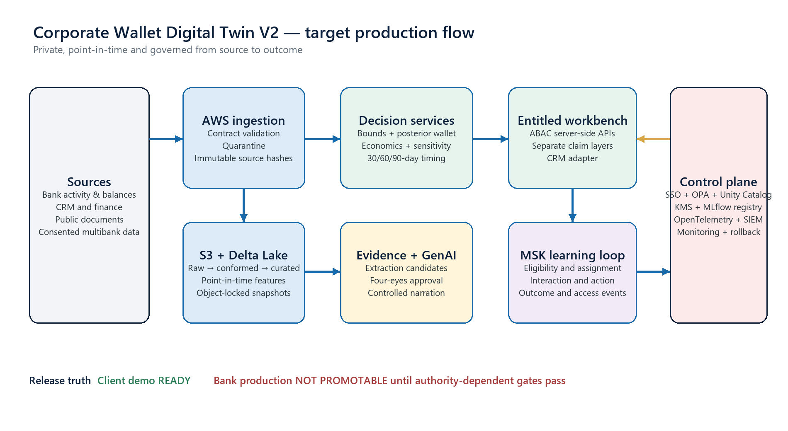
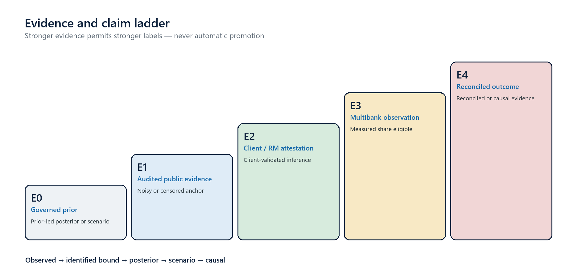

# Corporate Wallet Digital Twin V2

> **Archived V2 dossier.** The authoritative current edition is the V3 system dossier. This file preserves the governed substrate at its V2 release boundary.

## Complete System Dossier

**Prepared for:** Christopher Koen  
**Document purpose:** Authoritative description of the V2 solution implemented to date  
**As-of date:** 9 August 2026  
**Status:** Client-demo ready; bank-production release deliberately not promotable  
**Classification:** Project working document — public, representative, and simulated data only  
**Deployed demonstration:** https://corporate-wallet-digital-twin.christopherkoen.chatgpt.site/

---

## Document control

| Field | Value |
|---|---|
| Document owner | Corporate Wallet Digital Twin V2 programme |
| Primary reader | Product, relationship banking, finance, treasury, risk, model risk, data, security, architecture, engineering and audit stakeholders |
| Version | 2.0 system dossier — implementation snapshot |
| Source of truth | The V2 repository, exported contracts, governed data registers and machine-generated validation outputs as at 9 August 2026 |
| Supersedes | Informal implementation summaries and any V1 descriptions presented as current architecture |
| Review trigger | Any change to an API contract, model version, evidence classification, rate-card policy, release gate, cloud architecture or claim status |
| Approval state | Informational. It is not a bank architecture approval, model approval, product-finance approval, security accreditation or production authorization. |

### Change and interpretation rule

This dossier distinguishes between software that exists, controls that are encoded, evidence that has been verified, data that is representative, and operating claims that require a real bank environment. A component described as **implemented** exists in code or infrastructure definitions and has local or offline verification. It does not follow that the component has been deployed into an authorized bank account, validated by an independent control function, supplied with bank-owned inputs, or approved for client use.

Where an older project note conflicts with this dossier, the repository and current machine-generated outputs take precedence. In particular, V1 methodology, placeholder economics, historical confidence scores, and synthetic performance measures are preserved only as regression references. They are not V2 production claims.

## Status vocabulary

| Term | Meaning in this dossier |
|---|---|
| Implemented | Code, schema, policy, infrastructure definition or user interface exists in the V2 repository. |
| Verified offline | The implementation passed automated tests or reproducible analysis against public, representative or simulated inputs. |
| Client-demo ready | The owner-only demonstration can be used to explain the proposition with explicit provenance and limitations. It is not authorized for bank decisioning. |
| Production-shaped | The design includes production concerns such as private networking, immutable storage, identity, policy enforcement, lineage, monitoring and rollback. |
| Production-eligible | A record or artifact satisfies the defined provenance, approval, freshness and control requirements for consideration in a bank environment. |
| Promotable | All required data, model, economics, security, operational and governance gates have passed in the target bank environment. |
| Not promotable | One or more mandatory gates are absent or failed. The current V2 bank release is intentionally in this state. |
| Measured share | Wallet share supported by E3 multibank observation or E4 reconciliation. E0–E2 estimates are never given this label. |
| Posterior estimate | Model-based uncertainty distribution conditional on stated priors and evidence. It is not an observed fact. |
| Scenario value | Commercial value under governed target-share and pricing assumptions. It is not causal incremental value. |
| Causal value | Incremental effect demonstrated under an approved causal design. This label is disabled in the current solution. |

# Executive summary

Corporate Wallet Digital Twin V2 is a production-shaped decision-support system for corporate-banking wallet development. For each corporate relationship and product, it combines the bank's observed activity with point-in-time public evidence, identification bounds, probabilistic wallet estimates, governed commercial scenarios, timing signals, and a controlled recommendation workflow. Its purpose is to help a relationship manager understand four separate questions:

1. What activity does the bank already observe?
2. What range of total client wallet is defensible without overclaiming?
3. What opportunity might exist under an explicit model and commercial scenario?
4. What evidence, action and outcome must be recorded before incremental value can be claimed?

V2 is a clean enterprise replacement design rather than an extension of the original prototype runtime. It preserves V1 source fixtures, expected results, evidence registers and transparent calculations as a frozen regression boundary. The operative implementation is a Python/FastAPI analytical and service package with versioned JSON Schema and OpenAPI contracts, ten deployable service boundaries, production-shaped AWS/Databricks infrastructure-as-code, a governed evidence workflow, five product-specific wallet models, an effective-dated economics engine, a 10,000-draw global sensitivity laboratory, timing and experiment instrumentation, controlled GenAI adapters, deny-by-default entitlements, and an owner-only web workbench.

The current implementation truth has two tracks:

| Track | Current conclusion | What that permits |
|---|---|---|
| Client demonstration | **READY** — 11 of 11 demonstration gates pass | Explain and explore the product using public, representative and simulated inputs with visible labels and limitations. |
| Bank production | **NOT_PROMOTABLE** | No bank decisioning, RM release, customer action, production economics, measured competitor share, uplift claim or causal incremental-value claim. |

The solution currently contains:

- 3,064,295 rows of supplied SynBank simulated activity covering 20 clients, five products and 36 months.
- 82 point-in-time E1 public facts covering all 20 clients; 31 facts for BHP, Glencore and Shoprite are approved in the project register, while 51 facts for the remaining 17 clients pass automated source checks but still require finance-SME approval.
- A representative wallet analogue with 1,500 client-product records, known latent truth, controlled selection bias and inverse-probability weights. It is useful for model engineering, but it is explicitly not E3 multibank evidence.
- Five product-specific hierarchical beta posterior-predictive models, an independent deterministic bounds engine and reproducible entity-disjoint validation.
- Three complete but nonbank E0 economics packs — conservative, reference and upside — and a fail-closed engine that blocks missing, expired, unreconciled or unapproved production inputs.
- A 10,000-draw Latin-hypercube/Gaussian-copula sensitivity analysis that shows why the meaning of “dominant” matters: Trade Finance is the single first-ranked opportunity in all current draws, while Cross-border FX dominates top-ten composition and majority-dominance frequency.
- A seasonal 30/60/90-day timing baseline, 3,440 transaction-derived surrogate intervals, model promotion thresholds, and a discrete-time challenger. No qualified RM action/outcome history exists, so the challenger is not promotable.
- Trial contracts, cluster assignment, exposure/action/outcome events, an adoption protocol and a causal analysis rehearsal. No live RM trial has occurred and causal labels remain disabled.
- OpenAI, Anthropic, Google and deterministic GenAI provider adapters behind a fail-closed gateway; 809 evidence/GenAI checks; no approved live-provider release evaluation.
- AWS EKS, S3 Object Lock, Aurora PostgreSQL, MSK, KMS, CloudTrail, Databricks Unity Catalog/Delta/MLflow, Helm, OPA, OpenTelemetry and CI/security definitions. They are validated as code but have not been applied to a bank-controlled environment.

The most important design achievement is not a single model score. It is the encoded separation of evidence and claim types. Observed bank activity, assumption-light bounds, posterior estimates, commercial scenarios and causal value are different objects, with different provenance and release requirements. The current system exposes that separation in contracts, APIs, model outputs, the workbench and release controls.

The most important outstanding dependencies cannot be manufactured by more code or more synthetic data. They require authorized people, systems and observations: an E3 multibank calibration panel; approved pricing, FTP, capital, risk, cost and hurdle inputs; bank SSO and cloud services; signed SME approvals; approved live-provider evaluation; and a supervised real-RM pilot followed by a powered randomized trial.

# 1. Purpose, scope and design principles

## 1.1 Business problem

Corporate banks usually observe only the part of a client's financial activity that passes through their own books. They do not directly observe the total product wallet, the competitor allocation, the exact timing of the next contestable event, or the incremental value of a recommendation. Traditional wallet dashboards often hide this missingness inside point estimates, static confidence scores or hard-coded target shares. That creates three risks: false precision, confusion between revenue potential and incremental value, and poor auditability.

V2 treats the missing wallet as an evidence and decision problem. It creates a time-specific “digital twin” for each client-product relationship that is assembled from traceable observations and explicitly governed inference. The twin is designed to support banker judgment; it does not replace credit, pricing, conduct or customer-contact controls.

## 1.2 Initial product scope

The initial scope contains five product families:

| Product | Observed activity concept | Typical external anchors | Principal modelling challenge |
|---|---|---|---|
| Collections | Bank-observed inflows and collection volumes | Revenue, receivables, cash conversion and operating activity | Distinguishing addressable flows from total corporate revenue |
| Payments | Bank-observed payment and transaction volumes | Operating costs, payables and procurement intensity | Mapping accounting cost bases to payment events without treating them as exact labels |
| Liquidity | Balances and liquidity-related activity | Cash, deposits, working capital and debt | Separating structural cash from contestable balances |
| Cross-border FX | Bank-observed cross-border and currency conversion activity | FX exposure, geographic revenue/cost mix and currency disclosures | Translating exposure into executable wallet while respecting netting and hedging |
| Trade Finance | Instruments, facilities and trade-related events | Inventory, receivables, payables, short-term facilities and debt maturities | High margins, sparse events and accounting proxies that are informative but not equivalent to wallet |

## 1.3 Non-goals and prohibited automation

V2 does not automate customer communications, price approvals, credit decisions, product booking, pipeline-stage changes or legal commitments. The GenAI layer cannot publish evidence facts, approve reviews, change CRM state or invoke arbitrary external tools. The recommendation service ranks only eligible opportunities and provides evidence packs. A human remains accountable for interpretation and action.

## 1.4 Five strict analytical distinctions

The system treats the following as separate layers:

| Layer | Question answered | Claim class | Current availability |
|---|---|---|---|
| Observed bank activity | What did the bank itself record? | `OBSERVED` | Available in the demo from SynBank simulation; bank feeds still absent. |
| Identification bounds | What range is defensible under explicit weak assumptions? | `IDENTIFIED_BOUND` | Implemented independently from the statistical model. |
| Posterior estimate | What distribution follows from the selected prior, evidence and calibration data? | `POSTERIOR` | Implemented and validated offline on representative/simulated data. |
| Governed commercial scenario | What contribution could result under a stated target share and rate card? | `SCENARIO` | Implemented using E0 benchmark packs; bank production outputs fail closed. |
| Causal incremental value | What additional outcome was caused by showing the recommendation? | `CAUSAL` | Contracts and analysis design exist; label disabled until a valid trial passes. |

## 1.5 Design principles

The implementation follows the principles below.

1. **Point-in-time correctness.** Every modelled read requires an `as_of` date. A fact can be used only if it was available at that time.
2. **Evidence before confidence.** Confidence is decomposed into evidence tier, approval state, freshness, calibration and uncertainty instead of a single opaque score.
3. **Bounds before models.** A deterministic bounds engine remains independent from the Bayesian estimate, so modelling choices cannot erase assumption-light constraints.
4. **Fail closed.** Missing or stale critical rates, invalid entitlements, failed GenAI validation and incomplete production configuration block output rather than trigger silent defaults.
5. **Reproducibility.** Inputs, transformations, priors, rates, prompts, schemas, datasets and model versions are referenced on outputs.
6. **Human accountability.** Material public facts require four-eyes review; the banker decides whether to act; independent functions approve promotion.
7. **No synthetic promotion.** Simulated or representative data may exercise systems and methods but cannot satisfy a real-data release gate.

# 2. Implementation boundary and current status

## 2.1 V1 closure and regression boundary

V1 remains in the repository as an archived benchmark. Its fixtures and expected calculations are retained so that V2 can prove continuity where intended and deliberate change where necessary. V1 browser-side portfolio delivery, placeholder basis-point assumptions, transparent seasonal logic and manually assembled evidence should not be confused with V2 operational architecture.

The V2 runtime is a separate package under `src/wallet_twin_v2`. It owns current contracts, service composition, evidence governance, model outputs, economics and release-state logic. The source package contains 27 modules spanning APIs, contracts, evidence, economics, modelling, sensitivity, timing, experiments, GenAI, entitlements, repositories, adapters and validation.

## 2.2 What is complete enough for the demonstration

The owner-only web demonstration can show a 20-client by five-product portfolio, or 100 client-product opportunities. For each opportunity it can display observed activity, identification bounds, posterior intervals, a governed scenario endpoint, cited evidence, timing probabilities, sensitivity context and release blockers. It uses server-side APIs or a private bundled snapshot rather than publishing the entire raw portfolio as a browser asset.

The client-demo scorecard rates the current capability as follows:

| Area | Demonstration score | Basis |
|---|---:|---|
| Public evidence | 9.0/10 | All 20 clients covered; high-value showcase facts approved; remaining facts clearly pending SME approval. |
| Wallet modelling | 9.0/10 | Corrected posterior-predictive model, independent bounds and reproducible validation/conformal diagnostics. |
| Economics | 9.0/10 | Complete fail-closed calculation chain and three internally consistent benchmark packs with simulation watermark. |
| Timing | 8.5/10 | Explicit 30/60/90-day probabilities, event-table implementation and a validated but unpromoted challenger. |
| Causal learning | 8.0/10 | Trial design, event contracts, randomization and analysis rehearsal exist; no live effect claim. |
| GenAI | 9.0/10 | Four provider modes, structured schema, claim compiler, 809 checks and deterministic fallback. |
| Platform/security | 9.0/10 | Production-shaped definitions and local operational validation; no claim of bank deployment. |
| RM adoption | 7.5/10 | Usable workbench and a complete pilot protocol; no real participant evidence. |

These scores describe demonstration completeness, not bank production approval.

## 2.3 Bank-production readiness truth

The corresponding bank-candidate assessment is materially lower where actual authority or observations are absent:

| Area | Candidate score | Remaining production dependency |
|---|---:|---|
| Public evidence | 8.5/10 | Signed finance-SME approval for 51 pending facts and bank evidence ownership. |
| Wallet modelling | 8.0/10 | Representative, consented E3 multibank observations and independent model-risk validation. |
| Economics | 7.5/10 | Treasury/product-finance/risk-approved effective-dated inputs and MI reconciliation. |
| Timing | 7.0/10 | Qualified RM outcomes and sustained prospective calibration. |
| Causal learning | 6.5/10 | Supervised pilot, sufficient clusters and a powered randomized encouragement trial. |
| GenAI | 8.5/10 | Approved provider, bank contract and privacy review, sealed live evaluation and independent adjudication. |
| Platform/security | 8.0/10 | Actual bank AWS/Databricks/SSO/Unity Catalog/SIEM deployment and penetration testing. |
| RM adoption | 4.0/10 | Real banker sessions, feedback, operating support and adoption evidence. |

The production target checker confirms that 21 of 21 required control definitions exist, but the current environment truth is false for bank accounts, bank data feeds, SSO, Unity Catalog enforcement, SIEM routing and operating evidence. Infrastructure apply is therefore disabled. This is a safeguard, not a missing feature.

# 3. End-to-end architecture



## 3.1 Logical flow

The intended production flow is:

1. Internal activity, balances, CRM, finance, approved multibank sources and public documents enter through controlled ingestion interfaces.
2. Source payloads are contract-validated. Invalid, ambiguous or stale records are quarantined, not coerced.
3. Immutable source documents and analytical snapshots are stored in KMS-encrypted, object-locked S3. Delta Lake holds raw, conformed, curated, feature, training and monitoring data products.
4. Point-in-time evidence and features are joined to effective-dated economics, FX policies and governed model artifacts.
5. Independent bounds, product-specific posterior models and timing services produce versioned estimates.
6. The recommendation service ranks only entitled, commercially eligible opportunities and creates evidence packs.
7. The GenAI service may extract candidates or narrate approved claims through a provider gateway, but it cannot approve facts or take CRM actions.
8. The workbench BFF enforces identity and object-level authorization before presenting the twin to an entitled user.
9. Eligibility, assignment, exposure, interaction, action and outcome events are written to MSK and curated stores, closing the future learning loop.
10. OpenTelemetry signals, immutable access decisions, data quality, model diagnostics, GenAI evaluation and service health feed monitoring and the approved SIEM.

## 3.2 Ten service boundaries

| Service | Responsibility | Principal routes or outputs | State ownership |
|---|---|---|---|
| Ingestion | Contract validation, provenance capture and quarantine | `/v1/ingestion/records` | Ingestion/quarantine state; raw data products |
| Evidence | Documents, extraction candidates, citations, restatements and review | `/v1/evidence/*`, `EvidenceApproved` | Evidence workflow database and immutable document references |
| Economics | Pricing, FTP, liquidity, loss, capital, cost, hurdle and scenario calculations | `/v1/economics/*`, scenario inputs | Effective-dated rate-card schema |
| Wallet model | Bounds and product-specific posterior distributions | client twin and model-validation reads | Immutable model snapshots and feature references |
| Timing | Start-stop events and named 30/60/90-day probabilities | `/v1/timing/predict` | Timing feature/model artifacts |
| Recommendation | Eligibility, ranking, evidence packs and interactions | `/v1/opportunities`, `/v1/recommendations/*`, `/v1/scenarios/evaluate` | Recommendation interaction state |
| Experiment | Assignment, exposure, actions, outcomes and pilot records | `/v1/events`, `/v1/outcomes`, `/v1/pilot/*` | Experiment, outbox and pilot schemas |
| GenAI | Controlled extraction/narration and provider routing | `/v1/genai/*` | Audit hashes and evaluation artifacts; no retained prompt payloads |
| Entitlement | User/client/product/region policy evaluation | `/v1/access/evaluate`, `AccessDecisionLogged` | Immutable access-decision records |
| Workbench BFF / CRM adapter | Entitled UI aggregation and controlled CRM synchronization | selected read APIs and event adapters | UI session/projection state; no direct cross-service database access |

Each service is independently deployable even though the repository currently uses one shared Python distribution. Services expose a filtered FastAPI route set, run with separate workload identities and are prohibited from querying another service's operational database directly. Integration occurs through APIs, versioned events and curated analytical products.

## 3.3 Physical target

The target platform is private Amazon EKS and Databricks. An internal load balancer/API gateway and WAF front the EKS services. Aurora PostgreSQL supplies operational state, Amazon MSK carries versioned events, S3 Object Lock preserves evidence and release artifacts, and KMS manages encryption and signing. Databricks Delta Lake and Unity Catalog supply analytical storage, lineage and row/column enforcement. MLflow holds models, priors, transformations, diagnostics and promotion metadata.

The checked-in configuration is production-shaped and locally validated, but it has not been applied to a bank AWS account or workspace. No bank endpoint, account identifier, user directory or secret is embedded in the repository.

# 4. Data foundation and provenance

## 4.1 Canonical provenance model

Every curated record is intended to carry:

- business and source keys;
- event time and `valid_from`/`valid_to`;
- ingestion time and `available_date` where relevant;
- source hash and transformation version;
- quality status and accountable owner;
- entitlement domain;
- deployment environment, provenance class and permitted usage;
- artifact references for models, prompts, schemas, rates, priors, transformations and datasets.

The data contracts distinguish six provenance classes: bank-observed, public-audited, client-attested, multibank-observed, representative-public and synthetic-simulation. Usage is separately classified as production-eligible, client-demo-and-validation, or validation-only. This prevents a technically valid public or simulated record from being mistaken for an authorized bank observation.

## 4.2 Current data estate

| Data product | Scale | Provenance and role | Production status |
|---|---:|---|---|
| SynBank simulated activity | 3,064,295 rows | Supplied simulation for 20 clients, five products and 36 months | Demo/validation only; never bank-observed |
| Public evidence register | 82 facts, 20 clients | Point-in-time E1 public audited evidence with page/hash lineage | 31 approved in project workflow; 51 await SME approval |
| Representative wallet analogue | 1,500 client-product observations | Controlled simulation with known latent truth and selection weights | Validation only; not E3 |
| Africa trade reference | 10,000 records, 40 countries | Pinned CC-BY-4.0 external dataset for distributional context | Representative public reference, not client wallet evidence |
| PaySim reference | 6,362,620 remote rows | Pinned public transaction simulator for scale/schema testing | Federated reference only; not ingested as bank activity |
| FinQA | 8,281 public cases | Pinned CC-BY-4.0 financial QA corpus for evaluation-design reference | GenAI evaluation design only |
| Trial analogue | 1,500 opportunities, 30 clusters | Synthetic assignment/action/outcome rehearsal | Validation only; no causal claim |

## 4.3 SynBank simulation

The supplied SynBank pack contains:

| Source table | Rows |
|---|---:|
| Transactional banking | 2,802,875 |
| Cross-border payments | 241,117 |
| Trade finance | 20,303 |
| **Total** | **3,064,295** |

The activity covers July 2023 through June 2026. It exercises ingestion, aggregation, feature construction, bounds, posterior models, timing, scenarios, API serialization and the UI. Because it is simulated, the workbench labels it accordingly and the production configuration rejects it for production economics or evidence claims.

## 4.4 Representative wallet analogue

The calibration analogue contains 300 relationships across five products, producing 1,500 observations. It is stratified to challenge product, sector, geography, size, penetration and relationship-maturity behaviour. The population includes 685 South African, 285 SADC, 275 rest-of-Africa and 255 global records; 675 established, 525 developing and 300 new relationships; and 635 upper-mid, 480 mid and 385 large relationships. Sector counts are 445 mining, 355 consumer, 205 real estate, 135 technology, 125 industrials/pharma, 125 insurance and 110 telecommunications.

The generator uses a stable seed (`20260809`) and records selection probabilities, inverse-probability weights and known latent share. Those fields make it possible to test selection correction and coverage. The records intentionally have no evidence tier. Assigning E3 would falsely represent simulated competitor wallet shares as multibank observations.

## 4.5 External reference datasets

The pinned Africa trade dataset has 10,000 records across 40 countries, an approval rate of 46.54%, collateral incidence of 59.02%, requested-amount percentiles of USD 5,000 / 21,939.025 / 151,366.161, and processing-time percentiles of 8.9 / 21 / 37 days. It helps shape challenge scenarios for trade-finance distributions. It is not used to assert a named client's wallet.

PaySim is referenced remotely at 6,362,620 rows to exercise high-volume transaction contracts and schema assumptions. FinQA contributes 6,251 train, 883 development and 1,147 public test cases; its 919 private-test cases are excluded. Neither source is silently blended into production labels.

## 4.6 Point-in-time and restatement rules

A source fact is usable only when its publication or availability date is on or before the requested `as_of` timestamp and its valid period covers the analytical question. Restatements append a new version and lineage edge rather than overwriting history. Model snapshots retain the exact dataset and transformation references needed to reconstruct what the system knew at that date. Automated tests require zero future-data leakage.

# 5. Evidence system

## 5.1 Evidence tiers



| Tier | Definition | Typical source | Permitted interpretation |
|---|---|---|---|
| E0 | Governed prior | Approved product prior, scenario distribution or policy assumption | Prior-led inference or scenario only |
| E1 | Audited public evidence | Annual report, audited financial statement or governed public filing | Noisy/censored anchor; never exact wallet truth |
| E2 | Client or RM attestation | Structured client/RM statement with review and date | Stronger relationship-specific evidence, still not measured competitor share |
| E3 | Multibank observation | Client-consented multibank balances/transactions or equivalent direct observation | Eligible to support measured share, subject to quality and coverage |
| E4 | Reconciled economics/outcomes | Finance-reconciled contribution or governed realized outcome | Highest tier for economics/outcome reconciliation |

## 5.2 Evidence records and citations

An evidence fact records the document hash, page, bounding box, source date, available date, reporting period, original currency and unit, normalized value, extraction lineage, approval state and entitlement domain. The bounding box and page allow a reviewer to return to the exact visual source. The source hash proves which document version was reviewed.

Public accounting values are not re-labelled as direct product wallet. Revenue, operating costs, receivables, payables, inventory, cash, debt and FX exposures are treated as noisy or interval anchors. Each anchor has a governed relation to a product model and an evidence-dependent likelihood weight.

## 5.3 Current coverage

The register contains 82 E1 facts across all 20 showcase relationships. BHP Group and Glencore each have ten approved facts: revenue, operating cost base, opening and closing trade receivables, opening and closing inventory, opening and closing trade payables, FX exposure and current debt. Shoprite has those ten concepts plus short-term facilities, for 11 approved facts. Together these 31 approved facts activate accounting, FX and maturity anchors for the three highest-detail showcases.

The remaining 17 clients have three source-grounded facts each, or 51 facts in total. Automated QA confirms 17 of 17 documents and 51 of 51 facts pass page, source-hash, value, currency and point-in-time checks. They remain `PENDING_REVIEW` because automated consistency is not finance-SME approval.

## 5.4 Candidate validation and four-eyes review

Before review, deterministic validators check currency, unit, sign, period, arithmetic, duplicates, availability date, future leakage, supporting text, bounding box and document hash. Parentheses and source units are normalized without discarding the original representation. Conflicts and ambiguous restatements are surfaced rather than guessed.

The submitter cannot review their own candidate. Material facts require approvals from both a `FINANCE_SME` and an `EVIDENCE_REVIEWER`. A rejection terminates approval. The append-only manifest holds candidate and review hashes, roles, timestamps, pending/resolved state and a canonical manifest hash. The production target can sign that manifest using an asymmetric RSA-3072 KMS signing key; a production approval claim is permitted only when the signature is valid and no required review is pending.

## 5.5 Evidence effect on uncertainty

The model validation lab explicitly compares prior-only estimates with selection-weighted calibration and E1 anchors. In the representative holdout, the weighted plus E1 condition produces 88.70% nominal-90% wallet coverage and a share CRPS of 0.05497. Anchoring narrows the median interval by 44.449% relative to the unanchored condition while coverage remains 88.696% versus 88.261% unanchored. This demonstrates that additional evidence can narrow intervals without merely hiding error in a point estimate.

The result is an offline methodological demonstration, not a production validation claim. The observed 88.70% is inside the overall 85–95% coverage gate, but independent segment coverage, real E3 calibration and the required CRPS improvement must also pass. The dossier therefore reports the exact result without promoting the model.

# 6. Wallet estimation and competitor-share governance

## 6.1 Independent identification bounds

The deterministic bounds engine is implemented independently from the probabilistic model. It applies:

```text
lower = max(bank_observed_activity, evidence_lower_bound)
upper = min(evidence_upper_bound, capacity_bound)
```

When no direct evidence upper bound is available, the engine may derive a conservative upper bound from observed activity divided by a governed minimum-share assumption. The result is an `IDENTIFIED_BOUND`, not a posterior credible interval. The implementation prevents a posterior from implying a total wallet below activity already observed by the bank.

## 6.2 Product-specific priors

The current product priors are transparent E0 engineering defaults:

| Product | Prior mean share | Prior concentration |
|---|---:|---:|
| Collections | 0.36 | 12 |
| Payments | 0.34 | 12 |
| Liquidity | 0.28 | 9 |
| Cross-border FX | 0.30 | 10 |
| Trade Finance | 0.26 | 8 |

These priors do not claim to represent a bank's approved portfolio belief. Their concentration controls how strongly the prior resists new evidence and is included in sensitivity analysis.

## 6.3 Hierarchical posterior-predictive model

Model version `hierarchical-wallet-2.0.0` uses beta distributions for share and retains posterior draws. It estimates the distribution for a new relationship rather than reporting only the posterior distribution of a group mean. This correction is important: the former prototype approach could produce intervals that were too narrow by ignoring between-relationship variability.

Direct share observations are accepted only from E3 and E4 records. Their base reliability weights are 1.0 and 1.5 respectively; E2 relationship evidence receives 0.25. A same-sector record receives full weight, while an out-of-sector record receives 0.35. Inverse selection weights correct the representative panel's known inclusion process. Effective sample size is calculated as `(sum(w)^2 / sum(w^2))`, and panel influence is blended as `effective_n / (effective_n + 8)`. Inferred concentration is clipped between 4 and 35 to guard against implausible certainty.

For direct relationship evidence, concentration is 400 for E3 and 800 for E4. E1 public anchors never create a measured share. The model draws 4,000 reproducible samples using a stable hash-derived seed. Prior wallet is the bank-observed amount divided by a share draw; anchor values are sampled from triangular low/mode/high ranges and pooled on a log/geometric scale. Anchor weights are 0.35 for E1, 0.60 for E2, 0.90 for E3 and 0.94 for E4. The final wallet is floored at the observed bank amount.

The API exposes the 5th, 50th and 95th percentiles as a nominal 90% interval, plus model and as-of references. The system retains full draws and diagnostics so CRPS, rank probabilities and sensitivity can be reproduced.

## 6.4 Competitor-share labels

V2 can represent prior-led, publicly anchored, client-validated and empirically calibrated estimates. Only E3/E4 evidence can support the label “measured share.” No competitor transaction or actual competitor wallet-share data is present in the current repository. The workbench therefore shows inferred/posterior share and missing-evidence notices, not named competitor claims.

## 6.5 Offline calibration results

The entity-disjoint laboratory contains 240 entities and 1,200 product records: 148 panel entities and 92 holdout entities, producing 460 holdout rows. Selection weights are inverse inclusion probabilities clipped at six.

| Condition | Nominal-90% wallet coverage | Share CRPS | Interpretation |
|---|---:|---:|---|
| Frozen prior | 83.91% | 0.08659 | Transparent regression baseline |
| Weighted panel | 88.26% | 0.08404 | Selection correction improves calibration modestly |
| Weighted panel plus E1 anchors | 88.70% | 0.05497 | Anchors materially improve share scoring and narrow wallet intervals |

The weighted-panel share CRPS improves 2.942% over the frozen baseline, below the 10% production promotion requirement. Split conformal calibration raises share coverage from 90.0% raw to 93.478% at a 10.51% median-width cost, and wallet coverage to 91.304% at a 3.54% width cost. These are valuable engineering results but do not replace E3 validation or independent model-risk reproduction.

Product, sector and stress diagnostics are retained. Selection-weighted share CRPS is 0.08404 versus 0.08439 unweighted. The solution does not hard-code a pass based on overall coverage if a strategically material segment has severe undercoverage.

# 7. Economics and target-share scenarios

## 7.1 Effective-dated rate-card model

The economics service owns the full contribution chain:

```text
net basis points
= gross price
- client discount
- funds-transfer price
- liquidity charge
- expected loss
- capital charge
- hedging cost
- execution cost
- servicing cost
- operating cost
- tax
```

A rate card records source, owner, effective dates, approval, reconciliation and artifact version. Production commercial output is blocked if any required field is missing, expired, unapproved, unreconciled or sourced from a simulation in a controlled environment. A net rate at or below the approved hurdle is also blocked. Decimal and currency handling is explicit, including FX policy, rounding, negative values and restatements.

## 7.2 Three distinct value measures

| Measure | Definition | Current status |
|---|---|---|
| Reconciled observed contribution | Contribution attributable to activity already observed and reconciled | Calculation exists; no bank finance reconciliation supplied |
| Contestable scenario contribution | Contribution under an explicit target share, capacity and E0/E1 assumptions | Available in client demo with a simulated watermark |
| Causal expected incremental value | Expected contribution caused by exposure to the recommendation | Disabled until causal validation and approved economics both pass |

Contestable activity is `max(target_share × wallet_median − observed_activity, 0)`, capped by configured capacity. Scenario contribution applies the approved net rate and acquisition/implementation cost. A target share is called a scenario frontier, never “optimal,” until response curves or causal win probabilities have been validated.

## 7.3 Current benchmark packs

Three complete E0 packs provide deterministic demonstrations:

| Pack | Target share | Portfolio observed contribution | Portfolio scenario contribution | Current top product |
|---|---:|---:|---:|---|
| Conservative | 30% | 16.2446 million | 11.5331 million | Cross-border FX |
| Reference | 40% | 75.8256 million | 93.2972 million | Cross-border FX |
| Upside | 50% | 187.1264 million | 335.5301 million | Cross-border FX |

All three packs reconcile internally to floating-point tolerance. They use nonbank assumptions and remain `DRAFT`. Current gross-price ranges in basis points are Collections 0.5/1.2/2.5, Payments 0.3/0.8/1.6, Liquidity 2/6/12, Cross-border FX 4/9/18 and Trade Finance 20/45/85. They demonstrate mechanics, not approved margins.

## 7.4 Production input ownership

Production requires effective-dated inputs approved by Treasury, product finance, risk and finance: gross price, negotiated discount, FTP, liquidity transfer, expected loss, capital, collateral, hedging, execution, servicing, operating cost, tax, implementation cost, capacity, concentration, conduct constraints and hurdle. Outputs must reconcile to the bank's finance/management-information source. The current absence of these inputs is deliberately visible as a release blocker.

# 8. Global sensitivity and Trade Finance conclusion

## 8.1 Method

The implementation preserves the earlier 3×3 rate/prior benchmark for continuity and adds 10,000 reproducible Latin-hypercube draws under model version `lhs-copula-sensitivity-2.0.0`, seed `20260808`. A validated positive-semidefinite correlation matrix and Gaussian copula connect nine drivers: share prior, wallet, target share, anchor error, competitor-data error, FX policy, price, FTP and capital.

The report includes product first-rank probability, top-opportunity frequency, top-ten composition, majority dominance, commercial-value distributions, concentration and value-of-information correlations. No test asserts that a particular product must win.

## 8.2 Portfolio distribution

Current representative assumptions produce portfolio scenario economics of 80.964 million at P05, 167.192 million at P50 and 311.208 million at P95. These values are simulated and sensitive to unapproved price and share inputs.

## 8.3 Product dominance

| Product | First-ranked frequency | Mean share of top 10 | Majority-dominance frequency | Median absolute economics |
|---|---:|---:|---:|---:|
| Trade Finance | 100.00% | 25.187% | 0.00% | 53.368 million |
| Cross-border FX | 0.00% | 51.284% | 79.69% | 57.795 million |
| Liquidity | 0.00% | 23.511% | 0.00% | 34.794 million |
| Collections | 0.00% | approximately 0% | 0.00% | 12.810 million |
| Payments | 0.00% | 0.00% | 0.00% | 8.174 million |

Trade Finance absolute economics span 23.877 million at P05, 53.368 million at P50 and 103.331 million at P95. The correct conclusion is conditional: under current representative inputs, a Trade Finance opportunity is always the single highest-ranked item, but Trade Finance does not form the majority of the top-ten set. Cross-border FX dominates portfolio composition and has a higher median absolute total. The “dominant product” changes with the decision definition.

## 8.4 Value of information

Rank correlations with portfolio value are: target share 0.6513, price 0.4497, wallet 0.4336, share prior 0.2631, competitor error 0.2109, anchor error 0.1905, FX policy 0.0405, capital 0.0159 and FTP 0.0064. Under the present benchmark, target-share response, product price/margin and wallet calibration offer the greatest information value. Once bank-owned rates are loaded, the ranking must be recalculated rather than assumed stable.

# 9. Timing and event-hazard modelling

## 9.1 Start-stop event table

Timing is represented at client-product-opportunity level using start-stop intervals, named outcome types, censoring state and feature availability. The service returns calibrated-format probabilities for 30, 60 and 90 days rather than an opaque urgency score.

## 9.2 Seasonal baseline

The transparent baseline uses a daily hazard of `0.0025 × seasonal_ratio × (0.6 + 0.8 × recurrence)`. The seasonal ratio is clipped between 0.25 and 3.0. A known maturity inside 90 days increases the hazard by `1 + 1.5 × (1 − days_to_maturity / 90)`. The cumulative probability at a horizon is `1 − exp(−daily_hazard × days)`, ensuring monotonic 30/60/90-day probabilities.

This baseline is easy to inspect and remains the production challenger baseline until labelled outcomes justify a promoted model.

## 9.3 Current validation

The historical exercise uses 3,540 monthly records for 20 clients and five products, with 2,340 rolling forecasts. Seasonal nominal-90% amount coverage is 80.3846%, median sMAPE is 20.42% and MAE is 28.289 million. Mean top-ten Jaccard ranking stability is 0.8121, with a minimum of 0.4286.

Transactions produce 3,440 surrogate intervals and 361 surrogate events across activation, dormancy and volume-uplift definitions. These outcomes are useful for pipeline and feature testing but are not qualified RM-action outcomes. Mean surrogate probabilities are 12.557% at 30 days, 23.538% at 60 days and 33.139% at 90 days.

A regularized discrete-time challenger was trained on 1,957 records and tested on 883 records containing 117 events. Test Brier score is 0.10197 versus 0.11009 for the baseline, a 7.376% improvement, with expected calibration error of 0.03216. It is not promotable because the labels are surrogate and no prospective RM outcome set exists.

## 9.4 Promotion rules

An interpretable Cox model may be considered only after at least 200 eligible events and at least ten outcome events per effective model degree of freedom. Recurrent-event and competing-risk models become relevant when repeated opportunities and loss/expiry/refinancing outcomes exist. DeepHit is prohibited until at least 5,000 labelled events exist and an independently validated improvement over simpler models is sustained.

# 10. Recommendation, experimentation and causal learning

## 10.1 Recommendation eligibility

An opportunity is ranked only after evidence, economics, risk, entitlement and environment gates are evaluated. The output is `ALLOWED`, `SHADOW_ONLY` or `BLOCKED` with machine-readable reasons. Every eligible opportunity must be logged, including opportunities that are never displayed. This avoids training only on banker-visible winners.

## 10.2 Event chain

The causal learning loop records:

```text
eligibility → assignment → display → open/dismiss → banker action
            → pipeline milestone → reconciled outcome
```

Each event includes client/product/RM identifiers, event and as-of time, assignment probability, evidence tier, estimates, rank, reason codes, artifact versions, entitlement context and censoring state.

## 10.3 Pilot protocol

The first real release is a supervised pilot, not a randomized production rollout. A small entitled RM cohort receives mandatory onboarding and feedback. The pilot measures evidence-verification time, actionability, comprehension, omissions, overrides, factual-quality issues, entitlement incidents and operational load. Pilot sessions capture consent and source environment; fixture sessions do not count. The adoption release gate requires at least five completed real-participant sessions.

## 10.4 Randomized encouragement trial

After supervised usability and safety gates pass, the pre-registered design randomizes encouragement by RM portfolio or team to reduce contamination. The primary outcome is a qualified RM action within 30 days. Intention-to-treat risk difference is primary. Treatment-on-the-treated/Wald estimation is allowed only if assignment is a valid instrument and the first-stage effect is at least 0.10. Horizons, exclusions, censoring, outcome delays and analysis are declared before unblinding.

Cluster-robust inference, randomization inference, balance tests, first-stage diagnostics and A/A checks are implemented. Heterogeneous effects and doubly robust policy evaluation remain gated by overlap, effective sample size and independent validation.

## 10.5 Current rehearsal evidence

The trial analogue contains 1,500 opportunities in 30 clusters, with 387 30-day actions, 356 60-day milestones and 192 reconciled 90-day outcomes. A separate production-analysis rehearsal contains 1,152 events across 48 clusters; 1,042 are observed and 9.55% are censored. The ITT estimate is 0.00816 with cluster standard error 0.02425, 95% interval −0.0394 to 0.0557 and p-value 0.7365. The first stage is 0.50587 and the rehearsal Wald estimate is 0.01613. An A/A test produces ITT 0.00235 and randomization p-value 0.914.

These values confirm that the analysis code behaves sensibly, including when the correct conclusion is “no detectable effect.” They do not establish efficacy because the data are simulated. Production causal and uplift claims remain false.

# 11. Controlled GenAI implementation

## 11.1 Roles and boundaries

GenAI has two bounded roles: propose structured fact candidates from documents and compile a banker-readable narrative from an approved evidence pack. It cannot approve a fact, invent a number, alter a citation, query arbitrary tools, make a recommendation eligible, contact a customer or write a CRM outcome.

## 11.2 Provider gateway

The gateway supports four modes behind one interface:

| Provider | Implementation | Release behaviour |
|---|---|---|
| Deterministic | Template/claim compilation without external model | Always available fallback |
| OpenAI | Responses API structured parsing with pinned model snapshot | Requires explicit provider approval, runtime secret and evaluation gate |
| Anthropic | Messages adapter with schema parsing | Same fail-closed approval and secret requirements |
| Google | Schema-constrained JSON adapter | Same fail-closed approval and secret requirements |

The OpenAI adapter uses schema-constrained output, `store: false`, an empty tools list, no parallel tool calls and a hashed safety identifier. Provider keys are accepted only at runtime through secret references; they are never stored in source, output manifests, telemetry or this dossier. Any keys pasted during development must be revoked and rotated before further use.

## 11.3 Narrative schema and deterministic validation

The `BankerNarrative` contains a headline, situation, why-now explanation, next action, explicit claim list and abstentions. Payload Guard limits requests to 50 KB and 50 evidence items, detects prompt-injection patterns, email addresses, secret-like strings and long numeric identifiers. The claim compiler builds an allow-list of evidence IDs and numbers and rejects a narrative containing any number or citation absent from the pack.

A circuit breaker opens after three provider failures and resets after 60 seconds. Audit records retain hashes of opportunity and schema, provider/model/prompt versions, mode and validation reasons, but not raw prompt payloads.

## 11.4 Evaluation estate

The current estate contains 809 governed checks:

| Set | Count | Purpose |
|---|---:|---|
| Structured golden set | 36 | Twelve train, twelve development and twelve sealed cases |
| Evidence-register replay | 82 | Recheck approved/pending facts and source lineage |
| Page-grounding checks | 51 | Verify page, hash, value, period and currency for pending facts |
| Deterministic stress cases | 640 | 160 each for exactness, missing evidence, prompt injection and future leakage |
| **Total** | **809** | Controlled evidence/GenAI verification estate |

Development and sealed cases achieve 100% schema compliance, candidate precision, correct abstention, critical-value matching and injection resistance in the current deterministic evaluation. Training exactness is 91.67% and critical matching 80%, illustrating why training data are not release evidence. The 640 stress cases have zero failures; the one-sided 95% upper failure bound is 0.46699%, below the 0.5% minor unsupported-claim threshold.

All live provider states remain `CONFIGURABLE_NOT_EXECUTED`. The harness requires an explicit public-only acknowledgement, provider approval, pinned snapshot and runtime secret. It retains no payload. No bank-approved live-provider test or independent adjudication has occurred, so the production GenAI gate remains closed.

## 11.5 Production document path

The target document pipeline is allow-list validation, malware scanning, hashing, object-locked storage, OCR/layout extraction, table reconstruction, candidate extraction, deterministic semantic validation, finance-SME review, four-eyes approval, claim compilation and controlled narration. AWS Textract or the bank-approved equivalent supplies page geometry. Only entitled, minimized evidence may leave the bank boundary through an approved provider gateway.

# 12. APIs, contracts and events

## 12.1 Contract approach

V2 exports a versioned OpenAPI contract and 15 JSON Schemas. Internal APIs require bank identity in controlled environments, enforce object-level authorization and require `as_of` for modelled reads. List endpoints are paginated, with an opportunity limit capped at 100. Response records carry claim class, evidence/calibration status, artifact versions and eligibility reasons.

## 12.2 Canonical types

The shared contract package defines:

- `EvidenceTier`: E0, E1, E2, E3, E4.
- `ClaimClass`: OBSERVED, IDENTIFIED_BOUND, POSTERIOR, SCENARIO, CAUSAL.
- `ApprovalStatus`: DRAFT, PENDING_REVIEW, APPROVED, REJECTED, EXPIRED.
- `DeploymentEnvironment`: FIXTURE, DEVELOPMENT, CLIENT_DEMO, SHADOW, PILOT, PRODUCTION.
- `DataProvenance`: BANK_OBSERVED, PUBLIC_AUDITED, CLIENT_ATTESTED, MULTIBANK_OBSERVED, REPRESENTATIVE_PUBLIC, SYNTHETIC_SIMULATION.
- `Usage`: PRODUCTION_ELIGIBLE, CLIENT_DEMO_AND_VALIDATION, VALIDATION_ONLY.
- `Eligibility`: BLOCKED, SHADOW_ONLY, ALLOWED.
- `CommercialStatus`: BLOCKED, SIMULATED, APPROVED_SCENARIO, CAUSAL.
- `CalibrationStatus`: PRIOR_LED, PUBLICLY_ANCHORED, CLIENT_VALIDATED, EMPIRICALLY_CALIBRATED.
- value objects for money, intervals, artifact references, entitlement context, evidence facts, calibration observations, rate cards, timing predictions, wallet estimates, opportunities, event envelopes and start-stop intervals.

## 12.3 Operational persistence

Service-owned PostgreSQL schemas include evidence fact workflow, effective rate cards with exclusion constraints preventing overlapping validity windows, experiment assignment/outcome/pilot/outbox tables, recommendation interactions and entitlement access decisions. Cross-service SQL reads are prohibited. The transactional outbox supports reliable event publication.

## 12.4 MSK topics

Ten versioned domain topics carry eligibility, assignment, display, open, dismissal, action, milestone, outcome, evidence approval and access-decision events. Default production shape is 12 partitions, replication factor three, minimum in-sync replicas two and 365-day retention; the access-decision topic uses 24 partitions. Contract-quarantine and integration dead-letter topics retain failures for 90 days.

# 13. Security, privacy and entitlements

## 13.1 Deny-by-default authorization

The entitlement service evaluates user, team, region, client, legal entity, product and environment attributes. Shadow access is role-restricted. Client and product ownership must match. Sensitive economics require finance, treasury, risk or designated platform roles; evidence review requires the corresponding reviewer role. Demonstration identities are prohibited in production.

OPA applies the same default-deny posture at the gateway and checks environment, MFA, workload-identity age, client/region/product ownership and sensitive-data roles. Authorization is designed to be enforced at gateway, service, database/query and UI layers. Every decision emits an immutable `AccessDecisionLogged` record.

## 13.2 Identity and runtime configuration

The controlled modes SHADOW, PILOT and PRODUCTION fail startup unless AWS region, KMS key, immutable bucket, MSK, PostgreSQL, HTTPS OPA, HTTPS OIDC, OpenTelemetry, MLflow and Unity Catalog settings are present. OIDC validation uses remote JWKS with RS256 or ES256 and requires issuer, audience, subject, issued-at and expiry checks. Short-lived workload identities are capped at 3,600 seconds.

## 13.3 Privacy and telemetry

Telemetry processors remove client names, user emails and document content from traces and logs. OpenTelemetry uses memory limiting and batching before an approved HTTPS OTLP exporter. Source documents, provider prompts and secrets are not observability payloads. Data minimization and entitlement checks occur before any external GenAI call.

## 13.4 Software supply chain

The container uses Python 3.12.11 slim, a non-root UID, frozen `uv` dependencies, a read-only filesystem profile and a health check. CI runs contract export/diff, tests, coverage, frontend lint/build/render tests, dependency audit, SBOM generation, container scanning and secret scanning. Production signing and attestation remain the responsibility of the bank CI platform.

The latest local checks report zero production npm dependency findings and a clean source credential scan. This does not replace independent penetration testing, cloud configuration review or a bank security approval.

# 14. AWS, Kubernetes and Databricks target

## 14.1 AWS Terraform

Terraform uses AWS provider 6.55, an S3 backend and `af-south-1` as the default region. The EKS definition uses Kubernetes 1.34, private API access, disabled public endpoint, all control-plane logs and a managed Graviton node group of three desired/minimum nodes scaling to twelve. Cluster-creator administrator rights are disabled; federated roles must be supplied explicitly.

Aurora PostgreSQL is KMS-encrypted, uses a managed master secret and IAM authentication, retains 35 days of backups, enables deletion protection and creates a final snapshot. The production topology contains two database instances. MSK uses Kafka 3.9.x, three brokers, 500 GB per broker, IAM SASL/TLS, KMS encryption and broker logging.

Evidence and audit buckets enable versioning, public-access blocking and S3 Object Lock in compliance mode with a default retention of 2,555 days. CloudTrail is multi-region, records global service events, enables log-file validation and includes S3 data events. VPC flow logs and private endpoints cover ECR, KMS, logs, monitoring, Secrets Manager, STS and S3. Provider-secret resources create containers only; secret values are never Terraform variables.

An asymmetric RSA-3072 KMS key provides `SIGN_VERIFY` capability for evidence and release manifests. The bank must supply a VPC, at least three private subnets and route tables, federated roles, account-specific KMS/retention policy and permitted endpoints. `apply_allowed` is currently false because no bank account or deployment authority is available.

## 14.2 Helm and Kubernetes controls

The Helm chart requires an immutable image digest and deploys two replicas per service, with horizontal scaling from two to eight at 65% CPU and a disruption budget of maximum one unavailable pod. Each service has an independent IRSA placeholder.

Pods run as non-root, use RuntimeDefault seccomp, disable privilege escalation, drop all Linux capabilities, mount a read-only root filesystem and receive a bounded temporary volume. Startup, readiness and liveness probes, topology spread and resource controls are defined. Network policies deny by default and allow only approved namespace/service egress on ports 443, 5432 and 9098. Runtime secrets must already exist in the target secret manager integration.

Local chart validation renders 53 Kubernetes resources; all 53 pass schema validation. Helm lint and template checks pass. This verifies package shape, not cluster behaviour.

## 14.3 Databricks, Delta and Unity Catalog

The target creates raw, conformed, curated, features, training, monitoring, registry and governance schemas. Delta Change Data Feed and append-only properties are defined where appropriate for evidence facts, wallet snapshots, release-gate results, client-product activity, multibank calibration observations, effective rate cards, recommendation events and promotion decisions.

Governed tags identify entitled objects, client ID and `sensitive_economics`. Unity Catalog row filters map client identifiers to groups named `wallet_client_<clientid>`, with controlled platform/model-risk overrides. Column masks reveal sensitive decimal economics only to approved platform, product-finance, treasury and risk groups. Deployment expects Databricks Runtime 16.4 or serverless, SCIM-provisioned groups and supported governed-tag/ABAC capabilities. `SHOW EFFECTIVE POLICIES` forms part of deployment verification.

## 14.4 MLflow promotion policy

MLflow aliases are `candidate`, `shadow`, `champion` and `rollback`. A candidate must include the model, environment lock, point-in-time dataset manifest, feature transformation, prior, diagnostics, validation report, model card, SBOM and signature.

Candidate-to-shadow gates include independent reproduction, zero future leakage, overall 90% interval coverage between 85% and 95%, at least 10% CRPS improvement and no severe material-segment undercoverage. Shadow-to-champion additionally requires a representative E3 panel, approved economics, security and entitlement approval, 30 clean production-shadow days and model-risk approval. Promotion and rollback are human-authorized; no automatic model promotion is permitted.

# 15. Workbench and user experience

## 15.1 Current deployed views

The owner-only site contains three primary views:

| View | What the user can inspect |
|---|---|
| Client demo | Portfolio and client/product opportunity exploration; claim/assumption register; product and client selection |
| Evidence twin | As-of twin, observed activity, bounds, posterior distribution, governed scenario endpoint, cited facts and decision blockers |
| Models & gates | Two-track release truth, blocking gates, target AWS/Databricks architecture, demonstration scorecard, offline model scorecard, global sensitivity and E0 economics |

The interface intentionally separates observed, bounded, posterior and scenario layers. It exposes evidence tier, calibration status, freshness, uncertainty, recommendation eligibility, model/rate versions and missing evidence. It does not present an opaque composite confidence score.

## 15.2 Server-side data access

The workbench can use a server-side `WALLET_API_BASE_URL` proxy. The deployed owner-only demonstration may use a private generated snapshot for resilience, but the raw portfolio is not a public browser asset. User and entitlement headers are propagated server-side. The bank target requires authenticated BFF calls and row-level control in every layer.

## 15.3 What is not visible or available

The site does not expose source-document binaries, raw transaction rows, operational database state, infrastructure logs, provider keys, named competitor transactions, live bank rates, live GenAI outputs, real RM results or trial efficacy. It must not be used to infer that the AWS/Databricks target is currently deployed.

# 16. Verification and release gates

## 16.1 Current automated estate

The current verification snapshot includes:

- 61 backend tests;
- frontend lint and production build;
- two rendered interface tests;
- 809 evidence/GenAI controls;
- 21 of 21 production-control definitions present;
- Terraform initialization and validation using checksum-verified Terraform 1.15.8;
- Helm lint/template success and 53 of 53 rendered Kubernetes resources schema-valid;
- 300-request local API load test with 100% success and 274.438 ms P95;
- three negative entitlement scenarios, all denied;
- a 500-event restoration exercise with byte-identical result;
- zero production npm audit findings and a clean source credential scan.

## 16.2 Machine shadow gates

The release controller defines 20 core shadow gates:

1. zero point-in-time leakage;
2. all critical feed reconciliations pass;
3. overall nominal-90% interval coverage between 85% and 95%;
4. at least 10% CRPS improvement over the frozen baseline;
5. all production economics approved and reconciled;
6. GenAI schema compliance 100%;
7. critical fact verification 100%;
8. candidate precision at least 99%;
9. correct abstention at least 98%;
10. narrative numeric preservation 100%;
11. zero unsupported critical claims;
12. zero successful prompt injections;
13. all entitlement negative tests denied;
14. zero unresolved critical/high vulnerabilities;
15. monthly availability at least 99.9%;
16. synchronous read P95 below 750 ms;
17. event-ingestion latency below five minutes;
18. daily refresh complete by 06:00 SAST;
19. no unresolved Sev-1/Sev-2 event in the clean window;
20. at least 30 consecutive clean production-shadow days.

Additional gates cover segment calibration, live-provider approval, immutable signatures, real pilot participation, bank feeds and causal-label sufficiency. Missing data produce a blocked or not-evaluated state, not an assumed pass.

## 16.3 Local operational rehearsal

The 300-request local load run reports P50 185.740 ms, P95 274.438 ms, P99 306.875 ms, maximum 316.631 ms and throughput 82.68 requests/second. It demonstrates that the local service package is responsive under the test conditions. It is not a production SLO result because it excludes bank networking, identity, Databricks, MSK, production data volume, operational contention and failover.

Target operational objectives are 99.9% monthly availability, sub-750 ms P95 for synchronous reads, event ingestion below five minutes, daily refresh by 06:00 SAST, RPO one hour and RTO four hours, subject to stricter bank policy. Simulated shadow days do not count. Current qualifying production clean days equal zero.

## 16.4 Release truth

The client-demo release passes 11 of 11 demonstration gates. The bank-production release is `NOT_PROMOTABLE`. That conclusion is expected until real ownership, infrastructure, feeds, E3 observations, rate cards, provider approval and operating history exist.

# 17. Operating model and accountability

## 17.1 Required roles

| Role | Primary accountability |
|---|---|
| Product owner | Product scope, conduct guardrails, banker workflow and value hypothesis |
| Relationship banking owner | RM cohort, operating adoption, qualified-action definition and feedback |
| Finance controller | Evidence materiality, observed contribution reconciliation and commercial definitions |
| Treasury / FTP owner | Effective-dated funding, liquidity and FX policy inputs |
| Product finance | Gross price, discounts, costs, implementation economics and target-share constraints |
| Credit/risk/capital owners | Expected loss, capital, collateral, concentration and eligibility constraints |
| Evidence reviewer / finance SME | Source grounding, accounting interpretation, restatements and four-eyes approval |
| Data owner | Source contracts, reconciliation, lineage, retention and quality thresholds |
| Model owner | Estimand, training data, diagnostics, limitations and monitoring |
| Independent model risk | Reproduction, challenge, validation and promotion approval |
| Security/privacy/third-party risk | Identity, entitlements, cloud security, privacy, provider and retention approvals |
| Platform/SRE | Deployment, availability, telemetry, backup, recovery and incident response |
| Experiment owner / statistician | Pre-registration, randomization, outcome definition, analysis and causal label |

## 17.2 Approval sequence

The expected order is: establish bank repository and ownership; deploy private platform controls; ingest and reconcile bank feeds; complete evidence and economics approvals; validate models point-in-time; execute a minimum 30-day clean shadow; complete independent GenAI/security/operational reviews; run a supervised RM pilot; then conduct the powered randomized encouragement trial. Feature flags and documented rollback govern any scale-up.

## 17.3 Monitoring domains

Production monitoring must cover data freshness/reconciliation, point-in-time leakage, evidence expiry/review backlog, model calibration/coverage/drift, commercial input expiry, recommendation concentration, GenAI schema/claim failures, entitlement denials/anomalies, event completeness/delay, service SLOs, vulnerabilities and operational incidents. Model, prompt, rate, schema and application releases require independent rollback paths.

# 18. Limitations, risks and outstanding dependencies

## 18.1 Evidence

Fifty-one source-grounded facts await human approval. Public annual-report anchors are informative but cannot reveal actual competitor flows. A public evidence expansion can improve breadth and point-in-time anchoring; it cannot satisfy E3 measured-share requirements.

## 18.2 Wallet calibration

The representative panel is deliberately known-truth and selection-biased for testing. It cannot prove performance on the bank's population. The current weighted CRPS improvement is below the 10% promotion threshold. Real E3 data require client consent, reliable multibank aggregation, representative sampling, data-quality controls and governance of panel selection.

## 18.3 Economics

All current rates are E0 benchmark assumptions. Even when calculations reconcile perfectly, the resulting values are not approved margins. Bank economics can change ranking, concentration and the decision frontier.

## 18.4 Timing and causal value

Transaction-derived events are proxies. They do not prove that an RM will act or that a displayed recommendation will cause incremental business. No qualified banker outcome history or live randomized trial exists.

## 18.5 GenAI

Deterministic controls and offline stress testing are strong, but no approved provider has been evaluated under bank networking, retention, residency, model snapshot and independent adjudication requirements. Production extraction quality on scanned, complex and hostile documents remains an operational validation item.

## 18.6 Platform and adoption

Terraform and Helm definitions cannot substitute for a bank AWS account, SSO tenant, Databricks workspace, SIEM, source feeds, DR test, penetration test or on-call team. The current workbench has not been used by supervised real RMs, so comprehension, workflow fit and adoption remain unknown.

## 18.7 What more simulation can and cannot do

Further simulation can stress scale, missingness, bias, drift, correlations, tail events, latency, recovery, entitlements and statistical power. It can reveal implementation weaknesses and estimate sample requirements. It cannot convert a simulation into E3 evidence, approve bank rates, authorize a cloud account, demonstrate banker adoption or establish causal value. The solution encodes this boundary so that more sophisticated synthetic data do not accidentally create stronger labels.

# 19. Production handoff plan

## 19.1 Immediate bank-independent work

Before bank connectivity, the team can continue to:

1. expand and independently review public evidence, including complex-table and restatement cases;
2. increase synthetic population diversity and stress selection/measurement error without assigning E3 labels;
3. finalize data mappings, source-to-target reconciliation templates and data-quality contracts;
4. exercise disaster recovery, event replay, schema compatibility and failure injection locally;
5. run approved public-only live-provider evaluations after keys are rotated and provider terms are accepted;
6. prepare bank-specific Terraform variable packs, IAM matrices, Unity Catalog group mappings and SIEM field mappings without applying them;
7. prepare finance rate-card templates and sign-off workflows;
8. conduct controlled usability sessions with nonbank proxy users, clearly separated from the real-RM adoption gate;
9. pre-register the supervised pilot and randomized trial, including power scenarios and data-quality stopping rules.

## 19.2 Authority-dependent sequence

| Gate | Required evidence | Completion authority |
|---|---|---|
| Public-fact approval | Signed review manifest with no pending material review | Finance SME and evidence reviewer |
| E3 calibration | Representative consented multibank panel, selection analysis and independent validation | Data owner, client/legal authority and model risk |
| Economics approval | Effective-dated rate cards and MI reconciliation | Treasury, product finance, risk and finance |
| Platform accreditation | Applied private AWS/Databricks stack, SSO/UC/SIEM evidence, pen test and DR | Architecture, cloud platform, security and operations |
| GenAI approval | Provider contract/privacy approval, sealed live evaluation and adjudication | Third-party risk, privacy, security and model/AI governance |
| Shadow promotion | Thirty clean days and all release gates green | Product, model risk, security, operations and release authority |
| RM pilot | Real entitled participants, completion and issue remediation | Relationship banking and product owner |
| Causal label | Powered trial, ITT result, valid data and independent review | Experiment owner, finance and model risk |

## 19.3 Definition of “full production”

The product becomes a full production system only when the deployed environment and operating evidence satisfy the release controller. It is not enough that code exists or a site is reachable. Full production means bank-owned source data, approved economics, verified identity and row-level entitlements, immutable audit and lineage, registered/promoted models, monitored SLOs, tested recovery, independently validated GenAI and models, trained users, incident ownership and a controlled change process.

# 20. Conclusion

V2 has moved from a compelling prototype to a rigorously bounded, production-shaped system. Its implemented strengths are the evidence/claim taxonomy, point-in-time contracts, independent bounds, posterior-predictive modelling, fail-closed economics, global sensitivity, explicit timing probabilities, causal event instrumentation, controlled GenAI, deny-by-default entitlements, and a credible AWS/Databricks target.

The owner-only site can now tell the whole demonstration story without pretending that public or simulated evidence is bank truth. The next leap is institutional rather than cosmetic: supply representative E3 observations and approved economics, deploy into bank-controlled infrastructure, complete independent validation, and generate real banker/outcome history. Until those steps occur, the honest and technically correct production state remains `NOT_PROMOTABLE`.

# Appendix A — API catalogue

| Method | Route | Purpose |
|---|---|---|
| GET | `/health` | Process liveness |
| GET | `/ready` | Dependency/configuration readiness |
| POST | `/v1/access/evaluate` | Evaluate ABAC entitlement context |
| GET | `/v1/clients/{client_id}/twin` | Retrieve an as-of client twin |
| GET | `/v1/economics/benchmark-packs` | Retrieve demo-only benchmark pack summaries |
| GET | `/v1/economics/rate-cards/{product}` | Retrieve entitled effective-dated rate-card metadata |
| GET | `/v1/events` | Read entitled event records |
| POST | `/v1/evidence/candidates` | Submit a validated evidence candidate |
| POST | `/v1/evidence/{fact_id}/reviews` | Record a governed review decision |
| POST | `/v1/genai/narratives` | Compile or generate a controlled narrative |
| GET | `/v1/genai/status` | Report provider and release status without exposing secrets |
| POST | `/v1/ingestion/records` | Validate and ingest a canonical record |
| GET | `/v1/models/offline-validation` | Retrieve reproducible offline validation summaries |
| GET | `/v1/models/{model_id}/validation` | Retrieve version-specific model validation |
| GET | `/v1/opportunities` | List entitled, paginated as-of opportunities |
| GET | `/v1/opportunities/{opportunity_id}/explanation` | Retrieve claim-level explanation and evidence pack |
| POST | `/v1/outcomes` | Record a governed outcome |
| GET | `/v1/pilot/readiness` | Report supervised-pilot gate state |
| POST | `/v1/pilot/sessions` | Register a consented pilot session |
| POST | `/v1/pilot/sessions/{session_id}/feedback` | Record structured participant feedback |
| POST | `/v1/recommendations/{recommendation_id}/interactions` | Record display/open/dismiss/action interactions |
| POST | `/v1/scenarios/evaluate` | Evaluate an entitled governed scenario |
| GET | `/v1/sensitivity` | Retrieve the global sensitivity result |
| POST | `/v1/timing/predict` | Produce named 30/60/90-day probabilities |

# Appendix B — JSON Schema catalogue

| Schema | Main responsibility |
|---|---|
| `access-evaluation-request` | User/workload, environment and resource attributes for entitlement evaluation |
| `calibration-observation` | E2–E4 calibration evidence, selection probability/weight and source metadata |
| `curated-metadata` | Point-in-time keys, lineage, quality, owner and entitlement domain |
| `entitlement-context` | User, team, region, client, legal entity, product and environment attributes |
| `event-envelope` | Versioned domain event, identifiers, timestamps, artifacts and censoring |
| `evidence-fact` | Approved/pending fact, value, unit, period, citation, tier and review state |
| `extraction-candidate` | Candidate fact plus page geometry, source hash and deterministic validation inputs |
| `ingestion-record-request` | Canonical incoming record and contract/provenance details |
| `narrative-request` | Opportunity evidence pack and bounded narration request |
| `opportunity-view` | Separated observed, bound, posterior, scenario, timing and eligibility layers |
| `pilot-feedback-request` | Structured usability, trust, issue and actionability feedback |
| `pilot-session-request` | Participant consent, cohort, environment and session metadata |
| `rate-card` | Effective-dated pricing, cost, hurdle, approval and reconciliation fields |
| `start-stop-interval` | Client-product-opportunity interval, event type, features and censoring |
| `timing-request` | As-of timing features and requested named outcome |

# Appendix C — Public evidence coverage by client

| Client | Current E1 fact count | Current concepts | Review state |
|---|---:|---|---|
| BHP Group | 10 | Revenue; operating cost base; receivables open/close; inventory open/close; payables open/close; FX exposure; current debt | Approved |
| Glencore | 10 | Revenue; operating cost base; receivables open/close; inventory open/close; payables open/close; FX exposure; current debt | Approved |
| Shoprite | 11 | Same core concepts plus short-term facilities | Approved |
| Anglo American | 3 | Revenue; cash; current debt | Pending SME review |
| AngloGold Ashanti | 3 | Revenue; cash; current debt | Pending SME review |
| Aspen Pharmacare | 3 | Revenue; cash; current debt | Pending SME review |
| Bid Corporation | 3 | Revenue; cash; current liabilities | Pending SME review |
| Clicks Group | 3 | Revenue; cash; trade payables | Pending SME review |
| Gold Fields | 3 | Revenue; cash; current debt | Pending SME review |
| MTN Group | 3 | Revenue; cash; current debt | Pending SME review |
| Naspers | 3 | Revenue; cash; current debt | Pending SME review |
| NEPI Rockcastle | 3 | Gross rental income; cash; current debt | Pending SME review |
| OUTsurance Group | 3 | Insurance revenue; cash; insurance liabilities | Pending SME review |
| Pepkor Holdings | 3 | Revenue; cash; current debt | Pending SME review |
| Prosus | 3 | Revenue; cash; current debt | Pending SME review |
| Sanlam | 3 | Insurance revenue; cash; term finance | Pending SME review |
| Shaftesbury Capital plc | 3 | Revenue; cash; current debt | Pending SME review |
| The Bidvest Group | 3 | Revenue; cash; current debt | Pending SME review |
| Valterra Platinum | 3 | Revenue; cash; current debt | Pending SME review |
| Vodacom Group | 3 | Revenue; cash; current debt | Pending SME review |
| **Total** | **82** | **Twenty-client coverage** | **31 approved; 51 pending** |

# Appendix D — Event catalogue

| Event | Emitted when | Analytical importance |
|---|---|---|
| `EligibilityRecorded` | An opportunity is evaluated whether or not it will be displayed | Prevents survivor/visibility bias |
| `RecommendationAssigned` | Experiment arm is assigned | Preserves randomization and assignment probability |
| `RecommendationDisplayed` | A recommendation is rendered to an entitled user | Defines exposure separately from assignment |
| `RecommendationOpened` | User opens detail/evidence | Measures engagement and supports treatment compliance |
| `RecommendationDismissed` | User dismisses with reason | Captures negative feedback and workflow friction |
| `BankerActionRecorded` | Qualified or non-qualified action is recorded | Primary short-horizon behavioural outcome |
| `PipelineMilestoneRecorded` | Governed intermediate pipeline event occurs | Supports delayed-outcome analysis without redefining the primary endpoint |
| `OutcomeRecorded` | Reconciled outcome is available | Enables E4 outcome/economics analysis |
| `EvidenceApproved` | Required evidence reviews complete | Drives point-in-time evidence eligibility and audit |
| `AccessDecisionLogged` | Policy allows or denies data access | Immutable entitlement evidence and anomaly monitoring |

# Appendix E — Repository map

| Path | Role |
|---|---|
| `src/wallet_twin_v2/` | Current service, model, evidence, economics, GenAI, security and validation implementation |
| `contracts/openapi.json` | Exported internal API surface |
| `contracts/jsonschema/` | Fifteen versioned canonical JSON Schemas |
| `data/v2/` | Public evidence, external-dataset registry, benchmark packs and golden-set data |
| `infra/terraform/` | AWS/EKS/S3/MSK/Aurora/KMS/CloudTrail definitions |
| `infra/helm/` | Ten-service Kubernetes release package |
| `infra/databricks/` | Delta, Unity Catalog, ABAC and MLflow policies |
| `infra/opa/` | Gateway/object-level deny-by-default policies |
| `services/` | Service launch configuration and deployment boundaries |
| `dashboard/` | Entitled workbench and private site implementation |
| `tests/` | Backend, contract, model, evidence, security and regression tests |
| `outputs/v2_validation/` | Machine-generated offline, evidence, GenAI, causal, shadow and production-readiness outputs |
| `outputs/client_demo/` | Demonstration snapshot, scorecard, manifests and generated interface inputs |
| `legacy/` | Frozen V1 runtime/fixture boundary where retained |
| `docs/` | Architecture, contracts, model, GenAI, pilot, shadow, deployment and status documentation |

# Appendix F — Glossary

| Term | Definition |
|---|---|
| ABAC | Attribute-based access control using user/workload and resource attributes |
| BFF | Backend for frontend; the entitled aggregation layer serving the workbench |
| CRPS | Continuous Ranked Probability Score; a proper score for probabilistic forecasts, lower is better |
| ECE | Expected calibration error for predicted event probabilities |
| EKS | Amazon Elastic Kubernetes Service |
| E0–E4 | Governed evidence-quality tiers defined in Section 5 |
| FTP | Funds-transfer pricing |
| Identification bound | Range justified under explicit assumptions without relying on a full statistical posterior |
| ITT | Intention-to-treat causal effect of randomized assignment |
| MSK | Amazon Managed Streaming for Apache Kafka |
| Point-in-time | Reconstructing only information available at the requested historical time |
| Posterior predictive | Distribution for a new or target relationship after combining prior, evidence and calibration data |
| RPO / RTO | Recovery point objective / recovery time objective |
| SME | Subject-matter expert |
| SLO | Service-level objective |
| TOT | Treatment-on-the-treated effect, requiring a valid instrument under the proposed design |
| Unity Catalog | Databricks governance layer for catalogs, lineage, permissions, row filters and masks |

# Appendix G — Mandatory next decisions

1. Nominate named accountable bank owners for product, finance, Treasury, risk, data, model, security, platform and RM pilot workstreams.
2. Decide whether the client demonstration remains public-evidence-only or will be moved into a bank-controlled tenant before any client-facing session.
3. Approve the 51-fact review protocol and obtain signed finance-SME/evidence-reviewer decisions.
4. Establish the legal and consent basis for E3 multibank data; define a sampling frame before collecting convenient observations.
5. Complete the bank rate-card template and reconciliation definition before loading any commercial values.
6. Allocate bank AWS/Databricks accounts, private networking, SSO/SCIM groups, SIEM endpoints and workload identities.
7. Select the permitted GenAI provider and model snapshot only after third-party, privacy, residency and retention approval.
8. Run the 30-day production shadow only after real feeds and all access controls are active.
9. Complete a supervised real-RM pilot and remediate trust, usability, entitlement and factual-quality findings.
10. Run the pre-registered randomized encouragement trial before using uplift or causal incremental-value language.
