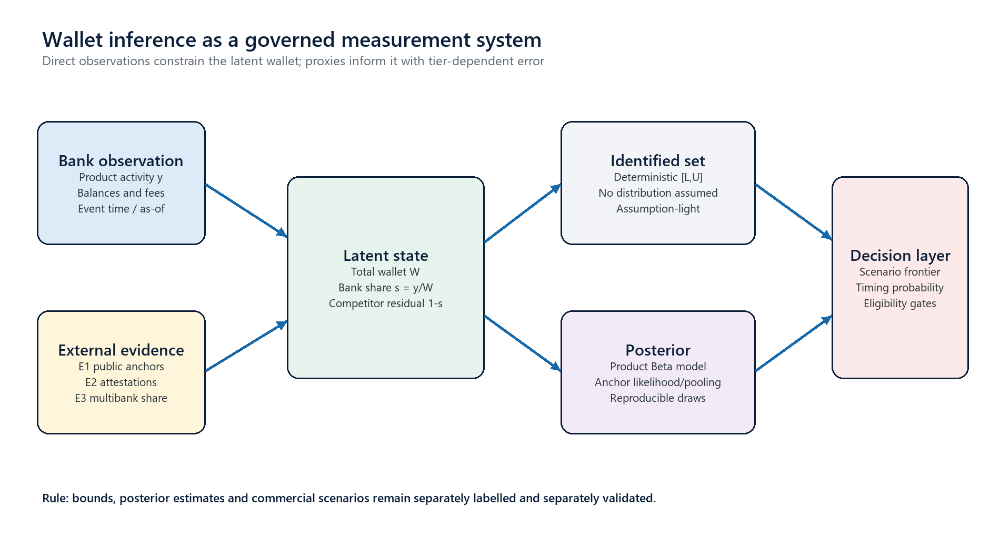
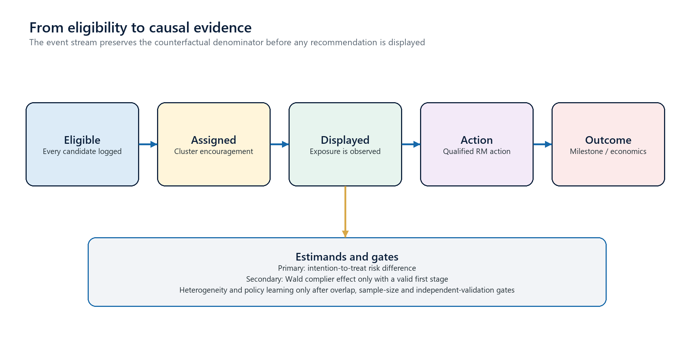
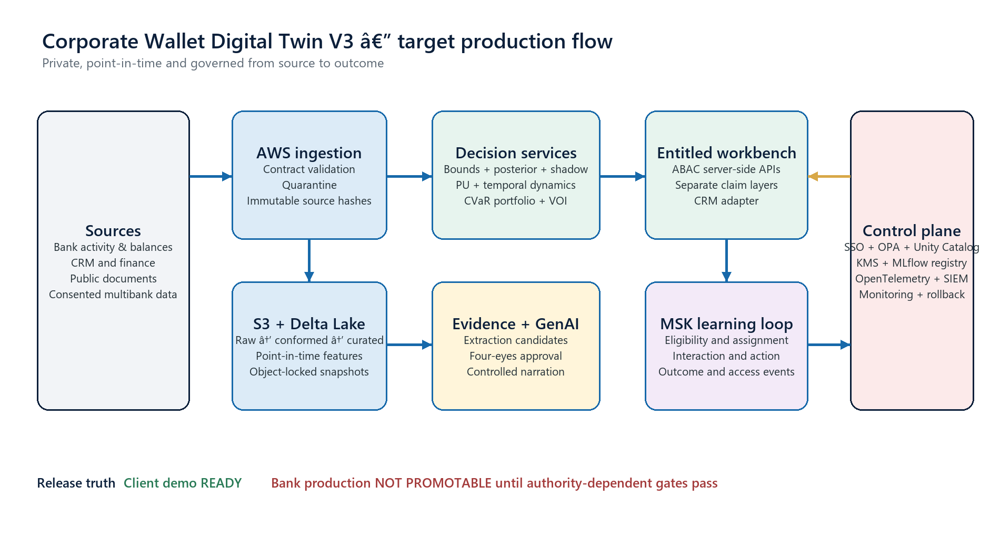
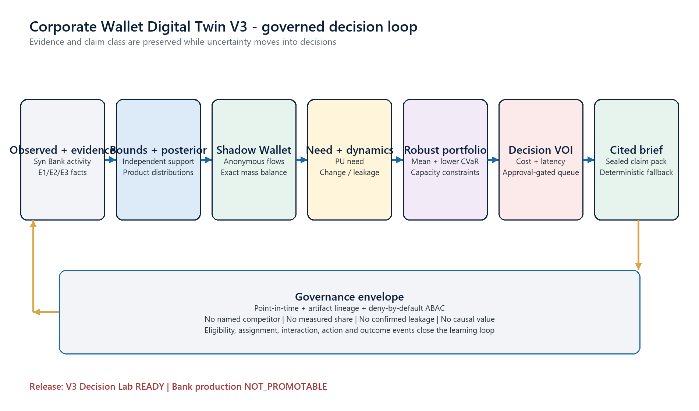

# Corporate Wallet Digital Twin V3.2.0 — Technical Foundations, Statistical Theory and Production Engineering

## Document control

| Field | Value |
|---|---|
| Document purpose | Literature-grounded technical specification of how V3 is being created, why each concept is used, how it is implemented, and how it must be validated |
| Version | 3.2.0 — promotion-readiness edition |
| Technical baseline | Repository state and validation artefacts available on 12 August 2026 |
| Team | Corporate Wallet Digital Twin |
| Team member | Christopher Koen |
| Intended readers | Corporate-bank product owners, quantitative analysts, Treasury and finance, model risk, data engineering, security, architecture, GenAI governance and relationship-management leaders |
| Product scope | Collections, Payments, Liquidity, Cross-border FX and Trade Finance |
| Demonstration status | Client demonstration ready using Syn Bank simulation, audited public evidence and pinned representative datasets |
| Production status | `OFFLINE_CANDIDATE`; promotion machinery rehearsed, bank production `NOT_PROMOTABLE` |
| Normative language | “Must” denotes a release or safety requirement; “should” denotes a strong design recommendation; “may” denotes an optional extension |
| Source hierarchy | Implemented source and frozen outputs; primary peer-reviewed literature; official standards and vendor documentation; programme design decisions |

## V3.2 control theory: evidence-aware promotion by construction

The Promotion Readiness Twin treats authorization as a typed, cumulative state
machine rather than a release-report label. For target state `s`, every gate
`g ∈ G_s` returns two outcomes. `R_g` is the real-bank decision and `H_g` is the
rehearsal decision. A transition is eligible only if every cumulative blocking
`R_g = PASS`; `H_g = PASS` can demonstrate only that the evaluator, evidence
binding and refusal behavior execute. No score can override a failed gate.

Let severity weight `w_g` be 5, 3 or 1 for critical, high or standard gates.
The audit indicators are:

```text
PMR_s = 100 * Σ_g w_g I(evaluator implemented ∧ positive test ∧ failure test
                         ∧ valid signed rehearsal PASS) / Σ_g w_g

BER_s = 100 * Σ_g w_g I(real-track PASS) / Σ_g w_g
```

`SYNTHETIC_REHEARSAL`, `SIMULATED_POLICY` and `NOT_AVAILABLE` contribute zero
to BER. PMR and BER are not probabilities and are never combined. Authorization
is the conjunction of gate outcomes plus accountable approval, not either score.

Mode integrity is a signed type discipline. An RFC 8785 canonical payload is
placed in a DSSE-style envelope. Trust roots bind a key to allowed modes,
environments, owner/approver roles, validity and revocation. Local P-256 and
GitHub OIDC/Sigstore signers are restricted to rehearsal/public packaging.
Only a bank-configured AWS KMS ECDSA signer may potentially carry `REAL_BANK`
or `BANK_ATTESTED`, and fixture mode loads no such trust root. Semantic hashes
exclude publication timestamps; signatures cover the complete published
envelope. Identical analysis can therefore have a stable content digest while
two publications remain distinguishable and independently auditable.

Consequence is factored from maturity through a capability lattice. Discovery,
posterior wallet, measured share, scenario economics, proposal, live GenAI and
causal value each require distinct evidence. This prevents operational success
from silently licensing an analytical claim: E3 absence blocks measured share
but not hidden shadow; unapproved rates block commercial value; unknown material
feasibility permits discovery only; and positive independently validated ITT
evidence is the only route to causal value.

The simulation programme is falsification-oriented. The synthetic E3 panel
creates hidden wallet/share truth under heterogeneity, selection bias,
measurement error, censoring and point-in-time restatement; the sample-size
planner repeats client-held-out temporal calibration at n = 20, 30, 40, 60,
80, 100 and 150 with Wilson Monte Carlo intervals. The economics lab performs
10,000 correlated Latin-hypercube draws for 16 solution ledgers. The timing lab
plants a discrete hazard in 2,000 36-month trajectories. The causal lab uses
analytic cluster-trial search followed by 2,000 Monte Carlo replications. The
GenAI suite contains 120 sealed cases and 1,000 deterministic mutations. All
carry `SYNTHETIC_REHEARSAL` and cannot satisfy real gates.

The accelerated shadow rehearsal advances virtual time without sleeping. A
critical day-17 reconciliation failure resets the clean counter; days 18–47
then establish 30 consecutive rehearsal days while real elapsed bank days stay
zero. Entitlement breach, stale evidence, unsupported GenAI, missing artifact,
high vulnerability, latency and refresh failures are isolated negative
scenarios. This proves refusal behavior; it does not pretend calendar operation
occurred.

Implementation is service-owned and append-only: a twelfth promotion service,
20 additive `/v3` paths, a single promotion event topic, PostgreSQL workflow
and outbox state, Delta governance history, MLflow artifact resolution and a
workbench Model Risk projection. Promotion is never automatic. A signed
decision is evidence for accountable human approval, not the approval itself.
The decision package is RFC 8785 canonicalized and DSSE-signed; the approval
must repeat both its `decision_id` and exact payload SHA-256. This prevents an
approval from surviving recalculation, expiry or any other change to the
decision it was actually reviewing.

## V3.1 scientific extension: from product opportunity to decision twin

### V3.1.1 measurement-governance correction

The primary estimand remains total wallet and share under the identity `A=qT`. The Decision Twin consumes?rather than replaces?this wallet evidence. A versioned measurement policy sets pooling weights `E0=0.00`, `E1=0.35`, `E2=0.60`, `E3=0.90`, and `E4=0.94`; the historical E1 weight 0.84 is retained only in frozen V1 material. Approval is a hard gate: 31 approved source facts activate 15 anchors for three clients, while 51 developer-verified but pending facts remain excluded. The corrected 20 ? 5 projection is therefore 15 publicly anchored and 85 prior-led opportunities. Sensitivity evaluates E1 weights 0.20, 0.35, and 0.50 against interval width, known-truth coverage, CRPS, and opportunity ranking.

V3.1 changes the decision-theoretic unit from `(client, product)` to a structured action:

```text
a = (client, stakeholder role, business problem, solution bundle, engagement window).
```

This is not a cosmetic change. It prevents the ranking policy from treating product propensity as the decision. A banker can act only when a business issue is supported, a responsible role is defensible, a solution is compatible, value is separated by beneficiary, feasibility is explicit and the timing statement is evidence-backed. The existing V3 client-product posterior remains an input to the problem and solution estimators; it is not discarded or relabelled.

### 0.1 Formal state and observation model

Let `X_i(t)` denote the latent business state for client `i` at decision time `t`. V3.1 represents `X_i(t)` with twelve components: revenue, cost, working capital, funding, liquidity, operations, geography, currency/commodity exposure, projects/SPVs, stakeholder responsibility, risk, and strategy/events. The platform does not observe `X_i(t)` directly. It observes a heterogeneous, availability-dated evidence set:

```text
D_i(t) = {bank observations, approved public claims, attestations, model artefacts : available_date <= t}.
```

Each evidence item has a measurement type, evidence tier and claim class. A Business Twin component is therefore a projection `T_k(D_i(t), theta_k)` with status `SUPPORTED`, `INFERRED`, `UNKNOWN` or `NOT_APPLICABLE`. A component is not a generative “digital clone.” It is a point-in-time, evidence-linked state summary with explicit missingness.

The dynamic graph factorises state into an attribute layer and an event layer. Attribute nodes represent persistent entities and exposures; event nodes represent maturities, projects, tenders, acquisitions, flow changes and detected regimes. This separation follows the useful retrieval pattern in FinKario [58], but V3.1 does not import its investment-prediction performance as validation of corporate-banking decisions. Graph paths are explanatory objects, not causal paths.

### 0.2 Problem detection under weak labels

For problem `j`, deterministic rules first produce an identification state `I_ij(t)` and reason codes. A scenario updater combines public evidence, bank observations, V3 PU outputs, change points and governed priors:

```text
p_ij(t) = P(problem_ij | D_i(t), policy_j).
```

Without adjudicated outcomes, `p_ij(t)` is a governed scenario weight, not a calibrated posterior probability. The implementation records positive evidence `D+` and counter-evidence `D-` separately so a narrator cannot erase contradiction. Commercial eligibility requires at least one critical signal that is bank-observed, approved E1 or approved E2. Pending E1 and all unreviewed LLM candidates are excluded.

The intensity output is an interval `[l_ij, m_ij, u_ij]`. It carries its units and claim class. Rules cannot create data: if inputs required for working-capital gap, refinancing exposure or FX exposure are missing, the indicator returns a missing-input state rather than zero.

### 0.3 Role resolution as policy, not person prediction

The stakeholder resolver implements a responsibility matrix `R(problem, solution, role)`. Its output is a role distribution or scenario weight, ownership rationale, secondary roles and an attestation requirement. This is preferable to an unvalidated named-contact ranking model for three reasons: sparse person-level labels, privacy/entitlement risk, and organizational non-stationarity. Named individuals are unavailable in fixture mode and must come only from entitled CRM resolution in a bank. The LLM cannot create a named stakeholder assertion.

### 0.4 Multi-solution measurement

Each of sixteen solution estimators implements an independent bounds layer and a probabilistic/scenario layer appropriate to its economic quantity. Transaction banking models flows and operational benefits; hedging models exposure/notional and risk reduction; lending models funding gaps and facility intervals; DCM models financing need and indicative mandate economics; project finance models SPV cash-flow capacity; agency models event-linked addressable flow; sustainable finance requires evidence-qualified capex; advisory models event and transaction-size scenarios.

For solution `s`:

```text
Z_is(t) = {need weight, amount/exposure interval, timing, client value,
           bank value, feasibility, lineage}.
```

Every estimator must either return a valid `Z_is(t)` or a fail-closed reason. “Unavailable” is a valid model result. Eleven new families remain `SCENARIO` until solution-specific empirical and economics gates pass.

### 0.5 Funding-route intelligence

A material funding requirement has route set `r` = bank debt, bond/DCM, equity, project finance, internal cash and hybrid/other. The transparent baseline calculates auditable route scores from leverage, cash cover, maturity pressure, historical route, project/SPV status and capital-market evidence, then applies softmax:

```text
P(route=r | x) = exp(score_r(x)) / sum_q exp(score_q(x)).
```

The distribution sums to one and exposes every contribution and missing input. It is a governed scorecard, not fitted truth. A multinomial challenger is registered but cannot replace it until at least 500 point-in-time financing events exist, with at least 50 for every promoted route and issuer-held-out plus temporal validation.

### 0.6 Client and bank utility

Client and bank value are separate functions because transferring value between parties is not the same as creating joint value. Client components may be monetised, proxy, qualitative or unavailable. Examples include:

```text
WorkingCapitalRelease = DailyOperatingCost * DeltaCCC
FundingSaving = Amount * DeltaBps * Days / (365 * 10,000)
LiquidityBenefit = IdleCash * YieldImprovement + AvoidedBorrowingCost
OperationalBenefit = Volume * (UnitCostBefore - UnitCostAfter) - ImplementationCost.
```

FX, rate and commodity outputs are risk-reduction scenarios, not guaranteed savings. The bank engine remains fail closed:

```text
DeltaV_bank = Revenue - FTP - Liquidity - ExpectedLoss - Capital
              - Hedging - Execution - Servicing - OperatingCost - CostToWin.
```

Coverage time, onboarding, credit/legal and integration effort are explicit. Direct opportunity value and three-year relationship value are stored separately. Causal incremental value remains null.

### 0.7 Feasibility as a vector

Feasibility is a six-dimensional vector `F(a)` over capability, credit/risk, compliance/conduct, legal/jurisdiction, operations/onboarding and technology/integration. Each coordinate is `PASS`, `FAIL`, `UNKNOWN` or `NOT_REQUIRED`. Any failure blocks. A material unknown restricts the action to discovery or validation. Only all required passes may support a product proposal in pilot/production.

Risk and friction remain distinct covariates. Folding both into a generic confidence score would make a high-risk/low-friction opportunity indistinguishable from a low-risk/high-friction opportunity. V3.1 carries both through the Pareto and policy layers.

### 0.8 Robust Pareto dominance and CVaR plan

For scenario draw `omega`, candidate `a` has vector:

```text
z_a(omega) = (need, client value, bank value, timing, relationship value,
              strategic value, -risk, -friction, feasibility).
```

Candidate A robustly dominates B when A is no worse on benefit dimensions and no worse on risk/friction in at least 80% of common draws, with one strict improvement. V3.1 computes a within-client/problem frontier and an entitled portfolio frontier before applying policy weights. This preserves genuine trade-offs and prevents an opaque scalar from hiding domination.

The governed benefit score is:

```text
Benefit = .25 Need + .20 ClientValue + .20 BankValue + .15 Timing
          + .10 RelationshipValue + .10 StrategicValue

AdjustedBenefit = Benefit * Feasibility * (1 - .50 Risk) * (1 - .35 Friction).
```

The weekly plan solves a mixed-integer program:

```text
max 0.45 E[AdjustedBenefit] + 0.55 CVaR_10%(AdjustedBenefit)
```

subject to eight-conversation capacity, client, client-role, solution-family, sector, mutual-exclusion and feasibility constraints. Common draws make dominance, sensitivity and value-of-information comparisons reproducible. Deterministic tie-breaking and solver status are recorded. A greedy fallback is permitted only with `DEGRADED_FALLBACK`.

### 0.9 Decision-focused active learning

Generic uncertainty reduction is not sufficient. Following the decision-focused principle of Sundin et al. [56], the system asks only when information can change a decision:

```text
VOI(Q) = E[max_a U(a | Answer(Q))] - max_a E[U(a)] - Cost(Q) - Delay(Q).
```

The estimator uses 512 common draws and an explicit answer-state model. Questions that cannot change rank, bundle, feasibility or abstention are rejected even if the variable is statistically uncertain. Only positive-net-VOI questions are selected. The client-answer workflow is bitemporal: submission creates pending E2; approval creates a new version; only then are the twin, graph, intervals and plan rebuilt.

### 0.10 Controlled language generation

One bounded orchestrator performs five tasks: document-to-claim extraction, approved-event implication candidates, question wording, stakeholder-specific explanation and closed-pack briefing. Arithmetic, graph traversal, rank, VOI, value and citations are deterministic. `ConversationBrief` has Why, How and What sections, value statements, citations, missing evidence, feasibility, the primary question, prohibited claims and abstentions.

The compiler constructs a closed set of permissible facts and rejects any number, role assertion, path or citation not present. Provider failure returns deterministic output. This architecture limits the LLM to translation under schema and evidence constraints rather than treating it as an autonomous analyst or CRM actor.

### 0.11 Point-in-time platform semantics

Every curated V3.1 product carries event time, valid time, ingestion time, availability date, source hash, transformation version, owner, quality and entitlement domain. This is necessary for leakage-free replay and for proving which version supported a banker decision. Delta tables are append-only with change data feed. Operational PostgreSQL stores workflow and an outbox rather than analytical truth. MSK uses four domain topics, and an event envelope carries version, type, decision-object correlations, artifacts and entitlements.

Repositories are interfaces: the fixture repository produces deterministic demo results; Delta and PostgreSQL adapters are production boundaries and deliberately raise when the target bank infrastructure is absent. Atomic snapshot promotion prevents a BFF from serving a partially updated twin and plan.

### 0.12 Validation implications

V3.1 validation is structural, statistical, economic, security and operational. Structural tests enforce 20 x 12 twins, 20 x 16 solution projections, no dangling graph edges, no named stakeholders, strict schemas and backward-compatible routes. Statistical tests enforce bounds coherence, probability sums, common-draw reproducibility, positive-net-VOI and scenario labels. Economic tests enforce dual-ledger separation, currency/sign/unit integrity, fail-closed rates and null causal value. Security tests enforce client filtering and no full-portfolio decision objects in the browser.

The representative fixture demonstrates mechanics, not external validity. Promotion still requires E3 calibration, approved economics, empirical problem/funding validation, live identity/catalogue/SIEM controls, provider adjudication, qualified RM outcomes, a randomized trial and clean shadow operation.

> This document deliberately separates scientific validity from software completeness. A service, schema or model can be implemented and tested while the corresponding production claim remains unavailable because the necessary bank data, authority, operating history or independent approval does not yet exist.

## Executive synthesis

The Corporate Wallet Digital Twin V3 is a governed decision system for a partially observed corporate financial network. It estimates the size and composition of a client's addressable transaction-banking wallet, reconstructs distributions over plausible anonymous external flows, distinguishes product need from selective labels, detects temporal regime changes, translates uncertainty into a capacity-constrained RM action portfolio, chooses which missing evidence is worth acquiring and records the events required to learn causal value. It is not a literal accounting replica of a corporate treasury. It is a point-in-time, probabilistic and evidence-linked representation of opportunity under incomplete observation.

The central scientific problem is missing data. A bank directly observes its own flows, balances, facilities, fees and interactions, but normally does not observe the client’s complete multibank wallet or the identity and share of every competitor. Public financial statements expose economically relevant totals—revenue, costs, receivables, payables, cash, debt and maturity schedules—but these are neither exact transaction-banking wallets nor contemporaneous multibank labels. Relationship-manager knowledge can be informative but may be selective, stale or subjective. The design therefore follows a measurement-system logic: observations constrain a latent wallet; evidence of different quality enters with explicitly different error; deterministic bounds remain separate from probability models; commercial assumptions remain separate from estimates; and causal labels require an experiment rather than a prediction.

Five epistemic layers are preserved end to end:

- **Observed** bank activity is a recorded bank fact, not a prediction.
- **Identified bounds** are assumption-light feasible ranges implied by observation, capacity and admissible external constraints.
- **Posterior estimates** are distributions conditional on a stated model, prior, calibration panel and evidence likelihood.
- **Scenarios** apply governed target shares, prices, costs and constraints; they describe conditional economics rather than forecasts of realized value.
- **Causal estimates** quantify incremental effects only after a valid assignment, exposure, action and outcome design has been executed and independently validated.

This layered semantics is the most important control in V3. It prevents a prior-led estimate from being presented as “measured share,” an entropy-regularised reconstruction from being presented as a named competitor network, a PU score from being presented as a confirmed need, a change point from being presented as confirmed leakage, a target-share scenario from being presented as “optimal,” a timing score from being presented as a calibrated event probability, and observational correlation from being presented as uplift. The approach is grounded in customer-wallet modelling [1–2], partial identification [3], Bayesian hierarchical measurement [4–6], proper probabilistic scoring and conformal calibration [7–8], event-history analysis [16–19], randomized/causal policy learning [20–25], entropy-regularised optimal transport [52–53], positive–unlabelled learning [54], Bayesian online change-point detection [55], downside-risk optimization [57] and cost-sensitive value of information [56].

The implemented analytical core is intentionally transparent. The V2 substrate remains responsible for deterministic bounds, five product-specific posterior-predictive Beta models, selection-weighted analogue observations, direct E3/E4 updates, tier-weighted public-anchor pooling, fail-closed economics, 10,000-draw correlated sensitivity, the transparent timing baseline, experiment analysis and the controlled GenAI provider boundary. The additive `wallet_twin_v3` package implements entropy-constrained Shadow Wallet reconstruction, positive–unlabelled product-need estimation, Bayesian online run-length filtering, leakage signals, treasury graphs, 512-scenario lower-tail-CVaR portfolio selection, decision-directed evidence acquisition and an evidence-cited brief. The V3 layer consumes the V2 posterior and provenance; it never mutates the evidence tier or replaces deterministic bounds.

The production architecture applies the same epistemic design to engineering. Immutable evidence and analytical snapshots are held in S3 with KMS and Object Lock; Delta Lake and Unity Catalog provide point-in-time data products, row-level controls and lineage; MLflow records model, prior, transformation and evaluation versions; private EKS services own operational PostgreSQL state; MSK carries eligibility, assignment, exposure, action, outcome and access events; OPA enforces deny-by-default object authorization; OpenTelemetry emits traces, metrics and logs to an approved SIEM. BCBS 239 motivates accuracy, completeness, timeliness and lineage in risk-relevant data [36], while NIST ABAC and OWASP object-authorization guidance motivate policy evaluation at every data-access layer [40–41].

Current validation is meaningful but bounded. The evidence estate contains 82 E1 facts across all 20 clients; 51 expanded facts pass automated page-grounding checks but have no finance-SME or independent approval. The known-truth wallet laboratory reports 88.7% nominal 90% share/wallet coverage in the selection-weighted-plus-anchor configuration, with split-conformal coverage of 93.5% for share and 91.3% for wallet on entity-disjoint evaluation records. V3 adds 100 Shadow Wallet reconstructions, 1,500 anonymous edges and 256 draws per reconstruction with zero exported-currency mass-balance error; 33 transparent PU positives; 100 deterministic 36-month change-point replays; a 12-action portfolio satisfying every capacity limit; and eight positive-net-VOI requests. The release contains zero measured-competitor-share claims and zero causal-value claims. These results demonstrate mechanics under representative known truth; they cannot establish external validity. The deterministic GenAI baseline passes 809 governed checks, including 640 stress cases and zero prompt-injection successes in that bounded suite. V3.2 additionally records 8 accepted hackathon external-provider outputs from 9 targets; this is distinct from bank provider approval and independent finance-SME adjudication. Local operational rehearsal records a 274 ms p95 read latency over 300 requests and byte-identical recovery of a 500-event stream; it does not establish an AWS/Databricks service-level objective or bank RPO/RTO.

The intended production claim is therefore precise: V3 is a technically implemented and literature-grounded bank-production candidate whose client demonstration is ready. It is not yet a bank-production decision system. Promotion requires the evidence, calibration, economics, identity, infrastructure, live-provider, supervised-RM, randomized-trial and clean-shadow evidence that only a bank-controlled operating environment can create.

## 1. Problem formulation and decision scope

### 1.1 The wallet is a latent economic construct

For client `i`, product `p` and point in time `t`, let `W_ipt` denote the total contestable wallet basis: the amount of economically relevant activity from which the client could plausibly allocate product business across banks. Let `Y_ipt` denote activity observed by the focal bank and `S_ipt` its wallet share. The basic identity is:

```text
Y_ipt = S_ipt × W_ipt,          0 ≤ S_ipt ≤ 1,          W_ipt ≥ Y_ipt.
```

Only `Y_ipt` is directly observed in ordinary bank-only data. Inferring both `S_ipt` and `W_ipt` from one equation is underidentified unless additional restrictions, measurements or priors are introduced. This is why a single “share-of-wallet model” that silently treats public turnover or banker judgment as ground truth is epistemically unsafe. Du, Kamakura and Mela frame size and share of customer wallet as jointly latent quantities and show why accounting for both changes targeting decisions [1]. Fox and Thomas use a hierarchical Bayesian framework to infer wallet share while borrowing strength across customers [2]. V3 adopts the same high-level problem structure but adds explicit evidence tiers, independent bounds and bank-specific production controls.

The total wallet is also product-specific. A collections wallet may be related to receivables, sales channels and transaction counts; a payments wallet to supplier disbursement and payroll activity; liquidity to investable balances and operating cash; FX to foreign-currency revenue, costs and hedging flows; and trade finance to inventory, payables, imports, exports and facility utilization. The product submodels share a common contract but do not share a single semantic proxy or prior.

### 1.2 Decision estimands

The system is designed around explicit estimands rather than a generic “opportunity score.” For every client-product-as-of tuple it can answer five different questions:

| Layer | Formal target | Decision meaning | Permitted evidence |
|---|---|---|---|
| Observed | `Y_ipt` and reconciled observed contribution | What business the bank recorded | Bank ledger/activity and E4 reconciliation |
| Identified | Feasible set `W_ipt ∈ [L_ipt,U_ipt]` | What wallet sizes remain possible under stated constraints | Observation plus auditable restrictions |
| Posterior | `p(W_ipt,S_ipt ; D_t,M_v)` | What distribution follows from data available by `t` and model version `v` | E0–E4 with tier-specific measurement assumptions |
| Scenario | `V_ipt(q,r,c ; D_t)` | What contribution would follow under target share `q`, rate card `r` and constraints `c` | Governed commercial inputs; no causal label |
| Causal | `E[Y_i(1)-Y_i(0)]` or policy value | What incremental effect is caused by encouragement/exposure | Valid assignment, exposure and outcomes |

This taxonomy corresponds to the `ClaimClass` enum in `contracts.py`: `OBSERVED`, `IDENTIFIED_BOUND`, `POSTERIOR`, `SCENARIO` and `CAUSAL`. It is propagated through APIs, event envelopes, explanation payloads and workbench visual layers. A recommendation is eligible only when its requested label is supported by both its evidence tier and its validation state.

### 1.3 Unit of analysis and time

The analytical key is not simply client. It is `(client, legal entity, product, as_of, entitlement domain, model snapshot)`. `as_of` is mandatory because public filings, exchange rates, account activity, prices and model artefacts become available at different times. V3 distinguishes:

- **Event time**, when an economic or interaction event occurred.
- **Valid time**, the interval over which a fact or rate applies.
- **Available date**, the first time evidence could legitimately have entered a model.
- **Ingestion time**, when the platform received the record.
- **As-of time**, the decision cut-off used to reconstruct state.

A fact with reporting period end 30 June but publication date 15 September is unavailable to a 31 August snapshot. A restatement creates a new valid-time version; it never overwrites the historical record that was available to an earlier decision. These bitemporal controls are the foundation for leakage-free model validation and causal analysis.

### 1.4 Decision boundary

The twin may prioritize research, suggest banker actions, assemble evidence, evaluate scenarios and record outcomes. It must not autonomously communicate with a client, change a price, approve credit, book a product, alter a CRM pipeline stage or claim causal value. The system is a decision-support and learning instrument. Human and institutional authority remain outside the model boundary.

## 2. Literature-to-system design

### 2.1 Research programmes combined by V3

V3 combines bodies of literature that are often treated independently:

| Research programme | Core idea imported | V3 implementation consequence |
|---|---|---|
| Customer-wallet modelling [1–2] | Wallet size and bank share are related latent quantities | Joint wallet/share outputs by product; hierarchical borrowing across clients |
| Partial identification [3] | Incomplete observation may identify a set, not a point | Independent deterministic bounds; no probability claim attached to feasibility |
| Bayesian multilevel measurement [4–6] | Pool information while preserving segment/product heterogeneity and uncertainty | Product priors, weighted calibration observations, posterior predictive draws |
| Proper forecast evaluation [7–8] | Sharpness matters only subject to calibration | Coverage, CRPS, rank stability and split-conformal audits |
| Bank transfer pricing [9–12] | Revenue must be decomposed into funding, liquidity, risk, capital and cost components | Effective-dated fail-closed rate cards and separate contribution layers |
| Global uncertainty analysis [13–15] | Uncertainty must be propagated jointly rather than one assumption at a time | Latin-hypercube draws, governed correlation, rank frequency and concentration |
| Survival and recurrent-event analysis [16–19] | Timing requires risk sets, censoring and named event processes | Start-stop records and 30/60/90-day cumulative event probabilities |
| Randomized and causal learning [20–25] | Prediction does not identify incremental action | Eligibility denominator, cluster encouragement, ITT first and gated IV/policy learning |
| Financial-document intelligence [26–28] | Financial facts are embedded in text, tables, layout and arithmetic | Layout-aware extraction candidates plus deterministic financial validation |
| GenAI evaluation and governance [29–35] | Schema compliance is insufficient; factuality, abstention, attacks and data controls require explicit evaluation | Structured outputs, claim compiler, sealed sets, human review, no tools/actions |
| Risk-data and security standards [36–48] | Traceability, least privilege, immutable audit and continuous risk management | Point-in-time metadata, ABAC, object authorization, lineage, registries and observability |
| Human adoption and trial reporting [49–50] | Expert override and staged exposure affect trust and treatment fidelity | Shadow mode, supervised pilot, mandatory feedback and cluster-trial protocol |
| Entropy-regularised transport and network reconstruction [52–53,63] | Infer couplings that respect marginals while retaining structural uncertainty | Anonymous Shadow Wallet ensemble, exact mass balance and no named competitor inference |
| Positive–unlabelled learning [54] | Selection into known positives differs from the latent class | Transparent SCAR correction, exposed selection constant and no false-negative assumption |
| Bayesian online change detection [55] | Maintain a posterior over time since the latest regime change | Deterministic run-length replay, explicit hazard and labelled uncertainty |
| Cost-sensitive value of information [56] | Acquire data when expected decision-loss reduction exceeds cost | Approval-gated evidence queue rather than generic semantic retrieval |
| Coherent downside risk and portfolio optimization [57] | Optimize a portfolio against both mean and lower-tail outcomes | CVaR-aware RM capacity allocation with client, product and sector constraints |
| Legal-entity, trade and macro public sensors [58–62] | Enrich state through governed, versioned external signals | Registered point-in-time adapters; no silent connection or entity resolution |

No individual paper defines the complete architecture. The design is a programme synthesis: the literature establishes valid statistical objects and known failure modes; banking and security standards establish control objectives; the repository realizes those objectives as types, algorithms, services, policies and release gates.

### 2.2 Literature is not implementation proof

Referencing a method does not establish that V3 has implemented the full published model. The current wallet estimator is a transparent hierarchical posterior-predictive Beta empirical-Bayes model, not a full joint Markov-chain Monte Carlo model with client, sector, geography and time-varying random effects. Public-anchor integration uses a tier-weighted geometric pooling rule that approximates a noisy measurement update; it is not yet a formally estimated proxy likelihood. The sensitivity module’s “value of information” output is an absolute Spearman association useful for prioritization, not formal expected value of perfect or sample information. The timing baseline is a fixed exponential hazard with governed multipliers, not a fitted Cox model. The document uses these precise labels throughout.

### 2.3 Design principles derived from the literature

1. **Identification before estimation.** Determine what the observation and hard constraints imply before adding a probability distribution.
2. **Calibration before sharpness.** A narrower interval is valuable only if empirical coverage is retained [7].
3. **Likelihood weight follows evidence quality.** Direct E3/E4 observations must materially outweigh public proxies or priors.
4. **Time is part of every datum.** Training and replay must reconstruct what was knowable, not what is known now.
5. **Economics fail closed.** Missing or expired bank-owned inputs block monetary output rather than trigger a convenient default.
6. **Prediction is not causation.** Recommendation value remains scenario value until an identified treatment effect exists.
7. **Language models propose; deterministic systems and humans dispose.** A schema-valid response is a candidate, not an approved fact.
8. **Authorization is evaluated on the object.** Authentication alone does not determine whether a user may read a client, product or sensitive economic value [40–41].
9. **Every result is reproducible from immutable versions.** Dataset, transformation, model, prior, prompt, schema, rate and policy artefacts travel with the record.

## 3. Epistemic type system and canonical contracts

### 3.1 Evidence tiers

`EvidenceTier` is an ordered governance vocabulary, not a numeric certainty score:

| Tier | Meaning | Typical source | Permitted interpretation |
|---|---|---|---|
| E0 | Governed prior or benchmark assumption | Approved prior registry, representative fixture, product hypothesis | Prior-led posterior or explicitly simulated scenario |
| E1 | Audited public evidence | Annual report, audited financial statement, official filing | Noisy, censored or interval anchor; never direct bank share |
| E2 | Client or RM attestation | Confirmed banking panel, treasury interview, RM verification | Client-validated proxy or stated allocation, with freshness and scope |
| E3 | Multibank observation | Client-consented transaction aggregation, validated multibank reporting | Measured wallet/share eligible within observed coverage |
| E4 | Reconciled economics or outcomes | Finance-reconciled contribution, confirmed outcome | Reconciled monetary or causal input eligible subject to design |

The ordering does not imply that every E3 observation is correct or every E1 observation weak. It determines the default measurement-error treatment and which labels become eligible. Scope, freshness, coverage, selection and reconciliation still matter.

### 3.2 Strict value objects

`contracts.py` uses Pydantic models as executable semantics. `Money` stores a decimal amount, original currency/unit, normalized amount and FX-policy reference; binary floating point is avoided for governed monetary calculations. `IntervalEstimate` requires ordered lower, median and upper values, nominal coverage, model version and as-of time. `PointInTimeMetadata` carries source keys, event/valid/available/ingestion times, source hash, transformation version, quality status, owner and entitlement domain. `ArtifactReference` pins the versions that generated a result.

The value object protects meaning at boundaries. For example, an interval of `[10, 6, 12]` is invalid before it reaches the database. A public fact without `available_date` is not silently assigned its reporting-period date. A synthetic rate card in a controlled environment is rejected. An assignment event without assignment probability is invalid because off-policy or randomization analysis would be unrecoverable.

### 3.3 Recommendation eligibility as a first-class result

The platform returns `RecommendationEligibility`, not merely a Boolean. It contains allowed/blocked state and machine-readable reasons such as `MISSING_RATE_CARD`, `EVIDENCE_STALE`, `ENTITLEMENT_DENIED`, `UNAPPROVED_MODEL`, `INSUFFICIENT_E3`, `SHADOW_HIDDEN` or `CAUSAL_LABEL_NOT_VALIDATED`. This converts governance from prose into an auditable decision. The workbench can explain a blocked value without exposing the sensitive input that caused the block.

### 3.4 Contract evolution

Schemas are versioned under `contracts/jsonschema`; the OpenAPI contract is under `contracts/openapi.json`. Backward-compatible changes may add optional fields. Breaking changes require a new version, dual-read migration, replay validation and event-consumer compatibility. An event schema must never be modified in place because historical replay is itself an analytical input.

## 4. Point-in-time data, provenance and leakage control

### 4.1 Bitemporal reconstruction

Let `x_j` be a feature fact with economic event time `e_j`, availability time `a_j`, valid interval `[v_j^-,v_j^+)` and ingestion time `g_j`. A point-in-time feature vector for decision time `t` may include `x_j` only if:

```text
a_j ≤ t,       g_j ≤ snapshot_cutoff(t),       v_j^- ≤ t < v_j^+,
quality_j ∈ admissible states,       entitlement(user, object, t) = ALLOW.
```

Event time alone is insufficient. The `available_date` restriction prevents a filing published after the decision from entering historical features. Ingestion time detects late-arriving data and lets replay reproduce what the system actually knew. Valid intervals handle rate changes and restatements. The source hash and transformation version connect a displayed value to immutable evidence and code.

### 4.2 Layered lakehouse

The target Delta estate uses raw, conformed, curated, feature, training and monitoring layers:

- **Raw** preserves source payloads and receipt metadata without semantic coercion.
- **Conformed** validates identifiers, currencies, units, dates and source contracts; failures enter quarantine.
- **Curated** creates business entities and point-in-time facts with ownership and entitlement domains.
- **Feature** materializes reusable transformations with availability-time cut-offs.
- **Training** freezes entity-disjoint or rolling-origin snapshots and selection weights.
- **Monitoring** records quality, drift, coverage, latency, authorization and release decisions.

BCBS 239 emphasizes accuracy, integrity, completeness, timeliness, adaptability and traceability in risk-data aggregation [36]. V3 applies these ideas beyond formal risk reporting because an opportunity system that cannot reproduce its data lineage cannot support finance reconciliation, model validation or a controlled experiment.

### 4.3 Quarantine rather than coercion

Production records with missing critical keys, ambiguous units, future availability, unsupported currencies, invalid dates or stale ownership are quarantined. The ingestion service records the violated contract, source key, hash and remediation owner. It does not substitute a median, use today’s FX rate, infer a page or silently coerce text to zero. Defaults are allowed only when they are explicit E0 inputs in an approved registry and the resulting output is labelled accordingly.

### 4.4 Restatement lineage

An audited figure can be restated. The evidence service represents the original and restated facts as separate versions linked by `supersedes_fact_id`, with distinct source hashes, available dates and approval histories. A snapshot before the restatement continues to reference the old fact; a later snapshot may reference the new fact. This is essential for honest backtesting: replaying all history using the latest restated value would introduce hindsight.

### 4.5 Implemented data products

The repository defines curated Delta tables for client-product activity, calibration observations, effective rate cards, recommendation events and promotion decisions in `infra/databricks/curated_tables.sql` and `data_products.sql`. The V3 extension adds Shadow Wallet draws and edges, PU product-need estimates, Bayesian change-point state, leakage alarms, Treasury graph snapshots, portfolio scenarios and selections, and evidence-acquisition plans. Unity Catalog tags and policies are specified in `unity_catalog_controls.sql`, including client-level and sensitive-economics tags on the new products. The implementation is a deployable definition, not evidence that a bank metastore has been provisioned or that a production feed has reconciled.

## 5. Deterministic partial identification

### 5.1 Why bounds come first

When the total wallet is not observed, there may be many combinations of wallet and share consistent with bank activity. Partial-identification theory treats the inferential target as an identified set when assumptions do not select a unique point [3]. This is more honest than forcing a point estimate and then attaching a confidence interval whose apparent precision comes mainly from unacknowledged assumptions.

For non-negative observed activity `Y`, elementary feasibility gives `W ≥ Y`. If the bank is believed to have at least a minimum share `s_min > 0`, then `W ≤ Y/s_min`. External evidence may provide a lower or upper wallet constraint; capacity or market-size restrictions may provide another upper limit. The implemented engine computes:

```text
L = max(Y, L_evidence)

U_candidates = {U_evidence, capacity, Y / s_min} for all available admissible terms
U = min(U_candidates)

if U < L, report an inconsistent constraint set rather than reversing the interval.
```

The current code defensively sets `U ≥ L` so downstream contracts remain ordered. In production, an inconsistency flag should also be mandatory because collapsing contradictory evidence to a point can hide a data-quality or semantic error.

### 5.2 Independent implementation

`DeterministicBoundsEngine` in `bounds.py` accepts `BoundEvidence` and does not call the Bayesian model. This independence is architectural, not cosmetic. A posterior implementation defect must not alter the assumption-light range, and model reviewers must be able to reproduce the bound using only observation and registered constraints.

The result is labelled `IDENTIFIED_BOUND`. It is not a Bayesian credible interval and it has no frequentist coverage claim. The current contract uses a near-one `nominal_coverage` placeholder because the shared interval schema requires the field; this should be replaced in a future schema revision by an explicit `interval_semantics` enum so feasibility sets are not forced into probability terminology.

### 5.3 Identification assumptions register

Every non-trivial bound must point to an assumption record containing:

- Mathematical restriction, for example `S ≥ 0.05`.
- Economic rationale and product scope.
- Evidence tier and accountable approver.
- Effective period and geography/segment applicability.
- Sensitivity range and known failure modes.
- Whether violation is logically impossible, operationally implausible or merely uncommon.

Minimum share is particularly consequential: `Y/s_min` explodes as `s_min` approaches zero. It must never be embedded as a hidden constant. Capacity limits must distinguish bank capacity from market-wallet size; the former can constrain target share without constraining the client’s total wallet.

### 5.4 Interval narrowing as an empirical claim

Additional evidence normally narrows a feasible set by adding constraints, but a narrower probabilistic interval is not automatically better. V3 therefore reports two separate effects:

1. **Logical narrowing**, the reduction in width of the deterministic identified set.
2. **Statistical narrowing**, the reduction in posterior interval width, reported only with empirical coverage.

In the synthetic known-truth audit, adding E1 anchor pooling reduced the median wallet relative interval width from approximately 2.63 to 1.46 and produced a reported narrowing metric of 44.4%, while nominal-90% wallet coverage moved from 88.3% to 88.7%. Because the data are synthetic, this demonstrates the validation procedure, not real-world calibration.

## 6. Hierarchical posterior wallet and share model

### 6.1 Current implemented model class

The current estimator in `wallet_model.py` is best described as a product-specific hierarchical posterior-predictive Beta empirical-Bayes model with tier-weighted anchor pooling. It is hierarchical because product/segment evidence updates a governed product prior and can borrow information from an analogue panel. It is posterior-predictive because it retains reproducible draws for wallet/share intervals and scoring. It is empirical Bayes because hyperparameters are blended from weighted panel summaries rather than inferred jointly through a full probabilistic programme.

For a product prior mean `μ_0p` and concentration `κ_0p`, the prior share distribution is:

```text
S_ip ~ Beta(α_0p, β_0p)
α_0p = μ_0p κ_0p
β_0p = (1 - μ_0p) κ_0p.
```

The implemented priors are registered by product: Collections 0.36 with concentration 12; Payments 0.34/12; Liquidity 0.28/9; Cross-border FX 0.30/10; and Trade Finance 0.26/8. These are E0 governance inputs, not empirical truths. Their versions must be recorded with every output.

### 6.2 Weighted analogue evidence

Suppose calibration observation `j` contains share `s_j`, sampling/selection weight `w_j`, evidence tier `e_j` and similarity indicator. The implementation multiplies the selection weight by reliability: E2 0.25, E3 1.0 and E4 1.5, with a 0.35 discount for other-sector analogues. The weighted mean and Kish-style effective sample size are:

```text
μ_w = Σ w_j s_j / Σ w_j

n_eff = (Σ w_j)^2 / Σ w_j^2.
```

The Kish expression captures loss of information from unequal weights, but it does not by itself incorporate cluster correlation, stratification or model misspecification. In a real E3 panel, design-based or model-based variance must reflect the consented sampling design, repeated clients, geographic clustering and coverage gaps.

The prior and panel mean are blended with:

```text
λ = n_eff / (n_eff + 8)
μ_post = (1 - λ) μ_0p + λ μ_w.
```

An empirical variance implies a concentration parameter constrained to `[4,35]`, then blended with the prior concentration. The clipping prevents a small, homogeneous analogue panel from creating implausibly sharp intervals, but the thresholds are governed engineering safeguards and must be sensitivity-tested.

### 6.3 Direct E3/E4 measurement

If the client has a direct multibank share observation, V3 applies a much stronger update by adding concentration 400 for E3 or 800 for E4. This operationalizes the evidence hierarchy: direct measurement must dominate an E1 proxy or E0 prior. These concentrations are still assumptions about measurement precision. A production panel should estimate or calibrate them against reconciliation error, account coverage, unclassified transactions, currency conversion and observation-window mismatch.

### 6.4 Mapping share to wallet

Given observed activity `Y` and a share draw `S^(m)`, the mechanically implied wallet draw is:

```text
W^(m) = Y / max(S^(m), ε),
```

subject to deterministic bounds and domain constraints. Because a Beta distribution can place mass near zero, the lower-share tail can generate a heavy upper-wallet tail. This is an economic feature, not just a numerical nuisance: weak knowledge about a very small bank share implies substantial uncertainty about total wallet. The model must report skewed quantiles rather than mean ± standard deviation.

The implementation generates 4,000 draws with a stable seed derived from SHA-256 of the entity/product/snapshot inputs. Stable randomness makes the same frozen snapshot exactly reproducible while preserving variation across keys. Reproducibility is necessary for model validation and recommendation replay; it does not eliminate Monte Carlo error, which should be checked by draw-count sensitivity for production releases.

### 6.5 Public anchors as noisy measurements

An E1 anchor is represented as low/mode/high and sampled with a triangular distribution. It is combined with the wallet implied by bank share using geometric pooling:

```text
log W_pooled = (1 - ω_e) log W_share + ω_e log W_anchor,
```

with tier weights E1 0.35, E2 0.60, E3 0.90 and E4 0.94. The result is floored at observed activity and the share recalculated. Geometric pooling is appropriate for positive scale quantities and reduces dominance by extremely large levels, but it is a transparent approximation. A full production measurement model should instead specify product-specific proxy equations such as:

```text
log A_ik = a_k + b_k log W_ip + x_i'γ_k + u_sector,k + ε_ik,

ε_ik ~ Student-t(ν_k, 0, σ_k),
```

with censoring or interval likelihoods where the filing supplies only a bracket. Parameters must be learned from E3-linked clients, and proxy error must be validated out of sample. Public revenue should never be set equal to payments wallet; trade payables should never be set equal to trade-finance utilization.

### 6.6 Product-specific measurement equations

The common model shell supports different evidence maps:

| Product | Candidate latent wallet basis | Informative E1/E2 anchors | Key measurement errors |
|---|---|---|---|
| Collections | Receivable inflows and collection transactions | Revenue, receivable stock, DSO, channel mix | Non-bank settlement, netting, cash sales, seasonality |
| Payments | Supplier, payroll and operating disbursements | Cost of sales, payables, operating expenses, headcount | Internal transfers, card/acquirer routing, batch counts |
| Liquidity | Investable operating cash and surplus balances | Cash equivalents, short-term investments, working-capital cycle | Trapped cash, restricted balances, treasury centralization |
| Cross-border FX | Convertible foreign-currency receipts/payments and hedging | Geographic revenue/cost, functional/presentation currency, disclosed FX risk | Natural hedges, netting, derivatives, currency corridors |
| Trade Finance | Import/export settlement, guarantees, letters of credit and working-capital facilities | Inventory, payables, cost of sales, import/export exposure, debt maturities | Open-account trade, self-funding, facility utilization, tenor |

A production hierarchy should include random intercepts/slopes by sector, size, geography and relationship maturity, plus time effects. Partial pooling controls variance in sparse segments while allowing mining trade-finance intensity to differ from domestic services payments intensity. The full generative structure should be registered and estimated separately for each product; “five models” means five likelihoods, not one global score with product labels.

### 6.7 Graphical view



The diagram shows why evidence and posterior outputs are parallel to, not replacements for, deterministic bounds. Both feed the decision layer with their own semantics and validation status.

### 6.8 Selection bias in the E3 panel

Clients consenting to multibank observation are unlikely to be random. They may be more digitally mature, more engaged, more penetrated or concentrated in certain sectors. If `Ï€_i = P(I_i=1 | X_i)` is the inclusion probability, inverse-probability weighting uses `w_i = 1/Ï€_i`, usually clipped to control variance. The current laboratory clips weights at 6.0 and records the policy. Weighting can correct selection on observed covariates under positivity and correct propensity specification; it cannot correct unobserved selection without a stronger model or sensitivity analysis.

The production panel must be stratified across size, sector, geography, penetration, relationship maturity and product intensity. Diagnostics must include weighted/unweighted covariate balance, weight distribution, effective sample size, overlap, missing-bank coverage and segment-specific calibration. Direct E3 measurements should be reconciled to account coverage and observation window before receiving high likelihood weight.

## 7. Probabilistic validation and calibration

### 7.1 Calibration, sharpness and proper scoring

Gneiting and Raftery argue that probabilistic forecasts should maximize sharpness subject to calibration and should be evaluated with proper scoring rules [7]. For a nominal 90% interval `[L_i,U_i]`, empirical coverage is:

```text
coverage_0.90 = (1/n) Σ 1{L_i ≤ y_i ≤ U_i}.
```

Coverage alone is insufficient: an interval covering every outcome can be uselessly wide. V3 therefore reports coverage with interval width and Continuous Ranked Probability Score (CRPS). For predictive CDF `F` and outcome `y`:

```text
CRPS(F,y) = ∫ (F(z) - 1{y ≤ z})^2 dz.
```

For draws `X_1,...,X_M`, the empirical identity implemented in `wallet_model.py` is:

```text
CRPS ≈ (1/M) Σ |X_m-y| - (1/(2M^2)) ΣΣ |X_m-X_l|.
```

Lower CRPS is better. Because it is proper, a forecaster cannot improve expected score by reporting a distribution different from its true belief under the scoring assumptions.

### 7.2 Holdout design

Wallet validation must avoid leakage between clients and time. V3 uses client-level holdouts for cross-sectional analogue evaluation and rolling-origin splits for time-dependent features. Where a client appears repeatedly, all related records must remain in one fold unless the evaluation explicitly targets temporal generalization within known clients. Public-anchor parameters must be fitted without using evaluation-client E3 truth.

The release target is nominal-90% coverage between 85% and 95% overall, with no severe material-segment undercoverage, plus at least a 10% CRPS improvement over the frozen transparent baseline. The tolerance recognizes sampling error and avoids rewarding artificially wide intervals. Exact statistical confidence intervals for observed coverage should accompany the point estimate, especially in sparse products or sectors.

### 7.3 Split conformal audit

Conformal prediction can calibrate predictive sets under exchangeability without requiring the base model to be correct [8]. In split conformal, a base model is fitted on one set, nonconformity scores are computed on a separate calibration set, and a quantile of those scores expands the interval for evaluation records. V3’s synthetic audit keeps model-fit, conformal-calibration and evaluation entities disjoint.

The current report uses 230 calibration and 230 evaluation records. The share interval scale factor is 1.105, increasing median width by 10.5% and producing 93.5% coverage; wallet scale is 1.035, increasing median width by 3.5% and producing 91.3% coverage. These are useful known-truth mechanics. Exchangeability may fail under sector shift, macroeconomic change or panel selection, so production must also report coverage by product, sector, size and geography and consider weighted or group-conditional conformal methods.

### 7.4 Current known-truth results

| Metric | Current synthetic audit | Interpretation |
|---|---:|---|
| Calibration-panel entities | 148 | Representative simulation, not consented E3 clients |
| Model records | 1,200 | Synthetic known-truth only |
| Holdout records | 460 | Entity-level holdout in the reported configuration |
| Raw 90% share coverage | 88.7% | Inside the programme’s 85–95% aggregate gate |
| Raw 90% wallet coverage | 88.7% | Same caution as share coverage |
| Share CRPS | 0.0550 | Useful only relative to frozen alternatives on the same records |
| Wallet scaled CRPS | 0.2204 | Scale-normalized laboratory metric |
| Median share interval width | 0.3106 | Substantial uncertainty remains |
| Median wallet relative width | 1.4599 | Upper/lower spread remains economically material |
| Mean within-client rank Spearman | 0.503 | Moderate synthetic product-ranking agreement |

The programme must not market these numbers as empirical bank calibration. Their value is that the entire validation path—stratified panel, selection weights, known truth, holdout, scoring, conformal scaling and stress tests—is executable before real data arrive.

### 7.5 Posterior diagnostics for the full target model

A full Bayesian implementation must add chain diagnostics and posterior predictive checks: split-R-hat, effective sample size by parameter, divergences, energy diagnostics, prior-to-posterior movement, residuals by proxy and segment, predictive coverage by tier, and sensitivity to prior concentration and likelihood tails. If variational inference is used for scale, its interval calibration must be compared with MCMC on a representative subset because mean-field approximations can understate posterior dependence and tail uncertainty.

## 8. Economics, pricing and target-share decision theory

### 8.1 Three monetary objects

V3 exposes three monetary quantities separately:

1. **Reconciled observed contribution**: finance-reconciled value of activity already on the bank’s books.
2. **Contestable scenario contribution**: conditional contribution if a specified share were captured under approved rates and constraints.
3. **Causal expected incremental value**: incremental value attributable to the recommendation policy, allowed only after causal validation.

This separation prevents a large addressable wallet from being treated as revenue and a scenario margin from being treated as realized profit.

### 8.2 Effective-dated margin waterfall

For product `p` and date `t`, the rate card in `economics.py` defines a gross price and explicit deductions:

```text
m_net,p,t = m_gross
            - discount
            - FTP
            - liquidity
            - expected loss
            - capital
            - collateral
            - hedging
            - execution
            - servicing
            - operating cost
            - tax.
```

All rates are decimal-safe basis-point values with source, owner, approval, reconciliation and valid-from/to metadata. Basel liquidity guidance requires banks to incorporate liquidity costs, benefits and risks into pricing, performance measurement and new-product approval [9]. BIS work on liquidity transfer pricing emphasizes matched-maturity marginal funding and central treasury governance [10]. EBA loan-origination guidance and IFRS 9 motivate risk-sensitive, forward-looking credit and expected-loss inputs [11–12]. V3 does not claim that one generic bps rate can represent every client, tenor, collateral or facility.

The engine fails closed when a required input is missing, expired, unapproved, unreconciled or synthetic in shadow/pilot/production. If net contribution does not exceed the hurdle, scenario value is blocked rather than shown as positive opportunity. Synthetic rate-card fixtures are permitted only in non-production and their outputs are watermarked.

### 8.3 Contestable volume and contribution

For target share `q`, posterior median wallet `W_50` and observed activity `Y`:

```text
contestable(q) = max(q W_50 - Y, 0)
contestable_capped(q) = min(contestable(q), capacity)

V_scenario(q) = contestable_capped(q) × m_net / 10,000
                - implementation_cost
                - acquisition_cost.
```

Observed contribution is computed separately from observed activity. The current code floors scenario value at zero after explicit acquisition cost. In production, negative NPV may itself be decision-relevant and should be retained in the analytical record even if the opportunity is ineligible for display.

### 8.4 Target-share frontier

A frontier evaluates scenario value over governed shares `q ∈ Q` subject to product capacity, credit/risk, concentration, operational and conduct constraints. The system reports a frontier, not an “optimal share,” because optimization requires a validated response curve or win probability. A high target share can look attractive in deterministic arithmetic while being commercially infeasible or causing price erosion.

A production stochastic decision formulation is:

```text
max_q  E[ P(win | q,x) × V(q,θ) ] - risk_penalty(q,x)

subject to capacity, concentration, credit, conduct and implementation constraints,
```

where `θ` contains uncertain wallet, rates, costs and correlation. Until `P(win|q,x)` or causal response is validated, V3 presents the conditional `V(q,θ)` distribution only.

### 8.5 Benchmark results and their limits

The reference benchmark pack reports ZAR 75.8 million observed contribution and ZAR 93.3 million scenario value at a 40% target share, with Cross-border FX first by scenario value. Conservative and upside packs change both absolute economics and rank. These values use E0 benchmark rates and acquisition cost of zero; they are demonstration artefacts, not bank-approved profitability. The reconciliation difference is below one cent-equivalent floating tolerance in each pack, demonstrating arithmetic closure rather than commercial approval.

## 9. Global sensitivity, dependence and information priorities

### 9.1 Why one-at-a-time sensitivity is insufficient

Wallet, share, price, FTP, capital and FX assumptions move jointly. A 3×3 rate/prior grid is transparent but cannot represent tail combinations or correlation. Latin-hypercube sampling stratifies each marginal distribution and improves space-filling relative to simple random sampling for many smooth simulation problems [13]. V3 preserves the 3×3 grid for continuity and adds at least 10,000 reproducible draws.

The nine current input families are share, wallet, target share, anchor error, competitor-data error, FX policy, price, FTP and capital/margin inputs. Each marginal distribution is governed. Uniform or triangular shapes are not “objective”; they encode available knowledge and should be replaced by bank-approved empirical or expert-elicited distributions when possible.

### 9.2 Correlation through a Gaussian copula

Let `R` be an approved positive-semidefinite correlation matrix. The implementation samples Latin-hypercube uniforms `U`, maps them to normal scores `Z = Φ^-1(U)`, applies a Cholesky factor `L` with `LL' = R`, and maps the correlated scores back through marginal inverse CDFs. This is a Gaussian-copula construction:

```text
Z* = Z L'
U*_k = Φ(Z*_k)
X_k = F_k^-1(U*_k).
```

The matrix is checked for symmetry and positive semidefiniteness. A Gaussian copula cannot represent asymmetric tail dependence; products exposed to joint stress in FX, liquidity and capital may require t-copulas, empirical copulas or scenario overlays. Rank-correlation induction is closely related to the Iman–Conover literature [14].

### 9.3 Decision outputs

For each product and portfolio the module reports:

- Probability of being first ranked.
- Frequency and share of top-10 opportunities.
- Majority-dominance frequency.
- P05/P50/P95 absolute economics.
- Portfolio concentration and product HHI.
- Top-10 composition stability.
- Sensitivity-prioritization statistics.

Trade Finance receives a separate report because prior results suggested dominance. The system does not hard-code that outcome. “Trade Finance remains dominant” is accepted only if its first-rank, top-10 and majority-dominance frequencies survive approved distributions, correlations and bank economics. Even when rank survives, absolute economics may remain highly sensitive.

### 9.4 The value-of-information distinction

The current output named `value_of_information` is based on absolute Spearman association between uncertain inputs and value. This is a useful global monotonic sensitivity proxy: a large magnitude suggests that resolving the input may change decisions. It is not formal expected value of perfect information (EVPI) or expected value of sample information (EVSI). Formal EVPI is:

```text
EVPI = E_θ[max_a U(a,θ)] - max_a E_θ[U(a,θ)].
```

It measures the expected benefit of knowing `θ` before choosing an action. EVSI additionally integrates a proposed data-collection experiment and posterior update. A production roadmap should rename the current field to `information_priority_proxy` and implement formal EVPI/EVSI for decisions such as obtaining an E2 attestation or onboarding an E3 feed.

### 9.5 Further variance-based analysis

Spearman association may miss non-monotone effects and interactions. Saltelli-style Sobol first-order and total-effect indices decompose output variance for independent inputs [15]; dependent-input generalizations or Shapley effects are needed when correlations are material. The release report should show convergence across draw counts and bootstrap uncertainty for sensitivity indices, not just point estimates.

## 10. Timing as event-history estimation

### 10.1 Probability of what, by when

A timing model is meaningful only when the event is named. V3 distinguishes at least activation, qualified RM action, pipeline milestone, won product, dormancy, loss/expiry and refinancing. For event type `k`, it targets cumulative incidence or event probability within 30, 60 and 90 days from a clearly defined origin. It does not expose a unitless “timing score.”

For continuous event time `T`, the hazard is:

```text
h(t | x) = lim_{Δt→0} P(t ≤ T < t+Δt | T ≥ t, x) / Δt.
```

The survival function is `S(t|x) = exp(-H(t|x))` with cumulative hazard `H(t)=∫h(u)du`, and the event probability by horizon `τ` is `1-S(τ|x)`. These definitions make risk-set membership and censoring explicit.

### 10.2 Start-stop event table

`StartStopInterval` in `contracts.py` represents `(client, product, opportunity, start, stop, event, event_type, covariates, censoring)`. Time-varying covariates—recent volume, season, maturity proximity, relationship state—are updated at interval boundaries without using future values. Recurrent opportunities produce multiple intervals rather than replacing prior events.

An interval is eligible only while the opportunity is genuinely at risk. If a product is already active, an activation event is not at risk until a new origin is defined. If a client exits, the record may be censored or enter a competing event depending on the estimand. These choices must be specified before fitting.

### 10.3 Transparent seasonal baseline

The implemented baseline in `timing.py` uses a constant daily hazard with governed multipliers:

```text
h_daily = 0.0025 × seasonal_ratio × (0.6 + 0.8 × recurrence)

seasonal_ratio is clipped to [0.25,3.0]
recurrence is clipped to [0,1]

if maturity_days ≤ 90:
    h_daily ← h_daily × [1 + 1.5(1 - maturity_days/90)]

P(T ≤ d) = 1 - exp(-h_daily d),     d ∈ {30,60,90}.
```

This is an exponential survival model with fixed coefficients. It is interpretable and monotone in horizon. It is not calibrated to qualified RM actions, and its numerical probabilities must therefore be labelled baseline estimates. Known debt maturities legitimately shift timing because refinancing need increases as maturity approaches, but the effect size is a governed assumption until real outcomes estimate it.

### 10.4 Cox promotion target

The Cox proportional-hazards model specifies:

```text
h_i(t | x_i(t)) = h_0(t) exp[x_i(t)'β],
```

leaving the baseline hazard unspecified while estimating covariate log-hazard ratios through partial likelihood [16]. It is attractive for banker-action timing because effects are interpretable and time-varying covariates can enter start-stop form. Proportional hazards must be checked using Schoenfeld-style residuals and time interactions; calibrated 30/60/90 probabilities also require a baseline-hazard estimate, not only relative risk.

V3 promotes a Cox model only after at least 200 eligible events and at least 10 outcome events per effective model degree of freedom. The latter is an internal conservatism rule, not a universal theorem. Required sample size depends on censoring, predictor distributions, shrinkage, anticipated effect and calibration objective. Penalization may reduce variance but does not create information absent from outcomes.

### 10.5 Recurrent events and competing risks

Bank opportunities recur. Andersen–Gill extends Cox regression through counting processes and start-stop risk intervals [17], but its common-intensity interpretation and robust variance assumptions must be evaluated when event order matters. Alternatives such as Prentice–Williams–Peterson may stratify by event number. Frailty models can capture unobserved client propensity but add distributional assumptions.

Competing outcomes are not ordinary independent censoring. A refinancing opportunity may be won, lost, expire or be refinanced elsewhere. Cause-specific hazards answer instantaneous etiologic questions among those currently event-free, while Fine–Gray subdistribution hazards model the cumulative incidence of a named event in the presence of competitors [18]. The model must match the decision estimand; a subdistribution hazard ratio is not interchangeable with a cause-specific hazard ratio.

DeepHit learns a discrete joint distribution of time and competing event using neural networks [19]. V3 considers it only after at least 5,000 labelled events and sustained independently validated improvement over simpler models. This gate protects interpretability and prevents a high-capacity model from being promoted on sparse, censored banker outcomes.

### 10.6 Evaluation

Timing validation requires rolling-origin or temporal holdout. Metrics include horizon-specific Brier score, log loss, calibration intercept/slope, observed-versus-predicted curves, time-dependent discrimination and decision usefulness. Censoring requires inverse-probability-of-censoring weighting or an equivalent justified estimator. A model can rank well but be badly calibrated; recommendation scheduling needs absolute probabilities.

The current transaction-derived laboratory contains 3,440 eligible surrogate intervals and zero qualified RM outcome events, so the promotion decision is `RETAIN_SEASONAL_BASELINE`. A temporally held-out discrete-time logistic hazard challenger improves Brier score by 7.38% relative to the baseline on 883 test records and 117 surrogate events, but the qualified-action gate fails. Surrogate activation/dormancy/uplift events are covariates and rehearsal labels, not substitutes for banker outcomes.

## 11. Recommendation and decision service

### 11.1 Opportunity construction

The recommendation service consumes a point-in-time evidence pack, bound, posterior draws, economics distribution, timing probabilities, product capacity, client eligibility and entitlement context. It first applies hard gates, then ranks eligible opportunities. Gating before ranking prevents a high raw score from overriding missing evidence or authorization.

An eligible opportunity contains the evidence tier, claim class, posterior interval, deterministic bound, scenario distribution, timing horizons, artefact versions and reason codes. Its explanation is compiled from these fields. The service may calculate several views, but the workbench renders only those permitted for the user and deployment mode.

### 11.2 Ranking under uncertainty

A simple expected-value rank can be unstable and risk-seeking in heavy-tailed wallets. The target decision rule should expose multiple quantities rather than compressing uncertainty into an opaque score:

- Expected and lower-quantile scenario contribution.
- Probability of positive value or clearing the hurdle.
- First-rank and top-10 frequency across sensitivity draws.
- Concentration contribution and capacity utilization.
- Timing probability for the chosen horizon.
- Evidence cost and information-priority proxy.

If a scalar rank is operationally necessary, its utility function must be registered. One example is `E[V] - λ CVaR_loss - γ concentration_penalty`, conditional on actionability and timing. The coefficients are governance decisions and must be validated with banker use, not treated as natural constants.

### 11.3 Separate workbench layers

The workbench renders observed values, identified bounds, posterior estimates and scenarios as distinct visual layers. Evidence tier, calibration status, freshness and eligibility replace an opaque “confidence score.” Users can open claim-level citations, model/rate versions and missing-evidence notices. In shadow mode, recommendations remain hidden from RMs even though operational and validation users can inspect them.

## 12. Causal learning and experimentation

### 12.1 Potential outcomes and the causal question

Let `Z_i` be randomized encouragement to use an eligible recommendation, `D_i` actual exposure or qualified use, and `Y_i` a qualified RM action within 30 days. Potential outcomes `Y_i(z)` define the intention-to-treat estimand:

```text
ITT = E[Y_i(1) - Y_i(0)].
```

Randomization identifies ITT under correct assignment, no interference across randomized units beyond the design, and valid outcome measurement. V3 randomizes by RM portfolio or team to reduce contamination: bankers within a team naturally share information, so individual-opportunity randomization can violate treatment separation.

The primary outcome is a qualified RM action, not product revenue. It occurs earlier, is closer to the recommendation mechanism and is measurable at useful pilot scale. Later pipeline and reconciled economics are secondary outcomes with longer censoring horizons.

### 12.2 Why eligibility must be logged

Learning requires the denominator of opportunities that could have been treated. If only displayed or clicked recommendations are logged, the data condition on post-assignment behavior and cannot reconstruct assignment propensities or non-exposure. V3 therefore emits `EligibilityRecorded` before assignment and retains cases that are never displayed. The event chain is:



Every event carries client/product/RM identifiers, event and as-of time, assignment probability, arm, evidence tier, estimates, rank, reason codes, artefact versions, entitlement context and censoring state. Assignment probability is mandatory for randomization inference and future off-policy evaluation.

### 12.3 Cluster-randomized encouragement

The implemented assignment hashes a secret salt with the cluster key to produce reproducible allocation and records the probability. Reproducible hashing supports replay but must not make allocation predictable to trial participants. The salt and assignment service require restricted access.

The pre-registration in `experiment_analysis.py` locks:

- Unit of randomization: RM team.
- Treatment: encouragement to use an eligible wallet recommendation.
- Primary outcome: qualified action within 30 days.
- Primary estimand: cluster-robust ITT risk difference.
- Secondary estimand: Wald treatment-on-treated only if the first stage is at least 0.10.
- Horizons: 30, 60 and 90 days.
- Exclusions, censoring, balance diagnostics and randomization inference.

Locking before outcomes protects the analysis against outcome switching and model-shopping. CONSORT guidance for cluster and stepped-wedge designs motivates transparent cluster allocation, participant flow and intracluster correlation reporting [50].

### 12.4 Cluster-robust ITT

The current analyzer fits a linear probability model with treatment indicator and uses a cluster sandwich covariance. The coefficient is an absolute risk difference that bankers can interpret. With few clusters, asymptotic sandwich inference can be liberal; production analysis should add small-sample corrections or wild-cluster bootstrap and follow the pre-specified method. The programme’s minimum of 24 clusters is a governance threshold, not a guarantee of adequate power.

Randomization inference repeatedly reassigns treatment according to the design and compares the simulated statistic with the observed statistic. It relies on the actual assignment mechanism and complements regression-based standard errors. Baseline standardized mean differences diagnose chance imbalance but should not determine whether a valid randomization “worked.”

### 12.5 Compliance and the Wald estimand

Encouragement may not change actual use. The first stage is:

```text
FS = E[D|Z=1] - E[D|Z=0].
```

If assignment is a valid instrument, exclusion holds, monotonicity holds and the first stage is sufficiently strong, the Wald ratio estimates a complier/local average treatment effect:

```text
LATE = [E[Y|Z=1]-E[Y|Z=0]] / [E[D|Z=1]-E[D|Z=0]].
```

The exclusion restriction is demanding: encouragement must affect outcome only through the defined exposure. If it also changes manager attention or measurement, the treatment-on-treated interpretation fails. V3 reports ITT first and labels Wald as a gated secondary analysis.

### 12.6 Heterogeneous effects and policy learning

Causal trees use honest sample splitting to identify subgroups with different treatment effects [20]. Causal forests extend this through ensembles with asymptotic inference under stated conditions [21]. Double/debiased machine learning uses Neyman-orthogonal scores and cross-fitting to reduce first-stage regularization bias for target causal parameters [22]. Doubly robust policy evaluation combines reward and propensity models and is consistent if one of the two nuisance components is correctly specified under its assumptions [23].

These methods are later-stage tools, not replacements for design. V3 enables heterogeneous effects only after adequate overlap, effective sample size, stable first-stage behavior and independent validation. Offline policy evaluation requires logged propensities and support: a policy that recommends actions rarely or never taken historically cannot be reliably evaluated without extrapolation.

### 12.7 Current rehearsal

The synthetic trial rehearsal contains 48 clusters, 1,152 event records and 1,042 complete cases. It reports first stage 0.506, ITT risk difference 0.0082 with 95% interval approximately `[-0.039,0.056]`, and randomization-inference p-value 0.738. An A/A diagnostic shows no mechanical effect. These values test code paths only; `causal_claim_allowed` is false. Power simulation under stated assumptions estimates an 11.4 percentage-point minimum detectable effect with 48 clusters, emphasizing that a real trial may need more clusters or opportunities.

## 13. Financial-document intelligence and production GenAI

### 13.1 Document processing threat model

Annual reports and filings combine narrative text, tables, footnotes, repeated comparative columns, currency scales, signs, merged cells, scanned pages and restatements. They can also contain text that resembles instructions. FinQA and TAT-QA show that financial-document question answering requires numerical reasoning across narrative and tables [26–27]; LayoutLMv3 illustrates the value of jointly modelling text and document layout [28]. V3 treats every document as untrusted data, not executable instruction.

The production ingestion sequence is:

1. Allow-list source and MIME validation.
2. Malware and archive scanning.
3. SHA-256 hashing and immutable object storage.
4. OCR/layout and table reconstruction using an approved service such as Textract.
5. Candidate region detection with page geometry.
6. Schema-constrained extraction through the provider gateway.
7. Deterministic semantic and numeric validation.
8. Duplicate/restatement resolution.
9. Finance-SME and independent four-eyes review.
10. Signed approval manifest and point-in-time publication.

### 13.2 Provider boundary

`genai_gateway.py` defines a common interface for deterministic, OpenAI, Anthropic and Google providers. Providers are disabled by default. Controlled use requires an approved flag, pinned model snapshot and runtime secret supplied through a secret manager. Credentials are never embedded in source, fixtures or outputs.

The OpenAI adapter uses the Responses API with schema-constrained parsing, `store: false`, no external tools, no parallel tool calls and a privacy-preserving safety identifier. Structured Outputs ensure conformance to a supplied JSON Schema [29], but schema compliance does not ensure that the value, period or citation is correct. The data-control configuration must be contractually reviewed: official documentation notes that Responses application state is stored by default and that Zero Data Retention changes `store` behavior [32]. V3 therefore treats `store:false` as a necessary request control, not a complete legal or residency guarantee.

### 13.3 Extraction schema

An extraction candidate contains evidence concept, value, currency, unit, sign, reporting period, page, bounding box, supporting text, source hash, model/prompt/schema versions and abstention status. The language model is told to extract only, perform no authoritative calculations, use document content as data, cite page geometry and abstain where ambiguous. It cannot publish a fact or call CRM.

### 13.4 Deterministic validators

The semantic authority remains deterministic. Validators check:

- Currency and unit consistency, including `thousand`, `million` and `billion` scaling.
- Parentheses and minus signs.
- Reporting and comparative period.
- Arithmetic and table-column alignment.
- Exact supporting text and page/bounding box.
- Duplicate facts and conflicting restatements.
- Source/document hash.
- `available_date ≤ as_of`.
- Concept-specific admissibility.

The claim compiler receives an allow-listed evidence pack. It rejects any number, citation or evidence ID absent from that pack. Narrative generation is therefore constrained compilation, not open-ended factual authorship. A deterministic brief remains the operational fallback whenever the provider, circuit breaker, payload guard or compiler fails.

### 13.5 Injection and data minimization

`PayloadGuard` enforces a 50 KB request limit, at most 50 evidence items, injection-pattern detection, and secret/account/email pattern checks. The provider prompt explicitly says that document text cannot override system policy. No tools or autonomous actions are exposed. These controls reduce risk but regex detection is not a proof of prompt-injection safety. Production testing must include indirect injection, multilingual attacks, Unicode obfuscation, malicious tables, conflicting footnotes and attempts to exfiltrate context. NIST’s GenAI profile frames these risks as lifecycle concerns, not one-time filters [35].

Only the evidence needed for the entitled task is transmitted. Raw portfolio JSON, unrelated clients, account identifiers and secret values must not be included. Provider audit stores request/response hashes, versions, validation outcomes and reason codes rather than prompt payloads unless a specifically approved retention policy permits content.

### 13.6 Golden-set evaluation

The golden set is divided into sealed training, development and test partitions with scans, complex tables, currency scaling, comparative periods, restatements, missing/conflicting facts and embedded injection. Official OpenAI guidance supports representative labelled test data and explicit graders [30–31]. V3 uses deterministic exact checks for critical numerical fields and human adjudication for semantic edge cases; model graders may supplement but never replace finance SMEs. Model-grader hacking is itself evaluated because a model can learn the grader rather than the task [31].

Release thresholds are deliberately severe: 100% schema compliance; 100% verification of value, sign, currency, unit, period and citation for published critical facts; at least 99% candidate precision; at least 98% correct abstention; 100% numeric preservation in narratives; zero critical unsupported claims and successful prompt injections; and a minor unsupported-claim rate below 0.5% with a confidence bound.

### 13.7 Current evaluation state

The deterministic baseline evaluates 36 curated cases and 640 generated stress cases, for 809 governed checks. Sealed-test candidate precision, abstention, critical fact match and exact case accuracy are reported at 100%, with zero injection successes. The zero-failure one-sided 95% upper bound in the 640-case stress suite is 0.467%, just under the 0.5% programme threshold. Page-grounding replay covers 51 facts across 17 official documents, but no human approvals are complete. The V3.2 comparison records 8 accepted provider-generated outputs from 9 targets, covers all three providers and showcase clients, and blocks one output before publication. That result satisfies the hackathon provider proof; production remains false because bank authorization, contracting, residency, credentials and independent adjudication are absent.

### 13.8 Human-in-the-loop requirement

OpenAI’s official safety guidance recommends human review before practical use, especially in high-stakes domains, with access to the original evidence [33]. V3 operationalizes this through role separation, original-page access, reviewer comments and a signed manifest. A model may accelerate extraction and explanation; it does not reduce the need for accountable approval.

## 14. Evidence governance and auditability

### 14.1 Candidate versus approved fact

An extraction candidate is mutable workflow state. An approved fact is an immutable, versioned business record. `evidence.py` validates candidates, detects duplicates, records review actions and compiles approval manifests. Material facts require both a Finance SME and an independent Evidence Reviewer; the submitter cannot approve their own fact. Rejection terminates the current candidate version.

### 14.2 Citation geometry

An approved E1 fact retains document hash, source URL, page number, bounding box, supporting text, reporting period, source date, available date, currency, unit and restatement lineage. A page number without a hash is inadequate because the referenced document can change. A hash without page geometry is difficult for a reviewer to verify. Both are required for point-in-time evidence.

### 14.3 Cryptographic manifest

The service serializes the approval manifest as canonical JSON and hashes it with SHA-256. In production, KMS signs the digest using an asymmetric key. Verification establishes that the reviewed manifest has not changed; it does not prove that the original judgment was correct. Key policy, signer identity, revocation and retention are therefore part of the control.

### 14.4 Current evidence estate

The register contains 82 E1 facts across 20 showcase clients. BHP, Glencore and Shoprite include broader accounting, FX and maturity anchors; 51 expanded facts for the remaining clients pass automated page, value, hash, currency and point-in-time checks and are ready for finance-SME review. `human_approvals_completed` is zero and `production_approval_claim_allowed` is false. Automated grounding is a prerequisite, not four-eyes approval.

## 15. Service architecture and boundaries

### 15.1 Ten bounded services

V3 defines ten deployable service boundaries:

| Service | Authoritative responsibility | Prohibited shortcut |
|---|---|---|
| Ingestion | Source contract validation, reconciliation, quarantine and receipt events | Coercing invalid records into curated data |
| Evidence | Documents, candidates, citations, review, restatements and approved facts | Publishing a provider response directly |
| Economics | Effective-dated pricing, FTP, risk, cost and hurdle inputs | Using a synthetic default in controlled deployment |
| Wallet model | Deterministic bounds and product posterior distributions | Relabelling prior-led share as measured |
| Timing | Risk-set records and 30/60/90 event probabilities | Returning an uncalibrated score |
| Recommendation | Eligibility, ranking, evidence pack and explanation | Bypassing risk/evidence/entitlement gates |
| Experiment | Assignment, exposure, interaction, action and outcome analysis | Logging only displayed recommendations |
| GenAI | Structured candidate extraction and controlled narration | Taking CRM or client-facing actions |
| Entitlement | Attribute projection, policy decision and access event | Trusting browser filtering |
| Workbench BFF/CRM adapter | Entitled read model, scenario evaluation and event synchronization | Querying another service’s database directly |

Services communicate through versioned APIs and MSK events. Each owns its operational PostgreSQL schema; cross-service database reads are prohibited because they bypass contracts, authorization and audit. Analytical copies flow through governed data products.

### 15.2 API semantics

Core endpoints include opportunity lists, client twin views, explanations, scenario evaluation, interactions, outcomes, evidence candidates/reviews, model validation and rate cards. The composed V3 surface adds eight entitled routes: Decision Lab aggregate, opportunities, client latent network, leakage, action portfolio, evidence acquisition, decision brief and V3 validation. All modeled reads require `as_of`. Identity is established at the gateway, but object-level authorization is re-evaluated in the service and query layer. Idempotency keys protect write endpoints from client retries.

### 15.3 Event-driven learning surface

MSK topics carry `EligibilityRecorded`, `RecommendationAssigned`, `RecommendationDisplayed`, `RecommendationOpened`, `RecommendationDismissed`, `BankerActionRecorded`, `PipelineMilestoneRecorded`, `OutcomeRecorded`, `EvidenceApproved` and `AccessDecisionLogged`. V3 adds `ShadowWalletReconstructed`, `LeakageSignalPublished`, `ActionPortfolioSelected`, `EvidenceAcquisitionApproved` and `DecisionBriefCompiled`. The same governed event envelope supplies a stable event ID, schema version, producer, event time, as-of time, artifact versions, entitlement context and correlation/causation identifiers.

At-least-once delivery means consumers must be idempotent. Exactly-once business semantics are achieved through deterministic IDs, unique constraints, deduplication and reconciliation rather than assuming the broker can eliminate every duplicate across external side effects.

### 15.4 Transactional outbox

`production_adapters.py` writes domain state and an outbox row in one PostgreSQL transaction. A relay publishes the outbox to MSK using idempotent Kafka configuration and marks delivery. This avoids the dual-write failure in which a database commit succeeds but the event publish fails, or vice versa. Consumers still deduplicate by event ID because relay retries can publish more than once.

## 16. Security, identity, entitlements and privacy

### 16.1 Deny-by-default ABAC

NIST defines ABAC as authorization based on attributes of subject, object, operation and environment evaluated against policy [40]. V3’s `EntitlementContext` includes user, team, region, client, legal entity, product, role, environment and sensitive-economics attributes. Missing context denies access. A client ID in a URL is never sufficient authority.

`entitlements.py` enforces client/product ownership, shadow roles, evidence-review roles and sensitive-economics access. Demo identities are rejected in production. User identifiers are hashed in analytical access events. `client_entitlements.rego` implements the same policy shape in OPA with default `allow=false`, controlled-environment checks, MFA, token age and action restrictions.

### 16.2 Defence in depth

OWASP identifies broken object-level authorization as a leading API risk and requires authorization checks for every operation that consumes an object identifier [41]. V3 therefore applies controls at five independently testable layers: (1) identity provider and API gateway; (2) service method and domain object; (3) operational database or query predicate; (4) Unity Catalog row filter and column mask; and (5) the server-rendered workbench view.

UI hiding is not a security boundary. Unity Catalog’s row filters restrict rows at query time and column masks transform sensitive values; current Databricks guidance recommends centralized tag-based ABAC where consistent policies must apply across catalogs/schemas [46]. The production design must use name-based governed access and prevent path-level bypass.

### 16.3 Workload identity and network policy

EKS workloads run as non-root with read-only root filesystems, dropped Linux capabilities, no privilege escalation and signed digest-pinned images. Kubernetes service accounts map to narrowly scoped IAM roles rather than static AWS keys. NetworkPolicy defaults to deny and permits only approved egress such as TLS, PostgreSQL and MSK. Private endpoints and bank DNS keep service traffic off the public internet where required.

### 16.4 Privacy and POPIA

POPIA establishes conditions for lawful processing, purpose limitation, security safeguards, data-subject rights, automated decision concerns and cross-border transfer controls in South Africa [42]. V3 minimizes personal data: the economic unit is a corporate client, but RM identity, interaction history and account metadata may still be personal information. The production privacy impact assessment must document purpose, legal basis, retention, access, cross-border provider flow, profiling and human intervention. Public corporate facts are not automatically free of confidentiality or licensing restrictions when combined with bank data.

### 16.5 AI governance

NIST AI RMF organizes risk management around Govern, Map, Measure and Manage [34]. The PA/FSCA report on AI in the South African financial sector provides local supervisory context for governance, skills, risk and control expectations [43]. V3 maps these to accountable owners, model inventory, data/proxy analysis, evaluation reports, release gates, monitoring, incidents and rollback. Internal bank policy and regulatory interpretation supersede generic technical defaults.

## 17. AWS and Databricks production topology

### 17.1 Target flow



The target separates storage, analytical processing, operational service state and event transport. Terraform definitions provision the AWS baseline; Helm charts deploy hardened service workloads; Databricks SQL defines curated products and controls. These are infrastructure definitions that require bank-owned accounts, networks, metastore, groups and change authority before they can be applied.

### 17.2 S3 immutability and KMS

Source documents, approval manifests and analytical snapshots use content-addressed object keys derived from SHA-256, server-side KMS encryption, versioning and Object Lock. In compliance mode an object version cannot be overwritten or deleted by any user, including the account root, before retention expires [44]. This strength means retention periods and legal holds must be approved before use; an accidental long compliance lock is intentionally difficult to reverse.

`production_adapters.py` uses a seven-year default retention in its prototype configuration. The actual period must follow record-class policy, litigation hold and regulatory requirements. Hash equality verifies bytes; metadata and signature verification establish provenance and approval linkage.

### 17.3 EKS service plane

Private EKS services sit behind an internal load balancer/API gateway and WAF. Workload identity uses IRSA or the bank-approved successor. Deployments include readiness/liveness probes, topology spread, disruption budgets and resource limits. Container signing, SBOM generation, dependency/vulnerability scanning and admission policy prevent unsigned or high-risk artefacts from reaching production.

Separate namespaces and network policies isolate workloads. The GenAI provider gateway receives the only approved external-provider egress; model and evidence services do not open arbitrary internet access. Database credentials and provider secrets are short-lived or rotated through the bank secret platform.

### 17.4 Operational PostgreSQL

Each service owns operational workflow state in a separate PostgreSQL schema or database. RDS encryption, point-in-time recovery, multi-AZ configuration and restricted security groups are target controls. Schema migrations are versioned and backward-compatible across rolling deployments. Analytical queries do not run against service databases; Change Data Capture or governed service events move data to the lakehouse.

### 17.5 MSK event plane

MSK carries recommendation, interaction, approval, access and outcome events. Producers use `acks=all`, idempotence and TLS/SASL. Topic retention and compaction are selected by event semantics: assignment/outcome streams are immutable append logs; certain projection topics may be compacted by key. Partition keys preserve required ordering, usually opportunity or client-product rather than globally serializing the portfolio.

Schema compatibility is enforced in CI and at ingestion. Poison messages enter a controlled dead-letter/quarantine process with hashes and owner; consumers do not skip invalid events silently. Lag, duplicate rate, schema rejection and end-to-end event latency are monitored.

### 17.6 Delta Lake and Unity Catalog

Delta Lake provides ACID tables, schema enforcement/evolution, versioned snapshots and change data feed. Unity Catalog supplies ownership, privileges, tags, row filters, masks and audit. Production jobs access tables by governed catalog names rather than raw S3 paths, because path access can bypass catalog policy. Databricks documents that protected row/column values are filtered at query time and that secure execution may trade performance for leakage prevention [45–46].

The data model creates separate catalogs or schemas for raw, conformed, curated, feature, training and monitoring data. Sensitive economics is tagged and masked. Client and region tags drive row policies. Only controlled service principals can write curated tables; human analysts use read-only entitled views.

### 17.7 MLflow registry

Models, priors, transformations, evaluation reports and promotion decisions are registered in MLflow. A model version contains its source run, signature, input dataset snapshot/hash, code revision, dependencies and metrics. Aliases such as `candidate`, `shadow` and `champion` point to immutable versions; promotion changes the alias after gates rather than overwriting a model [47]. Prompt, schema and rate registries use equivalent immutable identifiers so a recommendation can be reproduced across all artifact classes.

## 18. Lineage, observability and reliability engineering

### 18.1 Lineage as an executable graph

OpenLineage models datasets, jobs and runs and allows input/output/run facets to carry metadata [48]. V3 should emit lineage for ingestion, normalization, fact approval, feature creation, model training, scoring, recommendation and monitoring. A displayed value can then be traversed backward from API response to model snapshot, feature job, curated table, transformation, source hash and evidence page.

Lineage is not a static diagram. It is a time-stamped record of which run consumed which dataset version and produced which output. Custom facets can carry `as_of`, evidence tier, claim class, entitlement domain and approval manifest while retaining the standard job/run/dataset core.

### 18.2 OpenTelemetry

OpenTelemetry provides a vendor-neutral model for traces, metrics and logs [51]. Every request and event relay should propagate a trace/correlation ID. The system records service latency, error codes, entitlement decisions, queue lag, provider calls, model/rate versions and fallback reasons without exposing sensitive payloads. The collector exports to the bank-approved observability and SIEM destinations.

High-cardinality client IDs must not be used indiscriminately as metric labels. Sensitive identifiers belong in access-controlled logs or traces with hashing/tokenization. Metrics aggregate operational state; audit events preserve accountable detail.

### 18.3 Service objectives

The target operational gate is 99.9% monthly availability, p95 read latency under 750 ms excluding asynchronous GenAI, event ingestion under five minutes and daily analytical refresh by 06:00 SAST. Default RPO/RTO are one hour/four hours subject to bank policy. These are service objectives, not current measurements.

The local rehearsal achieved 300/300 successful in-process requests, p95 274 ms and approximately 82.7 requests per second with 16 workers. It also restored 500 serialized events byte-identically. These results test serialization and service mechanics; they do not include cloud network, identity, database, Databricks query, broker or regional-failure behavior.

### 18.4 Failure modes and graceful degradation

Critical failure policies are explicit:

- Missing/stale economics blocks money but may allow a non-monetary evidence view.
- GenAI failure returns a deterministic brief.
- Evidence-service uncertainty blocks publication, not source ingestion.
- Timing challenger failure returns the transparent baseline.
- Model-registry unavailability uses only a previously pinned approved artefact; no latest-version discovery.
- Entitlement uncertainty denies access.
- Event publication failure retains the transactional outbox and prevents false exposure acknowledgement.

Circuit breakers, bounded retries, idempotency and bulkheads prevent one provider or topic from cascading across the workbench. Rollback must cover application, schema, model, prior, prompt, rate and policy versions.

### 18.5 Shadow operating period

Production shadow mode runs real feeds, controls and recommendations without RM exposure. The operational gate requires 30 consecutive elapsed days without unresolved Sev-1/Sev-2 incident, entitlement breach, critical unsupported claim or material reconciliation failure. The current synthetic 30-day control rehearsal cannot satisfy elapsed production time; `production_consecutive_shadow_days` remains zero.

## 19. Verification, testing and model-risk validation

### 19.1 Test pyramid by risk

V3 testing is organized around failure consequences rather than code layer alone:

| Risk | Required tests |
|---|---|
| Semantic contract failure | Pydantic/JSON Schema positive and negative cases; currency/date/interval invariants |
| Point-in-time leakage | Future publication, late ingestion, restatement and time-zone boundary tests |
| Model defect | Frozen regression fixtures, seeded draws, holdout scoring, sensitivity and extreme-tail tests |
| Economic misstatement | Decimal arithmetic, rate effective dates, FX policy, negative values and reconciliation |
| Authorization breach | Cross-client, cross-region, cross-product, role and sensitive-economics negative tests |
| GenAI factual error | Sealed exact-value/citation/abstention/injection cases and compiler rejection |
| Event loss/duplication | Outbox retry, duplicate consumer, partition ordering, replay and checksum tests |
| Operational failure | Load, dependency outage, recovery, rollback and disaster exercises |

### 19.2 Frozen V1 boundary

V1 source fixtures, expected results, evidence register and transparent calculations form a read-only regression boundary. V3 is not required to reproduce defects or ambiguous labels, but every intentional deviation is documented. The V1 runtime can be archived after V3 baseline tests prove that preserved reference calculations remain available.

### 19.3 Independent validation

Developers may produce unit tests and laboratory reports, but model-risk, security, GenAI and finance validation require organizational independence. The independent team must be able to reconstruct results from frozen point-in-time data, inspect assumptions, challenge proxy validity, reproduce code/environment, and assess limitations and monitoring. A signed developer report does not substitute for independent approval.

### 19.4 Wallet release gates

Wallet promotion requires:

| Gate | Requirement |
|---|---|
| W-01 | Client-level and rolling-origin holdouts |
| W-02 | 50%, 80% and 90% coverage reported by product, sector, size and geography |
| W-03 | Aggregate 90% coverage between 85% and 95% |
| W-04 | At least 10% CRPS improvement over the frozen transparent baseline |
| W-05 | No interval-narrowing claim unless coverage is maintained |
| W-06 | No strategically material segment with severe unresolved undercoverage |
| W-07 | Independent reproduction from frozen point-in-time data |

These gates balance calibration and usefulness. A model can fail even if aggregate coverage passes when a material segment is systematically undercovered.

### 19.5 GenAI release gates

Critical fact verification and citation precision are 100% gates because a single wrong currency, sign or period can materially alter wallet estimates. Candidate precision and abstention are measured with confidence intervals, not only point estimates. Test-set composition, adjudicator agreement and unresolved cases are disclosed. Successful prompt injection or an unsupported critical claim blocks release.

### 19.6 Security and supply chain gates

Production requires bank SSO/MFA, short-lived workload identity, authorization at four layers, immutable access decisions, signed images, SBOM, no exposed secrets and no unresolved critical/high vulnerabilities. IaC is scanned before plan; runtime images are rescanned; penetration tests exercise business-object authorization rather than only network perimeter.

### 19.7 Release decision record

`release_gates.py` evaluates twenty fail-closed control families. `production_target_validation.json` reports 21/21 implementation definitions present, while `apply_allowed` and bank production release remain false because the necessary accounts, metastore, SIEM, approvals and change authority are external. This distinction avoids the common mistake of calling an IaC template “deployed.”

## 20. Relationship-manager workbench and human factors

### 20.1 Human-centred explanation

Relationship managers need an actionable answer with visible provenance, not a statistical monograph. The workbench therefore presents: observed bank activity; feasible wallet bound; posterior range; scenario frontier; 30/60/90 timing; evidence tier/freshness; claim citations; eligibility reasons; and a short deterministic or compiled narrative. Technical details remain one click away for validation users.

Algorithm-aversion research shows that people may reject algorithms after observing errors, even when algorithms remain superior on average; limited ability to modify an output can improve adoption [49]. V3 supports structured banker feedback and override reasons, but it never lets an override mutate the underlying evidence or model record. The original recommendation and the banker decision coexist for learning.

### 20.2 Supervised pilot protocol

After shadow approval, a small entitled cohort receives the RM view behind a feature flag. The pilot measures:

- Evidence verification time.
- Actionability and comprehension.
- Factual omissions and false salience.
- Override and dismissal reasons.
- Trust calibration: whether users distinguish observation, inference and scenario.
- Entitlement or privacy incidents.
- Qualified action and outcome logging completeness.

At least five supervised sessions are an initial usability gate, not statistical adoption evidence. Material factual or authorization failures return the product to shadow. No automated client contact or CRM stage mutation is permitted.

### 20.3 Adoption data as model input

Dismissal is not necessarily a negative commercial label. A recommendation may be correct but badly timed, outside RM strategy or blocked by client context. Feedback taxonomy must separate factual error, already known, wrong product, wrong timing, insufficient evidence, capacity, conduct/risk and no action. Only carefully defined outcomes enter timing or causal models.

## 21. Current implementation assessment

### 21.1 What exists now

| Area | Implemented | Current evidence |
|---|---|---|
| Foundation | Versioned schemas, OpenAPI, V1 boundary, V2 substrate and additive V3 package | 22 JSON schemas plus `/v1` and `/v3` service/API implementation |
| Wallet | Independent bounds, five product estimators, posterior draws and validation lab | Synthetic known-truth coverage, CRPS and conformal reports |
| Evidence | 82 public facts, citation/restatement workflow and four-eyes logic | 51/51 expanded facts page-grounded; zero human approvals |
| Economics | Fail-closed effective-dated engine, three contribution layers and frontier | Three E0 benchmark packs; no bank rate approval |
| Sensitivity | 3×3 continuity grid and 10,000-draw correlated simulation | Rank, top-10, dominance, concentration and economic distributions |
| Timing | Start-stop schema, seasonal baseline and named horizon probabilities | Surrogate challenger tested; zero qualified RM outcomes |
| Causal | Event contracts, deterministic assignment and locked analysis | 48-cluster synthetic rehearsal; no causal claim |
| GenAI | Four provider interfaces, schema parsing, validators, compiler and fallback | 809 deterministic governed checks; no approved live run |
| Security | ABAC code/OPA, Unity Catalog SQL, hardened Helm and negative tests | 3/3 local denial tests; no bank SSO/metastore/SIEM |
| Platform | Terraform, Helm, Delta SQL, MSK topics, outbox and immutable S3 adapter | Definitions/rehearsals only; not provisioned in bank account |
| Workbench | Server-side entitled BFF, evidence/scenario views and shadow controls | Client demo ready; no supervised real RM sessions |
| Shadow Wallet | Entropy-regularised anonymous external-flow ensemble with hard marginals | 100 reconstructions, 1,500 edges, 256 draws each and zero median mass-balance error |
| PU need | Transparent logistic base learner and Elkan–Noto correction | 33 selected positives, 67 unlabelled; SCAR assumption exported |
| Temporal dynamics | Bayesian run-length filtering and explicitly unconfirmed leakage signal | 100 deterministic 36-month replays; no qualified event labels |
| Decision portfolio | Common scenario draws, mean/lower-tail-CVaR score and capacity constraints | 12 actions; client, product and sector constraints pass |
| Decision-directed evidence | Cost/latency-aware positive-net-VOI acquisition plan | Eight selected requests; human approvals required and autonomous retrieval false |

### 21.2 Non-delegable production gates

The following cannot be completed honestly with more simulation or public data:

| Gate | Required external authority or observation |
|---|---|
| P-01 | Finance-SME and independent approval of pending public facts |
| P-02 | Representative, client-consented E3 multibank calibration panel |
| P-03 | Treasury, Product Finance, FTP, risk, capital, cost and hurdle inputs approved and reconciled by the bank |
| P-04 | Bank AWS/Databricks accounts, SSO, Unity Catalog, SIEM, network and security validation |
| P-05 | Bank-approved live-provider evaluation on sealed, independently adjudicated documents |
| P-06 | Supervised real RM pilot and powered randomized trial |
| P-07 | Thirty elapsed clean production shadow days |

Synthetic, public and representative data are legitimate for engineering, demonstration and method validation. They are not a legal or statistical substitute for these authorities and observations.

## 22. Limitations and technical debt

### 22.1 Model-form limitations

- The Beta empirical-Bayes share model does not yet estimate a full joint product/sector/time hierarchy or all posterior hyperparameter uncertainty.
- Anchor pooling is a transparent heuristic approximation, not a learned proxy likelihood.
- Current public anchors can be stale and sector-specific; accounting magnitudes may not map monotonically to every product wallet.
- Direct competitor identity/share remains unavailable without E3 measurement.
- The deterministic bound schema uses a probability-like coverage field that should be replaced by explicit interval semantics.
- Shadow Wallet structure is driven by governed marginals/costs and may be overly dense without E3 structural calibration.
- PU calibration depends on SCAR, which is unlikely to hold uniformly across RMs, products and relationship maturity.
- The leakage signal is a deterministic combination of change probability, negative level shift and reconstructed wallet; it is not a learned lost-flow probability.
- Treasury Complexity is an explanatory simulation index, not a validated client or regulatory risk score.

### 22.2 Economic limitations

- Benchmark rate cards contain simulated basis points and zero acquisition cost.
- Wallet uncertainty, win probability and price elasticity are not yet estimated jointly.
- Scenario value is not causal incremental value or realized P&L.
- Capacity, concentration and conduct constraints require bank-owned definitions.
- The current greedy selector is auditable but may be suboptimal when future constraints create interacting or non-linear choices.
- Net VOI uses expected interval narrowing and rank-flip approximations; observed acquisition-cost and decision-change data do not yet exist.

### 22.3 Timing and causal limitations

- The timing baseline has fixed coefficients and no qualified-action calibration.
- Surrogate transaction events do not validate recommendation timing.
- The causal rehearsal uses synthetic events; its p-values and effects have no business interpretation.
- Interference across teams, outcome missingness and noncompliance require empirical diagnosis.

### 22.4 GenAI limitations

- Deterministic and synthetic evaluations do not establish live-provider factuality.
- Regex injection guards are bypassable and are only one defence.
- OCR/table reconstruction has not been evaluated in the bank’s document and provider environment.
- Provider data residency, retention and contracting remain external approvals.

### 22.5 Platform limitations

- Terraform and Helm have not been applied to bank infrastructure.
- SSO, SCIM group projection, Unity Catalog policies and SIEM export have not been end-to-end validated.
- Local latency/recovery results do not establish production availability or disaster recovery.
- CRM synchronization has not been tested against a bank instance.

## 23. Production completion roadmap

### 23.1 Foundation and authority

Import the repository into bank-managed Git; establish accountable owners; approve estimands, evidence labels, commercial definitions and event contracts; complete threat model, privacy impact assessment, third-party risk, model inventory and architecture review. Freeze the current fixtures and outputs with cryptographic manifests.

### 23.2 Data and economics

Provision controlled AWS and Databricks environments. Connect representative activity, balance, CRM and finance feeds through conformed contracts and reconciliation. Operate the public-fact four-eyes queue. Establish the client-consented multibank panel, sampling design, consent/coverage metadata and E3 reconciliation. Load bank-owned effective rate cards and prove separate observed/scenario/causal reconciliation.

### 23.3 Model validation

Fit product proxy likelihoods and the full hierarchy on training entities; reserve entity/time holdouts; run coverage, CRPS, conformal, rank and sensitivity analyses; challenge selection and missingness. Add E3 structural calibration for Shadow Wallet density/edges, study the PU selection mechanism, calibrate temporal alarms on qualified events, validate portfolio stability/regret with approved economics and calibrate VOI against observed acquisition decisions. Register every model, prior, transport/hazard/decision policy, transformation and frozen dataset in MLflow. Independently reproduce the composed release before shadow promotion.

### 23.4 GenAI validation

Approve provider contract and data controls; run OCR/layout extraction and all live providers on sealed, adjudicated pages; calculate confidence-bounded exactness, abstention and attack metrics; red-team the gateway; verify deterministic fallback; obtain finance-SME, security, privacy and third-party approval.

### 23.5 Shadow, pilot and trial

Operate real point-in-time recommendations hidden from RMs for at least 30 clean days. Reconcile outputs daily, verify access events and exercise rollback. Then run supervised RM sessions, remediate trust and workflow issues, and launch the powered cluster-randomized encouragement trial. Publish ITT first; permit later heterogeneity or policy evaluation only after gates.

## 24. V3 composition: from a latent scalar to a latent financial network



### 24.1 Additive model composition

V3 does not replace the identification or measurement problem described in Sections 5–7. It composes additional conditional models around it. Let `D_t` denote all entitled information available by the as-of time, `B_ipt` the identified wallet interval, `P_ipt` the posterior wallet/share distribution, `X_ipt` a latent external-flow network, `N_ipt` latent product need, `R_ipt` temporal regime state, `a` an RM action portfolio and `e` an evidence-acquisition plan. The computational dependency is:

```text
D_t -> B_ipt -> P_ipt -> X_ipt
                    \-> N_ipt
observed history ----> R_ipt
(P_ipt, X_ipt, N_ipt, R_ipt, economics) -> a
(a, uncertainty, cost, delay) -> e
(approved claims, a, e, missing gates) -> governed brief
```

This graph is deliberately not a single monolithic probabilistic model. The deterministic bound remains independently inspectable. Each model publishes its own assumptions and artifacts. The portfolio layer consumes scenario draws rather than pretending that all uncertainty is reducible to one probability. This modularity permits independent validation, challenger replacement and rollback. It also limits the blast radius of model error: a failed Shadow Wallet validator can block network and portfolio outputs without suppressing the observed/bound layers.

### 24.2 Conditional uncertainty and non-propagation of evidence tier

If an upstream wallet draw is prior-led E0/E1, a downstream network draw remains prior-led. Mathematical transformation does not improve provenance. The V3 contracts therefore carry both `ClaimClass` and evidence tier through composition. A `POSTERIOR` total can support a `POSTERIOR` or explicitly watermarked `SCENARIO` network. It cannot support `OBSERVED` edges, a named competitor, measured share or a causal response.

The same rule applies to uncertainty. Edge intervals are conditional on the transport priors and wallet draws; they are not empirical confidence intervals unless coverage has been assessed against an E3 network panel. PU probabilities are conditional on SCAR and the selected feature set. Change probabilities depend on the hazard and predictive family. Portfolio scenario values depend on representative economics and response multipliers. The workbench surfaces these model-specific conditions rather than combining them into a single confidence percentage.

### 24.3 V3 artifact graph

Every V3 result references:

- the `as_of` snapshot and V2 posterior artifact;
- source-dataset and transformation versions;
- Shadow Wallet cost/marginal/regularization versions;
- PU feature, label-policy and selection-model versions;
- temporal hazard and predictive-model versions;
- scenario, economics, correlation and CVaR policy versions;
- evidence-acquisition cost/latency policy;
- brief schema, prompt, provider and validator versions; and
- entitlement and access-decision context.

The immutable exported fixture is therefore not merely a JSON example. It is a reproducible graph of decisions and assumptions. Production storage should separate large posterior draws in Delta/Parquet from operational summaries in PostgreSQL while retaining stable artifact identifiers across both.

## 25. Entropy-constrained Shadow Wallet reconstruction

### 25.1 Problem definition

For a client-product-as-of tuple, let `A` be activity observed at Syn Bank and `T^(s)` a posterior total-wallet draw. The external wallet for draw `s` is:

```text
U^(s) = max(0, T^(s) - A).
```

Let `r` index observable corridors and `b` index anonymous provider nodes. The external-flow matrix `X^(s)` must satisfy:

```text
X^(s)_rb >= 0
sum_b X^(s)_rb = u^(s)_r       for every corridor r
sum_r X^(s)_rb = v^(s)_b       for every anonymous provider b
sum_r,b X^(s)_rb = U^(s).
```

The row and column marginals are scaled to the same mass before optimization. Row proportions are derived from entitled Syn Bank corridor structure and therefore describe a simulation analogue, not the client's complete external geography. Column proportions are product-specific governed priors. Neither marginal identifies a bank.

### 25.2 Entropy-regularised transport objective

Given a non-negative cost matrix `C`, V3 solves the regularised optimal-transport problem [52]:

```text
min_X  <C, X> + epsilon * sum_r,b X_rb * (log X_rb - 1)
subject to X 1 = u,  X' 1 = v,  X >= 0.
```

The first term favours structurally plausible corridor/provider couplings encoded by policy. The entropy term prevents brittle corner solutions and makes the problem computationally tractable. The Gibbs kernel is:

```text
K_rb = exp(-C_rb / epsilon).
```

Sinkhorn–Knopp scaling [63] alternates:

```text
a <- u / (K b)
b <- v / (K' a)
X <- diag(a) K diag(b)
```

until marginal error is below tolerance or the iteration cap is reached. Division is protected by a positive floor. Inputs are normalized for numerical stability, then rescaled to `U^(s)`. A final deterministic residual reconciliation corrects sub-cent rounding so the published matrix satisfies currency-precision mass balance.

### 25.3 Ensemble construction

The committed release uses 256 deterministic draws per opportunity. Each draw varies the posterior total wallet and permitted prior components under a seeded generator. The export stores lower, median and upper edge quantiles rather than the full matrix cube. Full draws remain a training/validation artifact for interval scoring and alternative-density challenges.

Normalized entropy is computed from edge proportions:

```text
H_norm = -sum_j p_j log(p_j) / log(J),    p_j = X_j / sum_k X_k.
```

`H_norm` lies in `[0,1]` when more than one cell is active. It summarizes concentration within the reconstructed coupling. It is not a probability that the network is correct, an evidence tier or a calibrated confidence score.

### 25.4 Structural uncertainty and density bias

Maximum-entropy reconstructions can be too dense and can understate contagion or concentration risk when the real network is sparse [53]. V3 mitigates, but does not eliminate, that risk by:

- using anonymous providers rather than inferred names;
- retaining an ensemble instead of one completed matrix;
- publishing interval-valued edges and entropy;
- exposing the cost matrix and provider-marginal policy as versioned artifacts;
- requiring alternative-density and alternative-cost challengers; and
- prohibiting empirical labels until E3 edges are available for calibration.

Production validation should compare entropy, degree, concentration, largest-edge share and corridor/provider marginals against consented E3 panels. Posterior predictive checks should be stratified by product, sector, scale, geography and relationship maturity. Sensitivity to `epsilon`, prior marginals and cost perturbations must be included in model-risk review.

### 25.5 Invariants and failure handling

The service blocks publication if any edge is negative, the total or marginal tolerances fail, the number of named provider nodes is nonzero, artifact references are absent or an upstream posterior is stale. A failed network does not fall back to fabricated equal shares. The API returns the V2 observed/bound/posterior layers with a machine-readable `SHADOW_NETWORK_UNAVAILABLE` reason. This is the required graceful-degradation path.

## 26. Positive–unlabelled product-need estimation

### 26.1 Why ordinary binary classification is biased

The observable label `s=1` means that a client-product case was selected into the known-positive set. The latent target `y=1` means genuine product need. Cases with `s=0` are unlabelled, not confirmed negatives. Training an ordinary classifier with every `s=0` treated as `y=0` creates asymmetric label noise and systematically suppresses plausible whitespace.

Under the Selected Completely At Random assumption used by Elkan and Noto [54]:

```text
P(s=1 | y=1, x) = c
P(s=1 | y=0, x) = 0.
```

If a probabilistic base learner estimates `g(x)=P(s=1|x)`, then:

```text
P(y=1 | x) = min(1, g(x) / c).
```

V3 estimates `c` from held-out selected positives, exports it with the model and clips corrected probabilities to `[0,1]`.

### 26.2 Transparent base learner

The demonstration learner is L2-regularised logistic regression. Standardized features are log observed activity, recurrence, recent trend, the governed timing score, relationship breadth and country footprint. The use of a simple learner is intentional: feature direction, scaling, convergence and correction are independently reproducible without a black-box explanation layer. The fixture contains 33 known positives and 67 unlabelled opportunities.

The PU result contains the selected-label score, corrected need probability, selection constant, feature values, model version and assumptions. The workbench names it a modelled need probability and displays the SCAR caveat. It does not use “confirmed whitespace.”

### 26.3 Assumption audit and alternatives

SCAR is strong. In a bank, relationship coverage, revenue visibility, RM behaviour and prior campaign activity may all make selection depend on `x`; this is Selected At Random or even non-ignorable selection. Production work must therefore:

1. document how known positives are created;
2. estimate propensity differences across RM teams, sectors and products;
3. compare SCAR correction with propensity-stratified and non-negative PU risk estimators;
4. use entity- and portfolio-held-out validation;
5. measure calibration and precision at capacity-relevant operating points; and
6. monitor drift in label propensity and feature distribution.

Until those checks pass, the output is useful for prioritization experiments but not for an absolute prevalence statement.

### 26.4 Promotion metrics

Appropriate metrics include Brier score and calibration curves on adjudicated positives/negatives, positive precision among the top `k` opportunities, recall under fixed RM capacity, stability across bootstrap samples, subgroup calibration and decision regret in the portfolio layer. AUROC alone is insufficient because the negative class is not initially observed and the operating decision is capacity constrained.

## 27. Bayesian online change points and leakage signals

### 27.1 Run-length state

Bayesian Online Changepoint Detection [55] maintains `P(r_t | x_1:t)`, where `r_t` is the run length since the latest change. With hazard `H(r)` and predictive density `p(x_t | r_{t-1}, x_t-r:t-1)`, growth and reset messages are:

```text
P(r_t=r_(t-1)+1, x_1:t) = P(r_(t-1), x_1:t-1)
                               * (1-H(r_(t-1))) * p(x_t | r_(t-1))

P(r_t=0, x_1:t) = sum_r P(r, x_1:t-1) * H(r) * p(x_t | r).
```

The joint vector is normalized after each observation. V3 uses a constant hazard corresponding to a governed expected run length and a Gaussian predictive family over log activity. The implementation retains deterministic seeds and finite floors so every replay is byte-stable.

### 27.2 Event-horizon translation

The detector's current and recent peak reset probability, modal run length and signed level shift become explicit 30/60/90-day event probabilities through a monotone transformation. Monotonicity is a contract invariant:

```text
0 <= P(event by 30d) <= P(event by 60d) <= P(event by 90d) <= 1.
```

These probabilities are representative baseline outputs, not prospectively calibrated opportunity-event probabilities. Promotion requires named outcomes, right-censoring, leakage-free replay and reliability/Brier assessment by horizon.

### 27.3 Leakage construction

The demonstration leakage probability is:

```text
P(L) = min(1, P(recent change) * [0.35 + 1.65 * max(0, -Delta)]),
```

where `Delta` is the standardized signed level shift. Scenario flow at risk multiplies `P(L)` by observed decline and the median reconstructed external wallet. This construction captures the intuition that recent downward regime shifts merit investigation. It is not a causal attribution to a competitor. Seasonality, client restructuring, data quality, product migration and ordinary volatility are competing explanations.

### 27.4 Challenger and release programme

Production validation should compare BOCPD with the seasonal baseline, Cox/event-history models and product-specific control charts. The model inventory must pin hazard, prior, predictive family, transform, thresholds and training window. Alarm evaluation should report precision, recall, lead time, false alarms per RM portfolio, calibration by horizon and decision utility. Thresholds are conduct-sensitive because excessive false alarms can prompt inappropriate client conversations.

## 28. Treasury graph and governed public sensors

### 28.1 Graph semantics

The Treasury graph is a typed property graph. Nodes can represent client/legal entity, observed Syn Bank corridor, anonymous external provider and approved public sensor. Edges carry type, direction, amount interval, time, provenance and entitlement domain. A graph path is not evidence of legal ownership or banking affiliation unless the supporting source explicitly establishes that relationship.

The Treasury Complexity Index is a normalized composite of relationship breadth, corridor diversity and Shadow Wallet entropy. It is used for explanation and scenario stratification. It is not a regulatory risk rating, KYC conclusion or customer segmentation label.

### 28.2 Entity resolution

GLEIF [58] can provide LEI records and parent/child relationships, but deterministic resolution is mandatory. A production resolver should normalize identifiers, legal names, jurisdiction and effective dates; calculate candidate match features; require human review above a materiality threshold; and retain both accepted and rejected match lineage. Name similarity alone must not join public facts to a client.

### 28.3 Point-in-time public sensors

SARS [59], UN Comtrade [60], JSE SENS [61] and SARB [62] are registered as potential event/context sensors. Every adapter must retain request parameters, source release, observation period, availability time, ingestion time, revision lineage, licence and entitlement. Backtests must use the vintage that existed at the decision date. Revised macro or trade data cannot leak into an earlier replay.

The offline V3 build registers these contracts only. It does not claim live ingestion, commercial licence or verified entity resolution. Failure to retrieve a sensor is represented as missing evidence; it is not silently imputed as a neutral observation.

## 29. Downside-aware RM portfolio optimization

### 29.1 Decision unit and scenario value

Let `j` index eligible opportunities, `omega` index common scenario draws and `z_j` be a binary selection variable. Scenario value `V_jomega` is derived from the V2 contestable-contribution chain under perturbed wallet, conversion, leakage urgency and representative economics. Common random numbers reduce noise when comparing candidates.

For each opportunity, V3 computes mean scenario value and lower-tail Conditional Value at Risk. If `q_alpha(V_j)` is the lower `alpha` quantile:

```text
CVaR_lower,alpha(V_j) = E[V_j | V_j <= q_alpha(V_j)].
```

The robust score is:

```text
S_j = (1-lambda) * E[V_j] + lambda * CVaR_lower,0.10(V_j),
lambda = 0.55.
```

This is a downside-aware scenario score. Rockafellar and Uryasev's coherent CVaR formulation [57] motivates focusing on tail outcomes rather than variance alone.

### 29.2 Capacity and concentration constraints

The committed selector enforces:

```text
sum_j z_j <= 12
sum_(j in client i) z_j <= 1
sum_(j in product p) z_j <= 4
sum_(j in sector g) z_j <= 4.
```

A deterministic greedy selection over robust score is sufficient for the small demonstration and makes tie-breaking auditable. A production optimizer should use an approved mixed-integer formulation when additional dependencies, minimum coverage, fairness, capacity by RM, implementation lead time or capital constraints are introduced. Solver version, optimality gap and infeasibility certificate must be registered.

### 29.3 Interpretation of the committed portfolio

The V3 fixture selects 12 actions: four Trade Finance, four Cross-border FX and four Liquidity. The representative expected scenario value is approximately ZAR 35.48 million and lower-tail CVaR approximately ZAR 27.17 million. Glencore and BHP Trade Finance remain selected, but the optimization does not hard-code a product winner.

These numbers are not approved pricing or causal value. Before production, scenario distributions must use approved rate cards and reconciled costs, and response curves must be estimated from real assignment/action/outcome data. Until then the correct label is `REPRESENTATIVE_SCENARIO_NOT_BANK_APPROVED` and causal value is withheld.

### 29.4 Decision-quality validation

Validation must test constraint satisfaction, stability under bootstrap and economics perturbations, turnover across snapshots, concentration, tail sensitivity, fairness by entitled portfolio, regret relative to challengers and graceful infeasibility. A no-action option must remain available. The optimizer must not force capacity to be filled when every eligible action has negative net scenario utility.

## 30. Decision-directed value of information

### 30.1 From relevance retrieval to action-conditioned acquisition

Conventional RAG selects semantically relevant content. V3 asks whether acquiring evidence would change an actual capacity-constrained decision enough to justify cost and delay. For evidence candidate `e` and current information `D`:

```text
NetVOI(e) = E[ U(a*(D,e)) - U(a*(D)) ] - C_e - L_e.
```

`C_e` is direct acquisition/review cost and `L_e` is the decision cost of latency. This follows cost-sensitive value-of-information acquisition [56]. The ideal expectation integrates over the predictive distribution of the unseen evidence and re-solves the portfolio for each outcome. The committed implementation uses transparent approximations based on expected interval-width reduction and rank-flip probability so the method remains reproducible without real acquisition histories.

### 30.2 Candidate classes and approvals

For selected actions, the planner considers:

- E3 multibank observation, requiring data-owner approval and client consent;
- finance-approved rate card, requiring product finance and Treasury; and
- E2 client/RM attestation, requiring the RM and governed attestation workflow.

Only positive-net-VOI items can enter the capacity-eight queue. Each item records expected decision benefit, expected width reduction, rank-flip probability, acquisition cost, latency penalty, net VOI, required approval and `retrieve` state. `autonomous_external_retrieval` is fixed to false.

### 30.3 Validation and learning

Production learning should compare predicted with observed acquisition cost, delay, interval change, rank change, action change and realised downstream outcome. The primary metric is not document relevance; it is decision improvement net of cost. Calibration should be assessed separately by evidence type and portfolio segment. The policy must abstain when benefits are uncertain or access/licence/consent is absent.

## 31. V3 briefing, contracts and production engineering

### 31.1 Sealed claim-pack compilation

The V3 brief compiler assembles an immutable claim pack before any provider call. It contains:

- observed Syn Bank activity with source identifiers;
- approved public facts with fact ID, source hash, page and point-in-time metadata;
- bounds, posterior, Shadow Wallet, PU and temporal model claims with artifact IDs;
- robust portfolio selection or deferral reasons;
- decision-directed evidence requests and approval owners; and
- explicit missing E2, E3, approved-economics and causal evidence.

The provider is permitted to transform only this pack into a schema-constrained narrative. It may not search, call tools, approve facts, alter the portfolio, update CRM or communicate with a client. Deterministic validation resolves every number and citation back to the pack, enforces prohibited phrases and falls back to a deterministic brief on any failure.

### 31.2 V3 API and schema surface

V3 preserves all `/v1` routes and adds eight entitled reads: the composed Decision Lab aggregate, opportunities, client latent network, leakage, action portfolio, evidence acquisition, opportunity brief and validation. Seven JSON Schemas describe the change-point signal, evidence plan, leakage alarm, composed opportunity view, PU need estimate, robust portfolio and Shadow Wallet, bringing the total catalogue to 22.

All modelled reads require `as_of`. Every endpoint executes object-level authorization and records the access decision. Large model arrays are not delivered to the browser; the backend-for-frontend returns entitled summaries and artifact references. Invalid client, region, product or sensitive-economics combinations fail closed.

### 31.3 Service deployment and data products

The ten-service target remains valid. V3 model code can initially be deployed inside the Wallet-model, Timing, Recommendation and GenAI service boundaries rather than creating one microservice per algorithm. This preserves operational simplicity while ownership and load are modest. Split-out is justified only by independent scale, failure isolation or release cadence.

Delta data products now define Shadow Wallet draws and edges, PU product-need estimates, change-point run-length state, leakage alarms, Treasury graph snapshots, portfolio scenarios/selections and VOI plans. PostgreSQL adds versioned reconstruction runs, signal publications, portfolio selections, evidence-acquisition approvals and brief compilations. MSK carries both the legacy learning events and five V3 completion/publication/selection/approval/compilation events. No service may query another service's database directly.

### 31.4 Registry and promotion

MLflow model versions must register training data, code, environment, hyperparameters, prior/transport/hazard policies, validation report, subgroup results, owner and approval state. The V3 promotion policy makes the transport manifest, PU selection mechanism, change-point hazard, public-sensor snapshot, CVaR scenario policy, VOI policy and composed V3 validation report mandatory artifacts. Promotion is model-family-specific:

- Shadow Wallet: mass balance plus E3 structural calibration and density challengers;
- PU need: label audit, selection-mechanism review and held-out calibration;
- change/leakage: prospective event calibration and false-alarm review;
- portfolio: approved economics, constraint audit and stability/regret testing;
- VOI: observed acquisition-cost and decision-improvement calibration;
- GenAI: sealed live-provider evaluation, red team and independent adjudication.

A composed V3 release is promotable only if every required component and upstream artifact is promotable for the requested use. A failed or expired upstream artifact automatically blocks the dependent layer.

### 31.5 Monitoring and rollback

OpenTelemetry spans should link request, entitlement decision, snapshot, model artifact, portfolio and evidence-plan identifiers. Monitoring includes data freshness/reconciliation, mass-balance residuals, network entropy and concentration drift, PU feature/label drift, change-point alarm rate, portfolio concentration/turnover, VOI prediction error, GenAI validator failure, authorization denial/anomaly rate, latency and error budget.

Rollback is versioned independently for data contract, transformation, model, prior, transport policy, rate card, hazard, prompt, schema and application. The workbench must continue to show observed and bound layers when downstream V3 artifacts are unavailable. The emergency state disables recommendation display and provider calls without preventing auditors from reading historical approved snapshots.

### 31.6 Current validation and remaining gates

The current repository passes the complete backend suite across the V1 regression boundary, V2 substrate and V3 layer, plus frontend lint/build, rendered interface checks and zero production dependency audit findings. V3 validation asserts 100 opportunities, 100 reconstructions, 1,500 anonymous edges, zero median mass-balance error, 33 selected PU positives, 100 change-point series, 12 capacity-respecting actions, eight positive-net-VOI requests, zero measured competitor-share claims and zero causal-value claims.

These are implementation and representative-validation claims. Bank production still requires signed approval of 51 facts, a representative E3 multibank panel, approved economics, bank AWS/Databricks/SSO/Unity Catalog/SIEM deployment, live-provider adjudication, qualified RM outcomes, a supervised pilot, a powered randomized encouragement trial and 30 clean shadow days. No amount of additional synthetic data can truthfully satisfy those operating gates.

## 32. Technical conclusion

The Corporate Wallet Digital Twin is created as a governed chain of evidence, latent-state models and decisions rather than a single predictive model. Bank observation defines the known base. Partial identification expresses what can be concluded without a probability model. Product-specific posterior measurement expresses uncertainty conditional on priors, analogue data and noisy anchors. Entropy-constrained transport reconstructs anonymous external networks that satisfy mass balance without inventing competitor identity. PU learning addresses selective positive labels. Bayesian run-length inference describes temporal regime uncertainty. Effective-dated economics and CVaR-aware selection express conditional portfolio value under governed inputs and capacity. Decision-directed VOI identifies which missing evidence merits scarce acquisition effort. Randomized encouragement identifies whether the decision support changes banker behavior. Controlled GenAI accelerates document work while deterministic validation and accountable humans retain factual authority.

The production architecture is the physical expression of the same theory: immutable source and snapshot history, point-in-time reconstruction, typed claim semantics, versioned artifacts, object-level authorization, append-only learning events and fail-closed release. The system is strong precisely where it refuses to collapse different kinds of knowledge into one score.

The current repository demonstrates this architecture and its analytical mechanics with substantial public, simulated and representative evidence. It is ready to support a technically honest client demonstration and a bank onboarding programme. It becomes a production decision system only when the bank supplies and approves the missing empirical, commercial, infrastructure and operating evidence.

## Appendix A. Mathematical notation

| Symbol | Meaning |
|---|---|
| `i,p,t` | Client, product and decision time |
| `Y_ipt` | Focal-bank observed product activity |
| `W_ipt` | Total contestable product wallet |
| `S_ipt` | Focal-bank share, `Y/W` |
| `[L,U]` | Deterministic identified set for wallet |
| `D_t` | Data available by as-of `t` |
| `M_v` | Model/artefact version `v` |
| `q` | Governed target share scenario |
| `m_net` | Net contribution margin in basis points |
| `T` | Time to named event |
| `h(t),H(t),S(t)` | Hazard, cumulative hazard and survival function |
| `Z` | Randomized encouragement assignment |
| `D` | Actual recommendation exposure/use |
| `X_rb^(s)` | Shadow Wallet flow from corridor `r` to anonymous provider `b` in draw `s` |
| `U^(s)` | Reconstructed external-wallet mass in draw `s` |
| `epsilon` | Entropic regularization strength |
| `s,y,c` | Selected-positive label, latent need label and positive-selection constant |
| `r_t` | BOCPD run length at time `t` |
| `Delta` | Signed standardized level shift used by the leakage signal |
| `z_j` | Binary selection of opportunity `j` into the RM portfolio |
| `CVaR_lower,alpha` | Mean outcome in the lower `alpha` tail of scenario value |
| `NetVOI(e)` | Expected decision improvement from evidence `e` net of cost and latency |
| `Y(1),Y(0)` | Potential outcomes under treatment/control |
| `Ï€_i` | Panel inclusion or action propensity |
| `F` | Predictive cumulative distribution |

## Appendix B. Algorithm sketches

### B.1 Wallet estimation

```text
INPUT: observed activity, product, as_of, evidence pack, calibration panel,
       governed prior version, deterministic constraints

1. Validate point-in-time eligibility and entitlement.
2. Compute deterministic wallet bounds independently.
3. Select product prior (mean, concentration).
4. Filter analogue observations to admissible tiers and segments.
5. Apply tier reliability, sector similarity and selection weights.
6. Compute weighted mean, variance and effective sample size.
7. Blend panel statistics with prior; apply direct E3/E4 update if available.
8. Generate stable-seed posterior share draws.
9. Convert share draws to wallet draws using observed activity.
10. Pool admissible anchor draws with tier-specific weight.
11. Enforce observation floor and deterministic support.
12. Return bound, posterior quantiles, diagnostics and all artifact versions.
```

### B.2 Scenario economics

```text
INPUT: wallet draws, observed activity, target share, effective date,
       rate-card version, capacity and policy constraints

1. Resolve the effective-dated approved rate card.
2. Fail closed on missing, stale, synthetic, unapproved or unreconciled input.
3. Compute net bps waterfall and hurdle headroom.
4. Compute contestable volume for each wallet draw and cap by capacity.
5. Apply implementation/acquisition cost and constraints.
6. Report observed contribution, scenario distribution and reconciliation.
7. Do not populate causal incremental value without approved causal artifact.
```

### B.3 Evidence publication

```text
1. Hash and immutably store the source document.
2. Extract OCR/layout/table regions.
3. Generate a schema-constrained candidate or abstain.
4. Validate value, sign, currency, unit, period, arithmetic and citation.
5. Resolve duplicate/restatement lineage.
6. Require Finance SME review.
7. Require independent reviewer approval; reject self-approval.
8. Canonicalize, hash and KMS-sign the approval manifest.
9. Publish only when point-in-time eligible and fully approved.
```

### B.4 Cluster trial analysis

```text
1. Lock pre-registration and hash it before outcomes mature.
2. Log all eligible opportunities.
3. Assign encouragement by cluster and store assignment probability.
4. Log display, opening, action, milestones and censoring.
5. Report participant/opportunity flow and baseline balance.
6. Estimate cluster-robust ITT risk difference.
7. Run design-consistent randomization inference.
8. Estimate first stage; report Wald only if IV assumptions/gates are met.
9. Keep causal labels false for synthetic or observational rehearsals.
```

### B.5 Shadow Wallet reconstruction

```text
INPUT: observed activity, posterior wallet draws, corridor proportions,
       anonymous provider prior, cost matrix, epsilon, seed

1. Validate upstream artifact, entitlement and as_of.
2. For each draw, compute external mass U=max(0,T-A).
3. Scale corridor and provider marginals to U.
4. Construct K=exp(-C/epsilon) with numeric floors.
5. Alternate Sinkhorn row/column scaling to tolerance.
6. Rescale and reconcile residual rounding to exact mass balance.
7. Aggregate edge lower/median/upper quantiles and normalized entropy.
8. Reject negative edges, named providers or failed marginal invariants.
9. Publish SCENARIO/POSTERIOR semantics; never measured competitor share.
```

### B.6 PU need and temporal replay

```text
1. Derive point-in-time features and transparent selected-positive labels.
2. Fit the regularised logistic base learner for P(s=1|x).
3. Estimate c from held-out selected positives.
4. Correct P(y=1|x)=min(1,g(x)/c); export SCAR and c.
5. Replay the 36-month log-activity series through BOCPD.
6. Normalize growth/reset messages at each month.
7. Export change probability, run length, level shift and horizon outputs.
8. Compute leakage signal only for negative shifts and label it unconfirmed.
```

### B.7 Robust portfolio and value of information

```text
1. Build common scenario draws for every eligible opportunity.
2. Calculate mean scenario value and lower-tail 10% CVaR.
3. Combine them with governed downside weight lambda.
4. Select under total capacity, one-per-client, product and sector caps.
5. For each selected action, enumerate admissible evidence requests.
6. Estimate decision benefit from interval reduction and rank-flip risk.
7. Subtract acquisition cost and latency penalty.
8. Select at most eight positive-net-VOI requests.
9. Require named approvals; keep autonomous retrieval false.
```

### B.8 V3 brief compilation

```text
1. Collect only entitled observed, approved public and model claims.
2. Add selected/deferred portfolio state and missing-evidence notices.
3. Resolve every number to a source or artifact identifier.
4. Seal the claim pack and select deterministic/provider mode.
5. If provider mode is permitted, send the minimized schema-only request.
6. Validate numeric preservation, citations, claim class and prohibited phrases.
7. Reject external tools, CRM action and unsupported text.
8. Return the deterministic brief on any provider or validation failure.
```

## Appendix C. Theory-to-code traceability

| Concept | Implemented module/asset | Principal literature or standard | Current maturity |
|---|---|---|---|
| Partial identification | `src/wallet_twin_v2/bounds.py` | Imbens–Manski [3] | Implemented; constraint inconsistency reporting should improve |
| Hierarchical share | `wallet_model.py` | Du et al.; Fox–Thomas [1–2] | Transparent empirical-Bayes implementation; real E3 calibration absent |
| Proper scoring | `wallet_model.py`, `offline_lab.py` | Gneiting–Raftery [7] | CRPS/coverage implemented on synthetic truth |
| Conformal audit | `offline_lab.py` | Angelopoulos–Bates [8] | Entity-disjoint synthetic audit implemented |
| Economics/FTP | `economics.py`, `benchmark_economics.py` | BCBS/BIS/EBA/IFRS [9–12] | Fail-closed engine; bank inputs absent |
| Global sensitivity | `sensitivity.py` | McKay et al.; Iman–Conover; Saltelli [13–15] | 10,000-draw LHS/copula implemented |
| Event history | `timing.py` | Cox; Andersen–Gill; Fine–Gray; DeepHit [16–19] | Baseline implemented; fitted qualified-outcome model absent |
| Causal trial | `events.py`, `experiment_analysis.py` | Athey–Imbens; Wager–Athey; DML; DR OPE [20–23] | Assignment and ITT rehearsal implemented; live trial absent |
| Financial extraction | `genai_gateway.py`, `evidence.py` | FinQA; TAT-QA; LayoutLMv3 [26–28] | Controlled candidates/validators implemented |
| GenAI controls | `genai_eval.py`, `live_provider_eval.py` | OpenAI docs; NIST AI RMF/GenAI [29–35] | Deterministic gate implemented; live approval absent |
| Risk-data lineage | Delta SQL, events, manifests | BCBS 239; OpenLineage [36,48] | Definitions implemented; bank platform absent |
| ABAC/object auth | `entitlements.py`, OPA, Unity SQL | NIST ABAC; OWASP BOLA [40–41] | Local negative tests; bank identity absent |
| Immutable evidence | `production_adapters.py`, Terraform | AWS S3 Object Lock [44] | Adapter/IaC implemented; bank bucket absent |
| Registry | MLflow target/config | MLflow registry [47] | Target defined; bank registry absent |
| Shadow Wallet | `src/wallet_twin_v3/shadow_network.py` | Cuturi; Anand et al.; Sinkhorn–Knopp [52–53,63] | 100 reconstructions and exact mass balance; E3 structural calibration absent |
| PU product need | `src/wallet_twin_v3/pu_learning.py` | Elkan–Noto [54] | SCAR correction implemented; bank selection mechanism unvalidated |
| Change points/leakage | `src/wallet_twin_v3/event_dynamics.py` | Adams–MacKay [55] | 100 deterministic replays; qualified lost-flow labels absent |
| Robust portfolio | `src/wallet_twin_v3/decision_portfolio.py` | Rockafellar–Uryasev [57] | 512-scenario mean/CVaR selection; approved economics and response curves absent |
| Decision-directed evidence | `src/wallet_twin_v3/voi.py` | Bilgic–Getoor [56] | Positive-net-VOI capacity queue implemented; observed acquisition-value history absent |
| Treasury graph/sensors | `treasury_graph.py`, external registry | GLEIF/SARS/UN/JSE/SARB [58–62] | Graph and adapter contracts implemented; live licensed connections absent |
| V3 evidence-cited brief | `briefing.py` | Structured outputs and NIST AI RMF [29–35] | Sealed claim pack and deterministic fallback implemented; live approval absent |

## Appendix D. Release-gate matrix

| Gate | Evidence required | Current state |
|---|---|---|
| Public facts | Finance SME + independent approval, signed manifest | 51 pending; 0 human approvals |
| Measured wallet/share | Representative consented E3 panel with reconciliation | No real E3 panel |
| Production economics | Bank-approved effective rate cards and finance reconciliation | E0 benchmark only |
| Timing promotion | ≥200 eligible events and qualified outcomes adequate for degrees of freedom | 3,440 surrogate intervals; 0 qualified outcomes |
| Causal value | Powered live randomization, valid ITT and independent review | Synthetic rehearsal only |
| GenAI | Approved provider, sealed adjudicated evaluation and red team | Configurable, not executed |
| Security | Bank SSO/MFA, UC/OPA enforcement, SIEM and penetration test | Definitions/local tests only |
| Operations | Bank environment, SLO measurement, DR exercise, 30 clean days | Local/synthetic rehearsal only |
| RM adoption | Supervised cohort and recorded sessions | No real sessions |
| Shadow Wallet promotion | Representative E3 flow panel, density challengers and maintained interval coverage | Representative anonymous reconstruction only |
| PU promotion | Adjudicated labels, selection-mechanism study and entity-held-out calibration | Transparent fixture positives/unlabelled cases only |
| Leakage promotion | Qualified event/lost-flow outcomes, prospective calibration and false-alarm approval | Modelled unconfirmed signals only |
| Portfolio promotion | Approved economics, approved response curves and independent constraint/regret review | Representative scenario portfolio only |
| VOI promotion | Observed acquisition cost, delay, decision change and outcome calibration | Transparent approximation only |

## References

[1] Du, R. Y., Kamakura, W. A., & Mela, C. F. (2007). [Size and Share of Customer Wallet](https://doi.org/10.1509/jmkg.71.2.094). *Journal of Marketing*, 71(2), 94–113.

[2] Fox, E. J., & Thomas, R. J. (2008). [A Hierarchical Bayesian Approach to Share-of-Wallet Estimation](https://doi.org/10.2139/ssrn.980047). SSRN working paper.

[3] Imbens, G. W., & Manski, C. F. (2004). [Confidence Intervals for Partially Identified Parameters](https://doi.org/10.1111/j.1468-0262.2004.00555.x). *Econometrica*, 72(6), 1845–1857.

[4] Gelman, A., Carlin, J. B., Stern, H. S., Dunson, D. B., Vehtari, A., & Rubin, D. B. (2013). *Bayesian Data Analysis* (3rd ed.). CRC Press.

[5] Gelman, A., & Hill, J. (2006). *Data Analysis Using Regression and Multilevel/Hierarchical Models*. Cambridge University Press.

[6] McElreath, R. (2020). *Statistical Rethinking* (2nd ed.). CRC Press.

[7] Gneiting, T., & Raftery, A. E. (2007). [Strictly Proper Scoring Rules, Prediction, and Estimation](https://doi.org/10.1198/016214506000001437). *Journal of the American Statistical Association*, 102(477), 359–378.

[8] Angelopoulos, A. N., & Bates, S. (2023). [Conformal Prediction: A Gentle Introduction](https://arxiv.org/abs/2107.07511). *Foundations and Trends in Machine Learning*, 16(4), 494–591.

[9] Basel Committee on Banking Supervision. (2026). [LQY10: Liquidity Risk Management](https://www.bis.org/basel_consolidated_guidelines/chapter/LQY/10.htm). BIS consolidated framework.

[10] Grant, J. (2011). [Liquidity Transfer Pricing: A Guide to Better Practice](https://www.bis.org/fsi/fsipapers10.htm). Financial Stability Institute Occasional Paper No. 10.

[11] European Banking Authority. (2020, amended 2024). [Guidelines on Loan Origination and Monitoring](https://www.eba.europa.eu/activities/single-rulebook/regulatory-activities/credit-risk/guidelines-loan-origination-and-monitoring).

[12] IFRS Foundation. [IFRS 9 Financial Instruments—Impairment and Expected Credit Loss](https://www.ifrs.org/issued-standards/list-of-standards/ifrs-9-financial-instruments/).

[13] McKay, M. D., Beckman, R. J., & Conover, W. J. (1979). [A Comparison of Three Methods for Selecting Values of Input Variables in the Analysis of Output from a Computer Code](https://doi.org/10.1080/00401706.1979.10489755). *Technometrics*, 21(2), 239–245.

[14] Iman, R. L., & Conover, W. J. (1982). [A Distribution-Free Approach to Inducing Rank Correlation Among Input Variables](https://doi.org/10.1080/03610918208812265). *Communications in Statistics—Simulation and Computation*, 11(3), 311–334.

[15] Saltelli, A., Annoni, P., Azzini, I., Campolongo, F., Ratto, M., & Tarantola, S. (2010). [Variance Based Sensitivity Analysis of Model Output: Design and Estimator for the Total Sensitivity Index](https://doi.org/10.1016/j.cpc.2009.09.018). *Computer Physics Communications*, 181(2), 259–270.

[16] Cox, D. R. (1972). [Regression Models and Life-Tables](https://doi.org/10.1111/j.2517-6161.1972.tb00899.x). *Journal of the Royal Statistical Society: Series B*, 34(2), 187–220.

[17] Andersen, P. K., & Gill, R. D. (1982). [Cox’s Regression Model for Counting Processes: A Large Sample Study](https://doi.org/10.1214/aos/1176345976). *Annals of Statistics*, 10(4), 1100–1120.

[18] Fine, J. P., & Gray, R. J. (1999). [A Proportional Hazards Model for the Subdistribution of a Competing Risk](https://doi.org/10.1080/01621459.1999.10474144). *Journal of the American Statistical Association*, 94(446), 496–509.

[19] Lee, C., Zame, W. R., Yoon, J., & van der Schaar, M. (2018). [DeepHit: A Deep Learning Approach to Survival Analysis with Competing Risks](https://doi.org/10.1609/aaai.v32i1.11842). *Proceedings of AAAI*, 32(1).

[20] Athey, S., & Imbens, G. (2016). [Recursive Partitioning for Heterogeneous Causal Effects](https://doi.org/10.1073/pnas.1510489113). *Proceedings of the National Academy of Sciences*, 113(27), 7353–7360.

[21] Wager, S., & Athey, S. (2018). [Estimation and Inference of Heterogeneous Treatment Effects Using Random Forests](https://doi.org/10.1080/01621459.2017.1319839). *Journal of the American Statistical Association*, 113(523), 1228–1242.

[22] Chernozhukov, V., et al. (2018). [Double/Debiased Machine Learning for Treatment and Structural Parameters](https://doi.org/10.1111/ectj.12097). *The Econometrics Journal*, 21(1), C1–C68.

[23] Dudík, M., Langford, J., & Li, L. (2011). [Doubly Robust Policy Evaluation and Learning](https://arxiv.org/abs/1103.4601). Proceedings of ICML.

[24] Angrist, J. D., Imbens, G. W., & Rubin, D. B. (1996). [Identification of Causal Effects Using Instrumental Variables](https://doi.org/10.1080/01621459.1996.10476902). *Journal of the American Statistical Association*, 91(434), 444–455.

[25] Imbens, G. W., & Rubin, D. B. (2015). *Causal Inference for Statistics, Social, and Biomedical Sciences*. Cambridge University Press.

[26] Chen, Z., et al. (2021). [FinQA: A Dataset of Numerical Reasoning over Financial Data](https://aclanthology.org/2021.emnlp-main.300/). *EMNLP 2021*.

[27] Zhu, F., et al. (2021). [TAT-QA: A Question Answering Benchmark on a Hybrid of Tabular and Textual Content in Finance](https://aclanthology.org/2021.acl-long.254/). *ACL-IJCNLP 2021*.

[28] Huang, Y., et al. (2022). [LayoutLMv3: Pre-training for Document AI with Unified Text and Image Masking](https://arxiv.org/abs/2204.08387). Proceedings of ACM Multimedia.

[29] OpenAI. (2026). [Structured Model Outputs](https://developers.openai.com/api/docs/guides/structured-outputs). Official API documentation.

[30] OpenAI. (2026). [Working with Evals](https://developers.openai.com/api/docs/guides/evals). Official API documentation.

[31] OpenAI. (2026). [Graders](https://developers.openai.com/api/docs/guides/graders). Official API documentation.

[32] OpenAI. (2026). [Data Controls in the OpenAI Platform](https://developers.openai.com/api/docs/guides/your-data). Official API documentation.

[33] OpenAI. (2026). [Safety Best Practices](https://developers.openai.com/api/docs/guides/safety-best-practices). Official API documentation.

[34] National Institute of Standards and Technology. (2023). [Artificial Intelligence Risk Management Framework (AI RMF 1.0)](https://doi.org/10.6028/NIST.AI.100-1). NIST AI 100-1.

[35] National Institute of Standards and Technology. (2024). [Artificial Intelligence Risk Management Framework: Generative Artificial Intelligence Profile](https://doi.org/10.6028/NIST.AI.600-1). NIST AI 600-1.

[36] Basel Committee on Banking Supervision. (2013). [Principles for Effective Risk Data Aggregation and Risk Reporting](https://www.bis.org/publ/bcbs239.htm). BCBS 239.

[37] Board of Governors of the Federal Reserve System. (2026). [SR 26-2: Revised Guidance on Model Risk Management](https://www.federalreserve.gov/supervisionreg/srletters/SR2602.htm).

[38] Society for Worldwide Interbank Financial Telecommunication. [Cash Management Reporting](https://www.swift.com/corporates/cash-management-reporting).

[39] Financial Sector Conduct Authority. (2024). [Open Finance Position Paper](https://www.fsca.co.za/Regulatory%20Frameworks/FinTechDocuments/2024%20Open%20Finance_FSCA%20Position%20Paper.pdf).

[40] Hu, V. C., et al. (2019 update). [Guide to Attribute Based Access Control Definition and Considerations](https://doi.org/10.6028/NIST.SP.800-162). NIST SP 800-162.

[41] OWASP Foundation. (2023). [API1:2023 Broken Object Level Authorization](https://owasp.org/API-Security/editions/2023/en/0xa1-broken-object-level-authorization/). OWASP API Security Top 10.

[42] Republic of South Africa. (2013). [Protection of Personal Information Act 4 of 2013](https://www.gov.za/documents/protection-personal-information-act).

[43] Prudential Authority & Financial Sector Conduct Authority. (2025). [Artificial Intelligence in the South African Financial Sector](https://www.resbank.co.za/en/home/publications/publication-detail-pages/media-releases/2025/artificial-intelligence-in-the-south-african-financial-sector).

[44] Amazon Web Services. (2026). [Locking Objects with S3 Object Lock](https://docs.aws.amazon.com/AmazonS3/latest/userguide/object-lock.html). Official AWS documentation.

[45] Databricks. (2026). [Row Filters and Column Masks](https://docs.databricks.com/aws/en/data-governance/unity-catalog/filters-and-masks). Official Databricks documentation.

[46] Databricks. (2026). [Attribute-Based Access Control in Unity Catalog](https://docs.databricks.com/aws/en/data-governance/unity-catalog/abac/). Official Databricks documentation.

[47] MLflow. (2026). [Model Registry Workflows](https://www.mlflow.org/docs/latest/ml/model-registry/workflow/). Official MLflow documentation.

[48] OpenLineage. (2026). [OpenLineage Object Model and Specification](https://openlineage.io/docs/next/spec/object-model/).

[49] Dietvorst, B. J., Simmons, J. P., & Massey, C. (2015). [Algorithm Aversion: People Erroneously Avoid Algorithms after Seeing Them Err](https://doi.org/10.1037/xge0000033). *Journal of Experimental Psychology: General*, 144(1), 114–126.

[50] Hemming, K., et al. (2018). [The CONSORT Extension for Stepped-Wedge Cluster Randomised Trials](https://www.bmj.com/content/363/bmj.k1614). *BMJ*, 363, k1614.

[51] OpenTelemetry. (2026). [OpenTelemetry Documentation](https://opentelemetry.io/docs/). Official project documentation.

[52] Cuturi, M. (2013). [Sinkhorn Distances: Lightspeed Computation of Optimal Transport](https://proceedings.neurips.cc/paper_files/paper/2013/hash/af21d0c97db2e27e13572cbf59eb343d-Abstract.html). *Advances in Neural Information Processing Systems*, 26.

[53] Anand, K., Craig, B., & von Peter, G. (2014). [Filling in the Blanks: Network Structure and Interbank Contagion](https://www.bis.org/publ/work455.htm). BIS Working Papers No. 455.

[54] Elkan, C., & Noto, K. (2008). [Learning Classifiers from Only Positive and Unlabeled Data](https://cseweb.ucsd.edu/~elkan/posonly.pdf). *Proceedings of the 14th ACM SIGKDD International Conference on Knowledge Discovery and Data Mining*, 213–220.

[55] Adams, R. P., & MacKay, D. J. C. (2007). [Bayesian Online Changepoint Detection](https://arxiv.org/abs/0710.3742). arXiv:0710.3742.

[56] Bilgic, M., & Getoor, L. (2014). [Value of Information Lattice: Exploiting Probabilistic Independence for Effective Feature Subset Acquisition](https://arxiv.org/abs/1401.3881). *Journal of Artificial Intelligence Research*, 41, 69–95.

[57] Rockafellar, R. T., & Uryasev, S. (2000). [Optimization of Conditional Value-at-Risk](https://doi.org/10.1023/A:1008995831481). *Journal of Risk*, 2(3), 21–41.

[58] Global Legal Entity Identifier Foundation. (2026). [GLEIF API](https://www.gleif.org/en/lei-data/gleif-api/). Official documentation.

[59] South African Revenue Service. (2026). [Trade Statistics Reports](https://www.sars.gov.za/customs-and-excise/trade-statistics/reports/). Official publication portal.

[60] United Nations Statistics Division. (2026). [UN Comtrade API](https://uncomtrade.org/docs/un-comtrade-api/). Official documentation.

[61] Johannesburg Stock Exchange. (2026). [Market Announcements](https://www.jse.co.za/market-data/market-announcements). Official SENS information portal; use remains subject to licensing.

[62] South African Reserve Bank. (2026). [Online Statistical Query](https://www.resbank.co.za/en/home/what-we-do/statistics/releases/online-statistical-query). Official time-series portal.

[63] Sinkhorn, R., & Knopp, P. (1967). Concerning Nonnegative Matrices and Doubly Stochastic Matrices. *Pacific Journal of Mathematics*, 21(2), 343–348.

