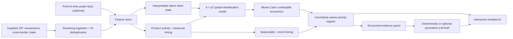

# Architecture

> **Archived V1 architecture.** V2 uses entitled server-side APIs, ten service boundaries and the AWS/Databricks target in [`v2_architecture.md`](v2_architecture.md). The browser-side JSON design below is retained only as a frozen regression reference.

## Offline layer

`wallet_twin.pipeline` reads the ZIP in one streaming pass, builds monthly aggregates, computes states and forecasts, runs Monte Carlo estimation, validates invariants, and writes immutable JSON/CSV evidence products. This is the numerical source of truth.

## Online layer

The dashboard is a static React application that reads the generated portfolio JSON. Filters, client switching, product drill-downs, scenario sliders and “explain this number” work entirely in the browser. There is no hidden server-side recomputation.

## Grounded language layer

`wallet_twin.genai` receives one client evidence pack. If `OPENAI_API_KEY` is absent, it returns the deterministic brief. If present, the OpenAI Responses API narrates the same evidence under a strict prompt. The model cannot query raw confidential data or change calculated values.

## Production seams

- replace CSV/ZIP ingestion with governed lakehouse tables;
- add entitled balances, product income, pricing and approved public facts;
- materialise the feature store point-in-time;
- register models and assumptions with change control;
- authenticate bankers and apply row-level client entitlements;
- capture recommendation, action and outcome events;
- monitor drift, coverage, rank stability, latency and unsupported-claim rate.
