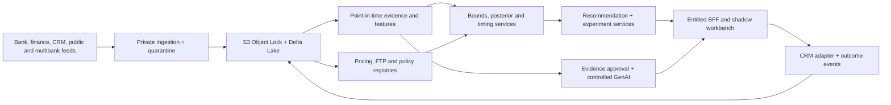

# V2 target architecture

## Trust boundaries

Bank feeds and approved public documents enter through private ingestion paths.
Originals and analytical snapshots are KMS-encrypted and object-locked in S3.
Delta Lake separates raw, conformed, curated, feature, training and monitoring
layers; every modelled read is point-in-time and requires `as_of`.

Ten private EKS services share schemas but not databases. RDS stores workflow
state; MSK carries versioned eligibility, assignment, interaction, approval,
access and outcome events. Unity Catalog governs lake access, while gateway,
service, query and UI layers independently enforce object authorization.

## Deployed reference assets

`infra/terraform` provisions private EKS, MSK, Aurora PostgreSQL, KMS and
compliance-mode S3. `infra/helm` creates ten signed-image deployments with
non-root/read-only security contexts and default-deny networking. The OPA policy,
service-owned SQL schemas, Delta tables and OpenTelemetry redaction are versioned
alongside application code.

External bank components—VPC controls, SSO, WAF/API gateway, Databricks workspace,
Unity Catalog attachment, SIEM destination, ECR signing and CRM connectivity—are
explicit integration dependencies, not local substitutes.
